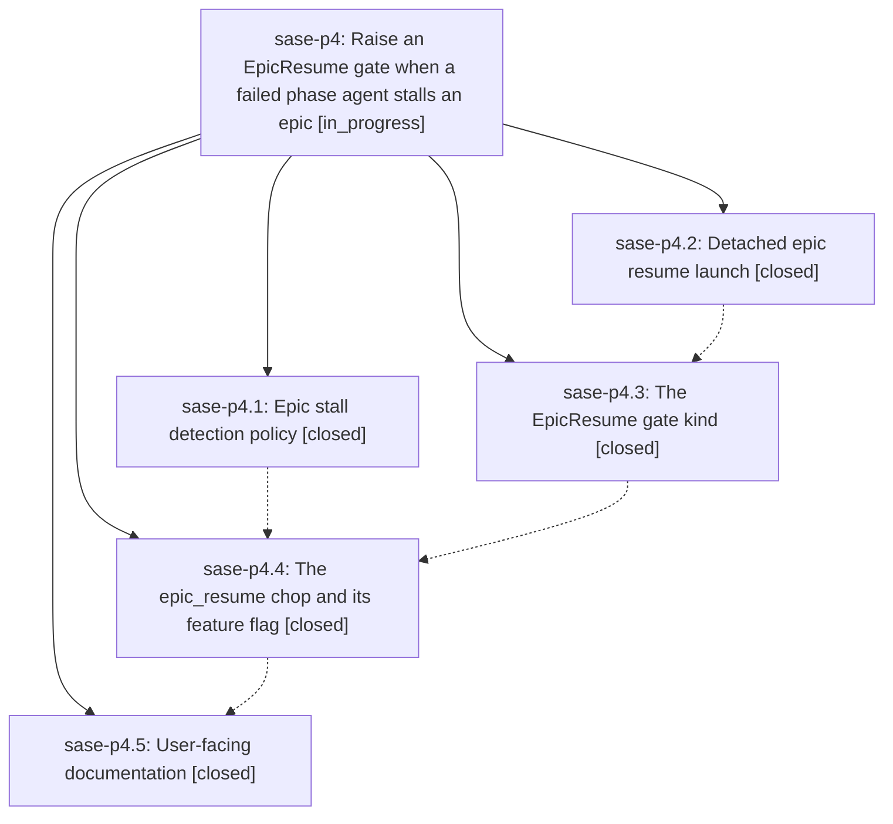

# Bead: sase-p4 — Raise an EpicResume gate when a failed phase agent stalls an epic

[Bead Pages](../README.md) / sase-p4

**Status:** ◐ in_progress · **Type:** ▸ plan · **Tier:** epic
**Owner:** `bryanbugyi34@gmail.com` · **Created by:** [bbugyi200.athena.05e](https://github.com/sase-org/sase--agents/blob/main/families/bbugyi200.athena.05e.md) · **Assignee:** `sase-p4.land`
**Created:** 2026-08-17 18:53:39 EDT
**Plan:** [202608/epic\_resume\_gate.md](https://github.com/sase-org/sase--plans/blob/main/202608/epic_resume_gate.md)

## Description

When an epic's phase agent fails and the epic stops making progress, SASE raises exactly one human-only EpicResume gate whose single option relaunches that epic with `sase bead work <epic_bead_id> --yes-to-all`, and reconciliation cancels the gate as soon as the epic resumes or closes.

## Notes

[2026-08-18T03:09:43Z · sase-p2.land--1] DISCOVERED ISSUE: closed phase sase-p4.3 left four stale Justfile --epic-symbol entries behind, and they are currently failing the lint (symvision) gate repo-wide on clean master fd2d71afc:
  --epic-symbol "sase-p4.3(active_epic_resume)"
  --epic-symbol "sase-p4.3(build_epic_resume_argv)"
  --epic-symbol "sase-p4.3(epic_resume_origin_from_gate_source)"
  --epic-symbol "sase-p4.3(submit_epic_resume_task)"
Symvision error per entry: "bead 'sase-p4.3' is closed. Remove this stale --epic-symbol entry and clean up the symbol."

REPRODUCTION: 'just check-full' (or 'just _lint-symvision' alone) on master. sase-p4.3 closed 2026-08-18T03:01:48Z; a 'just check' on this same tree passed symvision green about two minutes earlier, so the close is the trigger. Because symvision sits at Justfile line 680, the failure also aborts check-full before its remaining six gates (toobig, SASE validation, core-floor probe, committed plans, test cost, flake baseline) run, so every agent on this repo currently gets both an unrelated red and an incomplete verification.

STATE I VERIFIED: all four symbols are still genuinely unconsumed -- each appears only inside src/sase/bead/epic_resume_launch.py (definition, in-file call sites, and __all__), with no importer elsewhere in src/. So the exemption is still needed and deletion would be wrong; per the Symvision epic-whitelist policy this is the re-key case. Open phase sase-p4.4 'The epic_resume chop and its feature flag' is the obvious consumer -- the chop is what would call submit_epic_resume_task/build_epic_resume_argv/active_epic_resume and map a gate source via epic_resume_origin_from_gate_source -- so re-keying all four to sase-p4.4 looks correct, but I left the final call to this epic's agents rather than editing another epic's whitelist blind.

ACTION NEEDED BY THIS EPIC: re-key the four lines to sase-p4.4 (or to whichever open phase actually consumes them), or resolve the symbols if the design changed.

Reported by sase-p2.land. Also corroborated on task sase-o7 (+8), the systemic bead for stale epic-symbol entries -- with the note that this is the PHASE-close variant, which sase-o7's current epic-close-only fix candidates would not catch.

[2026-08-18T03:27:28Z · sase-p8.land] DISCOVERED ISSUE (reported by the sase-p8 land agent, 2026-08-18): 'just check' is red repo-wide at the _lint-flags gate — 'rule 8: live flag bead sase-pa has no definition (key epic_resume_gate)'. Reproduced on a CLEAN master tree (c033ca4c4) with all local edits stashed, so it is not caused by the reporting tree. Flag bead sase-pa ('Retire epic_resume_gate') was created 2026-08-17T23:19:01 EDT by agent sase-p4.4, whose phase is still IN_PROGRESS, while the epic_resume_gate flag definition has not landed in configuration yet; the flags gate treats a live flag bead with no definition as an error. This is transient in-flight state that sase-p4.4's own commit should close, but until it lands every other agent's mandatory 'just check' fails at a gate unrelated to its diff. Recording it here rather than as a task bead because the causal link to this epic is direct.

[2026-08-18T04:42:39Z · sase-p1.land] DISCOVERED ISSUE (corroborating the sase-p8.land note above, from the sase-p1 land agent): still red at master d4594a416 on 2026-08-18, roughly 4.5 hours after flag bead sase-pa was created. 'just check' on a clean tree fails at _lint-flags with "rule 8: live flag bead 'sase-pa' has no definition (key 'epic_resume_gate')" and, because _lint-flags sits at Justfile line 320, aborts before the remaining nine gates run. Every other lint gate, 'just validate', 'just validate-committed-plans', and a full 'just test' (32958 passed, 12 skipped) are green on that same tree, so this is the only thing standing between master and a green check. No action taken by sase-p1; recording the continued duration because sase-p4.4 is the only bead that can land the definition.

## Phases

| Bead | Title | Status | Size | Created | Agents | Commits |
|---|---|---|---|---|---:|---:|
| [sase-p4.1](sase-p4.1.md) | Epic stall detection policy | ✓ closed | medium | 2026-08-17 | 1 | 1 |
| [sase-p4.2](sase-p4.2.md) | Detached epic resume launch | ✓ closed | small | 2026-08-17 | 1 | 1 |
| [sase-p4.3](sase-p4.3.md) | The EpicResume gate kind | ✓ closed | medium | 2026-08-17 | 1 | 1 |
| [sase-p4.4](sase-p4.4.md) | The epic\_resume chop and its feature flag | ✓ closed | medium | 2026-08-17 | 1 | 1 |
| [sase-p4.5](sase-p4.5.md) | User-facing documentation | ✓ closed | small | 2026-08-17 | 1 | 1 |

## Lineage

## Agents

| Agent | Bead | Commits |
|---|---|---:|
| [bbugyi200.athena.sase-p4.1](https://github.com/sase-org/sase--agents/blob/main/families/bbugyi200.athena.sase-p4.1.md) | [sase-p4.1](sase-p4.1.md) | 1 |
| [bbugyi200.athena.sase-p4.2](https://github.com/sase-org/sase--agents/blob/main/agents/bbugyi200.athena.sase-p4.2/README.md) | [sase-p4.2](sase-p4.2.md) | 1 |
| [bbugyi200.athena.sase-p4.3](https://github.com/sase-org/sase--agents/blob/main/families/bbugyi200.athena.sase-p4.3.md) | [sase-p4.3](sase-p4.3.md) | 1 |
| [bbugyi200.athena.sase-p4.4](https://github.com/sase-org/sase--agents/blob/main/families/bbugyi200.athena.sase-p4.4.md) | [sase-p4.4](sase-p4.4.md) | 1 |
| [bbugyi200.athena.sase-p4.5](https://github.com/sase-org/sase--agents/blob/main/agents/bbugyi200.athena.sase-p4.5/README.md) | [sase-p4.5](sase-p4.5.md) | 1 |
| [bbugyi200.athena.sase-p4.land](https://github.com/sase-org/sase--agents/blob/main/agents/bbugyi200.athena.sase-p4.land/README.md) | [sase-p4](README.md) | 0 |

## Commits

| Repo | Commit | Subject | Bead | Committed |
|---|---|---|---|---|
| sase | [`ebdddf1`](https://github.com/sase-org/sase/commit/ebdddf18fa4af17a6ff4a1520e2996e48ef5fd86) | feat(bead): add the detached epic-resume launch helper | [sase-p4.2](sase-p4.2.md) | 2026-08-17 20:24:22 EDT |
| sase | [`567605a`](https://github.com/sase-org/sase/commit/567605a8fba6c157337d689c6f862be025f642ab) | feat(bead): add shared epic stall detection policy | [sase-p4.1](sase-p4.1.md) | 2026-08-17 21:03:00 EDT |
| sase | [`d04a5d7`](https://github.com/sase-org/sase/commit/d04a5d7103389a147943d34b5a5453ce1f21292a) | feat(gates): register the EpicResume gate kind | [sase-p4.3](sase-p4.3.md) | 2026-08-17 23:07:38 EDT |
| sase | [`11fddd5`](https://github.com/sase-org/sase/commit/11fddd525d0379a5052ec1b7eba60e22ad907fe1) | feat(bead): add the epic\_resume chop and its feature flag | [sase-p4.4](sase-p4.4.md) | 2026-08-18 00:58:27 EDT |
| sase | [`d23a269`](https://github.com/sase-org/sase/commit/d23a269e0dad75cdd8d4c154d5744e079b651986) | docs: document the EpicResume gate, epic\_resume chop, and its config | [sase-p4.5](sase-p4.5.md) | 2026-08-18 01:13:30 EDT |
