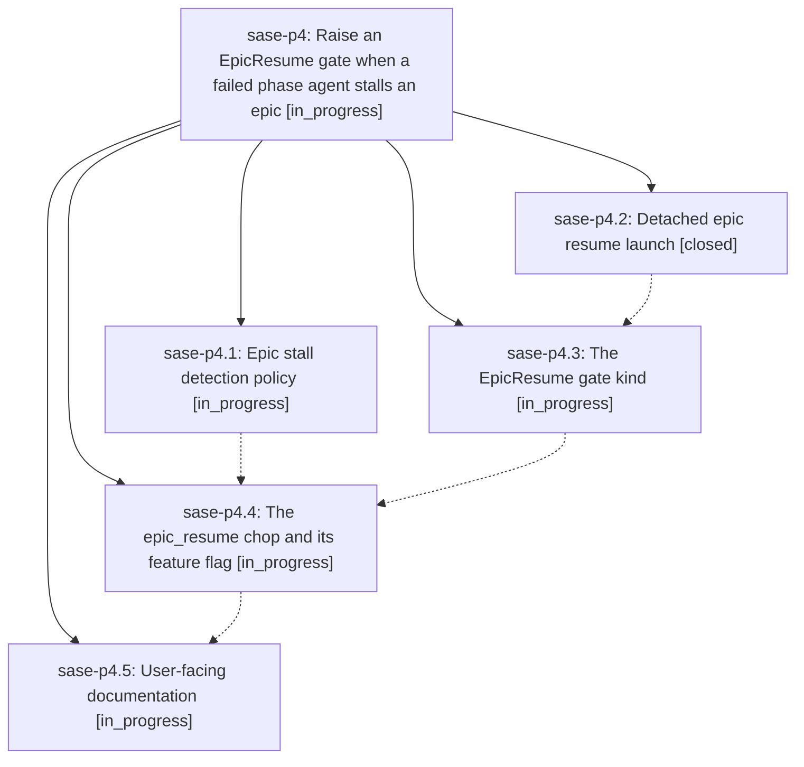

# Bead: sase-p4 — Raise an EpicResume gate when a failed phase agent stalls an epic

[Bead Pages](../README.md) / sase-p4

**Status:** ◐ in_progress · **Type:** ▸ plan · **Tier:** epic
**Owner:** `bryanbugyi34@gmail.com` · **Created by:** [bbugyi200.athena.05e](https://github.com/sase-org/sase--agents/blob/main/families/bbugyi200.athena.05e.md) · **Assignee:** `sase-p4.land`
**Created:** 2026-08-17 18:53:39 EDT
**Plan:** [202608/epic\_resume\_gate.md](https://github.com/sase-org/sase--plans/blob/main/202608/epic_resume_gate.md)

## Description

When an epic's phase agent fails and the epic stops making progress, SASE raises exactly one human-only EpicResume gate whose single option relaunches that epic with `sase bead work <epic_bead_id> --yes-to-all`, and reconciliation cancels the gate as soon as the epic resumes or closes.

## Phases

| Bead | Title | Status | Size | Created | Agents | Commits |
|---|---|---|---|---|---:|---:|
| [sase-p4.1](sase-p4.1.md) | Epic stall detection policy | ◐ in_progress | medium | 2026-08-17 | 1 | 0 |
| [sase-p4.2](sase-p4.2.md) | Detached epic resume launch | ✓ closed | small | 2026-08-17 | 1 | 1 |
| [sase-p4.3](sase-p4.3.md) | The EpicResume gate kind | ◐ in_progress | medium | 2026-08-17 | 1 | 0 |
| [sase-p4.4](sase-p4.4.md) | The epic\_resume chop and its feature flag | ◐ in_progress | medium | 2026-08-17 | 1 | 0 |
| [sase-p4.5](sase-p4.5.md) | User-facing documentation | ◐ in_progress | small | 2026-08-17 | 1 | 0 |

## Lineage

## Agents

| Agent | Bead | Commits |
|---|---|---:|
| [bbugyi200.athena.sase-p4.1](https://github.com/sase-org/sase--agents/blob/main/families/bbugyi200.athena.sase-p4.1.md) | [sase-p4.1](sase-p4.1.md) | 0 |
| [bbugyi200.athena.sase-p4.2](https://github.com/sase-org/sase--agents/blob/main/agents/bbugyi200.athena.sase-p4.2/README.md) | [sase-p4.2](sase-p4.2.md) | 1 |
| [bbugyi200.athena.sase-p4.3](https://github.com/sase-org/sase--agents/blob/main/agents/bbugyi200.athena.sase-p4.3/README.md) | [sase-p4.3](sase-p4.3.md) | 0 |
| [bbugyi200.athena.sase-p4.4](https://github.com/sase-org/sase--agents/blob/main/agents/bbugyi200.athena.sase-p4.4/README.md) | [sase-p4.4](sase-p4.4.md) | 0 |
| [bbugyi200.athena.sase-p4.5](https://github.com/sase-org/sase--agents/blob/main/agents/bbugyi200.athena.sase-p4.5/README.md) | [sase-p4.5](sase-p4.5.md) | 0 |
| [bbugyi200.athena.sase-p4.land](https://github.com/sase-org/sase--agents/blob/main/agents/bbugyi200.athena.sase-p4.land/README.md) | [sase-p4](README.md) | 0 |

## Commits

| Repo | Commit | Subject | Bead | Committed |
|---|---|---|---|---|
| sase | [`ebdddf1`](https://github.com/sase-org/sase/commit/ebdddf18fa4af17a6ff4a1520e2996e48ef5fd86) | feat(bead): add the detached epic-resume launch helper | [sase-p4.2](sase-p4.2.md) | 2026-08-17 20:24:22 EDT |
