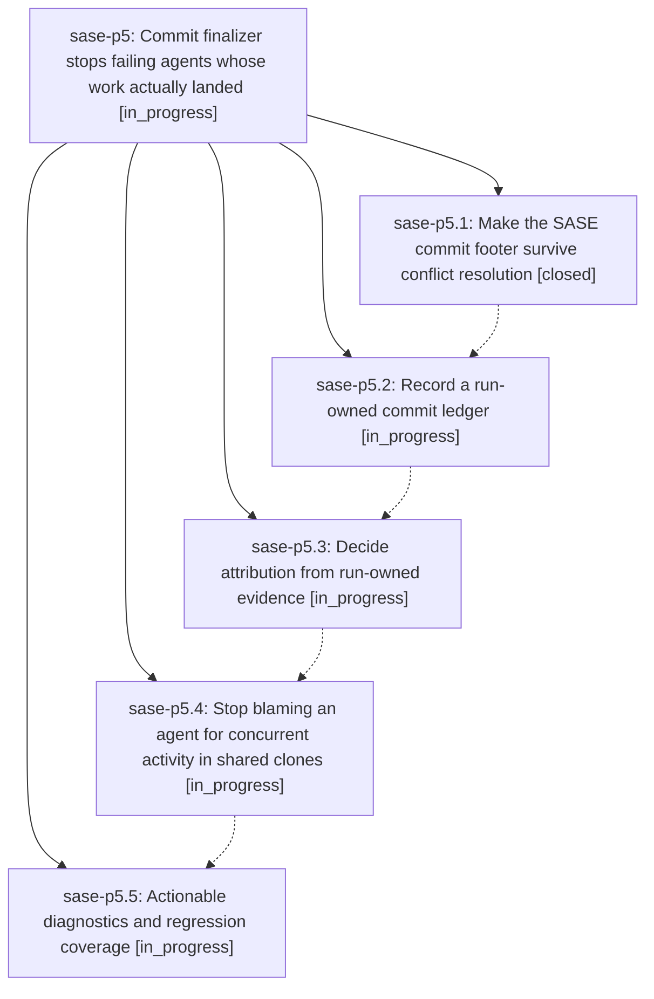

# Bead: sase-p5 — Commit finalizer stops failing agents whose work actually landed

[Bead Pages](../README.md) / sase-p5

**Status:** ◐ in_progress · **Type:** ▸ plan · **Tier:** epic
**Owner:** `bryanbugyi34@gmail.com` · **Created by:** [bbugyi200.athena.05d](https://github.com/sase-org/sase--agents/blob/main/families/bbugyi200.athena.05d.md) · **Assignee:** `sase-p5.land`
**Created:** 2026-08-17 18:55:29 EDT
**Plan:** [202608/commit\_finalizer\_attribution.md](https://github.com/sase-org/sase--plans/blob/main/202608/commit_finalizer_attribution.md)

## Description

An agent whose work is committed and pushed is never marked FAILED by the commit finalizer's discarded-work guard. Commit provenance survives conflict resolution, the finalizer decides attribution from evidence the run itself owns rather than from commit-message footers alone, and a concurrent agent's activity in a shared clone can no longer be misread as this agent discarding its work.

## Phases

| Bead | Title | Status | Size | Created | Agents | Commits |
|---|---|---|---|---|---:|---:|
| [sase-p5.1](sase-p5.1.md) | Make the SASE commit footer survive conflict resolution | ✓ closed | medium | 2026-08-17 | 1 | 1 |
| [sase-p5.2](sase-p5.2.md) | Record a run-owned commit ledger | ◐ in_progress | medium | 2026-08-17 | 1 | 0 |
| [sase-p5.3](sase-p5.3.md) | Decide attribution from run-owned evidence | ◐ in_progress | medium | 2026-08-17 | 1 | 0 |
| [sase-p5.4](sase-p5.4.md) | Stop blaming an agent for concurrent activity in shared clones | ◐ in_progress | medium | 2026-08-17 | 1 | 0 |
| [sase-p5.5](sase-p5.5.md) | Actionable diagnostics and regression coverage | ◐ in_progress | small | 2026-08-17 | 1 | 0 |

## Lineage

## Agents

| Agent | Bead | Commits |
|---|---|---:|
| [bbugyi200.athena.sase-p5.1](https://github.com/sase-org/sase--agents/blob/main/families/bbugyi200.athena.sase-p5.1.md) | [sase-p5.1](sase-p5.1.md) | 1 |
| [bbugyi200.athena.sase-p5.2](https://github.com/sase-org/sase--agents/blob/main/agents/bbugyi200.athena.sase-p5.2/README.md) | [sase-p5.2](sase-p5.2.md) | 0 |
| [bbugyi200.athena.sase-p5.3](https://github.com/sase-org/sase--agents/blob/main/agents/bbugyi200.athena.sase-p5.3/README.md) | [sase-p5.3](sase-p5.3.md) | 0 |
| [bbugyi200.athena.sase-p5.4](https://github.com/sase-org/sase--agents/blob/main/agents/bbugyi200.athena.sase-p5.4/README.md) | [sase-p5.4](sase-p5.4.md) | 0 |
| [bbugyi200.athena.sase-p5.5](https://github.com/sase-org/sase--agents/blob/main/agents/bbugyi200.athena.sase-p5.5/README.md) | [sase-p5.5](sase-p5.5.md) | 0 |
| [bbugyi200.athena.sase-p5.land](https://github.com/sase-org/sase--agents/blob/main/agents/bbugyi200.athena.sase-p5.land/README.md) | [sase-p5](README.md) | 0 |

## Commits

| Repo | Commit | Subject | Bead | Committed |
|---|---|---|---|---|
| sase | [`22e5444`](https://github.com/sase-org/sase/commit/22e5444bf29cdb1b964831c02678155911463689) | fix(commit): restamp dropped SASE footer tags on resumed commits | [sase-p5.1](sase-p5.1.md) | 2026-08-17 19:47:33 EDT |
