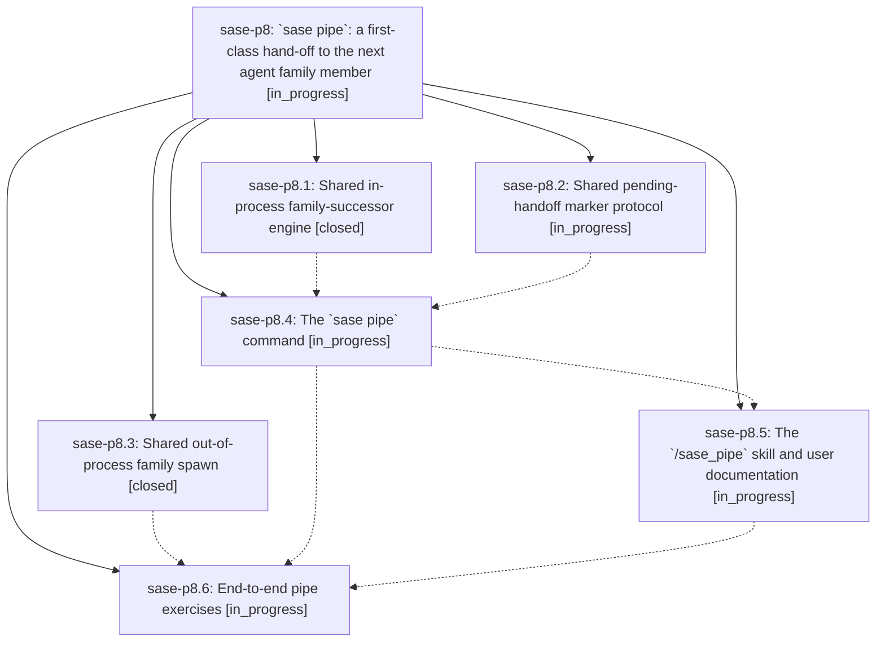

# Bead: sase-p8 — \`sase pipe\`: a first-class hand-off to the next agent family member

[Bead Pages](../README.md) / sase-p8

**Status:** ◐ in_progress · **Type:** ▸ plan · **Tier:** epic
**Owner:** `bryanbugyi34@gmail.com` · **Created by:** [bbugyi200.athena.05f](https://github.com/sase-org/sase--agents/blob/main/families/bbugyi200.athena.05f.md) · **Assignee:** `sase-p8.land`
**Created:** 2026-08-17 19:00:58 EDT
**Plan:** [202608/agent\_pipe.md](https://github.com/sase-org/sase--plans/blob/main/202608/agent_pipe.md)

## Description

An agent can end its own turn and hand the work to its next family member with one command, `sase pipe '<prompt>'`, exposed to agents as the `/sase_pipe` skill; the `sleep 1` monitor hack is no longer needed, and every in-process family-successor hand-off in the runner (plan approval, questions, pipe) plus every out-of-process family spawn (monitor follow-up) runs through one shared engine.

## Phases

| Bead | Title | Status | Size | Created | Agents | Commits |
|---|---|---|---|---|---:|---:|
| [sase-p8.1](sase-p8.1.md) | Shared in-process family-successor engine | ✓ closed | medium | 2026-08-17 | 1 | 1 |
| [sase-p8.2](sase-p8.2.md) | Shared pending-handoff marker protocol | ◐ in_progress | small | 2026-08-17 | 1 | 0 |
| [sase-p8.3](sase-p8.3.md) | Shared out-of-process family spawn | ✓ closed | medium | 2026-08-17 | 1 | 1 |
| [sase-p8.4](sase-p8.4.md) | The \`sase pipe\` command | ◐ in_progress | medium | 2026-08-17 | 1 | 0 |
| [sase-p8.5](sase-p8.5.md) | The \`/sase\_pipe\` skill and user documentation | ◐ in_progress | small | 2026-08-17 | 1 | 0 |
| [sase-p8.6](sase-p8.6.md) | End-to-end pipe exercises | ◐ in_progress | xsmall | 2026-08-17 | 1 | 0 |

## Lineage

## Agents

| Agent | Bead | Commits |
|---|---|---:|
| [bbugyi200.athena.sase-p8.1](https://github.com/sase-org/sase--agents/blob/main/agents/bbugyi200.athena.sase-p8.1/README.md) | [sase-p8.1](sase-p8.1.md) | 1 |
| [bbugyi200.athena.sase-p8.2](https://github.com/sase-org/sase--agents/blob/main/families/bbugyi200.athena.sase-p8.2.md) | [sase-p8.2](sase-p8.2.md) | 0 |
| [bbugyi200.athena.sase-p8.3](https://github.com/sase-org/sase--agents/blob/main/agents/bbugyi200.athena.sase-p8.3/README.md) | [sase-p8.3](sase-p8.3.md) | 1 |
| [bbugyi200.athena.sase-p8.4](https://github.com/sase-org/sase--agents/blob/main/agents/bbugyi200.athena.sase-p8.4/README.md) | [sase-p8.4](sase-p8.4.md) | 0 |
| [bbugyi200.athena.sase-p8.5](https://github.com/sase-org/sase--agents/blob/main/agents/bbugyi200.athena.sase-p8.5/README.md) | [sase-p8.5](sase-p8.5.md) | 0 |
| [bbugyi200.athena.sase-p8.6](https://github.com/sase-org/sase--agents/blob/main/agents/bbugyi200.athena.sase-p8.6/README.md) | [sase-p8.6](sase-p8.6.md) | 0 |
| [bbugyi200.athena.sase-p8.land](https://github.com/sase-org/sase--agents/blob/main/agents/bbugyi200.athena.sase-p8.land/README.md) | [sase-p8](README.md) | 0 |

## Commits

| Repo | Commit | Subject | Bead | Committed |
|---|---|---|---|---|
| sase | [`0b8bac8`](https://github.com/sase-org/sase/commit/0b8bac8376a5837f9d12c594be38367a108dc690) | refactor(axe): extract shared in-process family-successor engine | [sase-p8.1](sase-p8.1.md) | 2026-08-17 20:11:10 EDT |
| sase | [`d8a903a`](https://github.com/sase-org/sase/commit/d8a903ac90085156e126de50e8c92a54a3ab7ad8) | refactor(agent): share the out-of-process family-spawn primitive | [sase-p8.3](sase-p8.3.md) | 2026-08-17 20:24:10 EDT |
