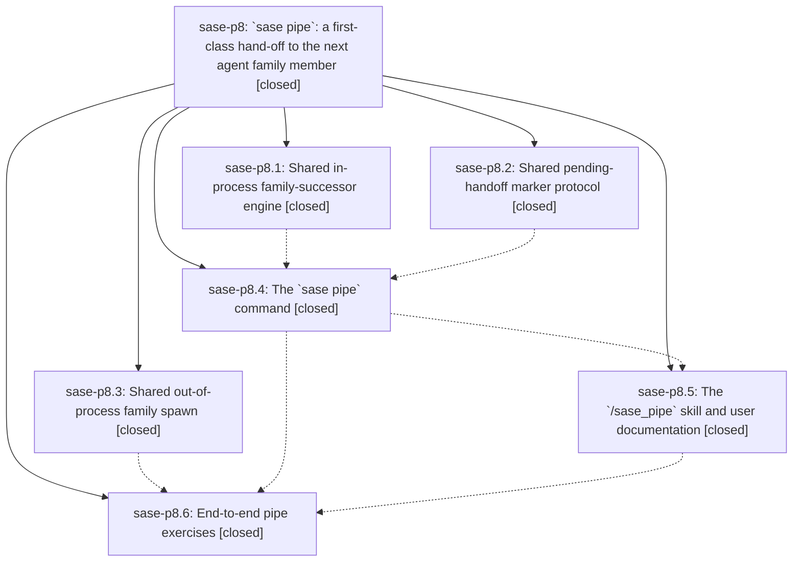

# Bead: sase-p8 — \`sase pipe\`: a first-class hand-off to the next agent family member

[Bead Pages](../README.md) / sase-p8

**Status:** ✓ closed · **Resolution:** done · **Type:** ▸ plan · **Tier:** epic
**Owner:** `bryanbugyi34@gmail.com` · **Created by:** [bbugyi200.athena.05f](https://github.com/sase-org/sase--agents/blob/main/families/bbugyi200.athena.05f.md) · **Assignee:** `sase-p8.land`
**Created:** 2026-08-17 19:00:58 EDT · **Closed:** 2026-08-17 23:50:57 EDT
**Plan:** [202608/agent\_pipe.md](https://github.com/sase-org/sase--plans/blob/main/202608/agent_pipe.md)

## Description

An agent can end its own turn and hand the work to its next family member with one command, `sase pipe '<prompt>'`, exposed to agents as the `/sase_pipe` skill; the `sleep 1` monitor hack is no longer needed, and every in-process family-successor hand-off in the runner (plan approval, questions, pipe) plus every out-of-process family spawn (monitor follow-up) runs through one shared engine.

## Notes

[2026-08-18T03:35:54Z · sase-p2.land--1] DISCOVERED ISSUE: commit d8a903ac9 (phase sase-p8.3, 'refactor(agent): share the out-of-process family-spawn primitive') broke tests/ace/tui/visual/test_ace_png_snapshots_agents_retry_e2e.py::test_real_fakey_completed_retry_chain_png_snapshot, which fails deterministically on clean master fd2d71afc.

FAILURE: AttributeError: 'types.SimpleNamespace' object has no attribute 'timestamp', raised in production code at src/sase/axe/run_agent_retry_spawn.py:324 ('child_timestamp = result.timestamp').

MECHANISM: that commit replaced the locally reserved timestamp with one read off the new shared primitive's return value -- the diff drops 'child_timestamp = reserve_launch_timestamp_batch(1)[0]' and adds 'child_timestamp = result.timestamp'. Its own message records that it updated the mocks whose call shape it changed, and it did update tests/fakey/test_retry_pipeline_e2e.py:180 to 'SimpleNamespace(pid=4242, timestamp="260710_120001")'. But the shared fakey harness mock at tests/fakey/harness.py:380 still returns 'SimpleNamespace(pid=os.getpid())' with no timestamp field, and that is the mock the visual retry E2E test uses.

WHY IT SURVIVED VERIFICATION: the visual suite is excluded from 'just test', 'just check', and 'just check-full' (all run -m 'not slow and not visual'); only the dedicated 'just test-visual' lane covers it. So sase-p8.3's gates could not have caught this.

REPRODUCTION: SASE_PYTEST_WORKERS=1 just test-visual tests/ace/tui/visual/test_ace_png_snapshots_agents_retry_e2e.py::test_real_fakey_completed_retry_chain_png_snapshot -- fails in about 5s in isolation, so it is not a contention flake.

LIKELY FIX: add the timestamp field to the harness mock at tests/fakey/harness.py:380, matching what the sibling mock already returns.

Reported by sase-p2.land, which found it running 'just test-visual' during an unrelated epic landing. Not caused by sase-p2: that epic touched no axe, agent-spawn, or fakey file.

[2026-08-18T03:50:57Z · sase-p8.land] VERIFIED (land agent, 2026-08-18). All six phases closed and their work confirmed against the source, not just the notes.

SHARED ENGINES ACTUALLY SHARED. src/sase/axe/run_agent_successor.py owns the six-step in-process hand-off with the ordering constraints documented; continue_as_successor has exactly three callers (run_agent_exec_plan_accept.py:403, run_agent_exec_questions.py:249, run_agent_exec_pipe.py:121). Behavior preservation is real: commit 0b8bac837 modified NO existing test file, adding only tests/axe/test_run_agent_successor.py, so the untouched plan-accept and questions suites are the evidence the plan asked for. src/sase/agent/pending_handoff.py names PLAN/QUESTIONS/MONITOR/PIPE and derives PENDING_HANDOFF_MARKERS from them; all four writers go through write_pending_handoff_marker, and run_agent_runner_signals._NON_MONITOR_HANDOFF_MARKERS is derived from the registry, so the pipe marker joins the SIGTERM claim-hold set automatically. src/sase/agent/detached_child.py is the only remaining detached-spawn path: monitor/followup.py:254 uses spawn_family_successor, run_agent_retry_spawn.py:287 uses spawn_detached_child, _family_attach_launch.py:44 uses family_attach_env. I confirmed no hand-rolled duplicate survives — the only other reserve_launch_timestamp_batch callers are the TUI launch path and launch_cwd_agents, which are user-equivalent launches, matching the exclusion the module docstring records for bead/work.py.

PIPE END TO END. Guards, chain bound, marker, and runner adoption read correctly and the relationships block does reach agent_meta.json: create_followup_artifacts inherits a whitelist that deliberately excludes pipe_depth/piped_from/pipe_reason, then flattens relationships over it, so pipe_depth increments per hop without leaking stale parent values. tests/fakey/test_pipe_e2e.py is genuinely end to end (real executor, fakey as a real subprocess, real artifact dirs, ACE loader), not mocked.

INTEGRATION. Reviewed all 16 non-epic commits landed since 0b8bac837. Nothing conflicts and nothing needed rewiring: the epic-resume work (ebdddf18f, d04a5d710) spawns through submit_via_lease + 'sase bead work', the documented user-equivalent launch path this epic deliberately did not absorb; no commit added a marker writer, a detached spawn, or an in-process successor. Confirmed no doc or skill still recommends the retired 'sleep 1 --next' hand-off — docs/monitors.md retires it explicitly and the /sase_monitor skill never taught it.

EPIC-CAUSED GAP FIXED IN THIS LANDING. Phase sase-p8.5 recorded that sase-p8.4 added max_agent_pipe_chain without a docs/configuration.md field reference. Added the '### max_agent_pipe_chain' section plus its TOC entry, documenting the depth-0 origin, the refusal behavior, why it is a config field rather than a flag, and the fact that only pipe records pipe_depth (so an intervening plan/question/monitor member restarts the count) — behavior I verified in create_followup_artifacts rather than assumed.

VERIFICATION RUN. just install; symvision clean; fmt (python+markdown), keep-sorted, ruff, mypy, pyscripts, test-waits, changelog, patch/stitch terminology, toobig, validate-committed-plans all pass. Full suite via the escalated test-scoped lane: 32,912 passed, 10 failed, 12 skipped. Every one of the 10 was proven NOT caused by this epic: 7 reproduce on a clean master tree with my edits stashed, and the other 3 pass in isolation. Two gates are red on clean master for reasons outside this epic and are recorded on their causal epics rather than absorbed here: _lint-flags (live flag bead sase-pa has no definition yet — in-flight sase-p4.4 state) and 'sase validate' (the sase-research-artifacts editable install points at a workspace directory that does not exist, so its module will not import).

FOLLOW-UPS, EVERY PROPOSAL ACCOUNTED FOR. Filed as tasks: sase-pb (in-process hand-offs in one wall-clock second share an artifacts dir — root-caused to create_artifacts_directory's bare timestamp, shared by all four hand-offs, so pre-existing rather than pipe's), sase-pc (the plan feedback replan branch is the fifth successor site the plan's own table missed, still hand-rolled), sase-pd and sase-pe (the two sase-p8.4 parallel-lane flakes needing node-specific beads under sase-ct's retired-umbrella policy), sase-pf (docs/xprompt.md's bundled-skills table omits sase_monitor and sase_new_task), sase-pg (a wall-clock completion budget that cannot hold under lane contention, found in my own run). Corroborated instead of duplicated: +1 on sase-o7 with a NEW variant — a PHASE close also strands entries, which widens that bead beyond epic closes — and +1 on sase-oz for the third node of the same sase-p8.4 run. Routed to causal in-progress epics as DISCOVERED ISSUE notes: sase-p3 (broken required-plugin install, which also explains 6 deterministic doctor test failures, plus its remediation text naming a doctor check id that does not exist) and sase-p2 (fd2d71afc renamed the Ctrl+] help label without updating its assertion). Declined, with reasons: the sase-p1.2 / sase-p2.2 / sase-p3.11 / sase-p4.3 stale-epic-symbol proposals were already resolved by other agents and no longer appear in the Justfile; the reflow-tier proposal is already tracked as sase-oj and now passes here, so I had no reproduction to add; the visual renderer-environment mismatch was specific to workspace sase_25 and does not reproduce here (14 passed); the 'sase doctor -C config.file_hooks' proposal was superseded by the deeper root cause noted on sase-p3.

ALSO UNBLOCKED THE REPO. just symvision was red for every agent on a stale '--epic-symbol "sase-p1.7(GlossaryPanel)"' row: that phase is closed while its parent sase-p1 and sibling sase-p1.8 are still open, and GlossaryPanel still has no non-test consumer. Re-keyed the row to the open parent sase-p1 rather than deleting ~700 lines of another epic's landed work. sase bead epic-symbols sase-p8 reports no entries.

[2026-08-18T03:53:28Z · sase-p8.land] Verified all six phases against source and commits: the three shared primitives (run_agent_successor.py with its three callers, write_pending_handoff_marker as the single marker writer feeding _NON_MONITOR_HANDOFF_MARKERS, detached_child.py as the only detached-spawn path) are genuinely shared, and commit 0b8bac837 touched no existing test file, which is the behavior-preservation evidence the plan asked for. Traced pipe_depth through create_followup_artifacts: the meta whitelist excludes pipe_depth/piped_from/pipe_reason, so the chain bound increments per hop without leaking stale parent values. Integration: reviewed all 16 non-epic commits since the epic started; none conflict, and epic-resume launches through submit_via_lease + 'sase bead work', the user-equivalent path this epic deliberately did not absorb. Fixed one epic-caused gap: sase-p8.4 added max_agent_pipe_chain with no docs/configuration.md entry. Also unblocked repo-wide 'just symvision' by re-keying a stale sase-p1.7(GlossaryPanel) row to its still-open parent sase-p1. Follow-ups filed: sase-pb, sase-pc, sase-pd, sase-pe, sase-pf, sase-pg; corroborated sase-o7 (new variant: phase closes also strand epic-symbol entries) and sase-oz; declined four proposals already resolved, tracked elsewhere (sase-oj), workspace-specific, or superseded.

## Phases

| Bead | Title | Status | Size | Created | Agents | Commits |
|---|---|---|---|---|---:|---:|
| [sase-p8.1](sase-p8.1.md) | Shared in-process family-successor engine | ✓ closed | medium | 2026-08-17 | 1 | 1 |
| [sase-p8.2](sase-p8.2.md) | Shared pending-handoff marker protocol | ✓ closed | small | 2026-08-17 | 1 | 1 |
| [sase-p8.3](sase-p8.3.md) | Shared out-of-process family spawn | ✓ closed | medium | 2026-08-17 | 1 | 1 |
| [sase-p8.4](sase-p8.4.md) | The \`sase pipe\` command | ✓ closed | medium | 2026-08-17 | 1 | 1 |
| [sase-p8.5](sase-p8.5.md) | The \`/sase\_pipe\` skill and user documentation | ✓ closed | small | 2026-08-17 | 1 | 1 |
| [sase-p8.6](sase-p8.6.md) | End-to-end pipe exercises | ✓ closed | xsmall | 2026-08-17 | 1 | 1 |

## Lineage

## Agents

| Agent | Bead | Commits |
|---|---|---:|
| [bbugyi200.athena.sase-p8.1](https://github.com/sase-org/sase--agents/blob/main/agents/bbugyi200.athena.sase-p8.1/README.md) | [sase-p8.1](sase-p8.1.md) | 1 |
| [bbugyi200.athena.sase-p8.2](https://github.com/sase-org/sase--agents/blob/main/families/bbugyi200.athena.sase-p8.2.md) | [sase-p8.2](sase-p8.2.md) | 1 |
| [bbugyi200.athena.sase-p8.3](https://github.com/sase-org/sase--agents/blob/main/agents/bbugyi200.athena.sase-p8.3/README.md) | [sase-p8.3](sase-p8.3.md) | 1 |
| [bbugyi200.athena.sase-p8.4](https://github.com/sase-org/sase--agents/blob/main/agents/bbugyi200.athena.sase-p8.4/README.md) | [sase-p8.4](sase-p8.4.md) | 1 |
| [bbugyi200.athena.sase-p8.5](https://github.com/sase-org/sase--agents/blob/main/agents/bbugyi200.athena.sase-p8.5/README.md) | [sase-p8.5](sase-p8.5.md) | 1 |
| [bbugyi200.athena.sase-p8.6](https://github.com/sase-org/sase--agents/blob/main/families/bbugyi200.athena.sase-p8.6.md) | [sase-p8.6](sase-p8.6.md) | 1 |
| [bbugyi200.athena.sase-p8.land](https://github.com/sase-org/sase--agents/blob/main/agents/bbugyi200.athena.sase-p8.land/README.md) | [sase-p8](README.md) | 1 |

## Commits

| Repo | Commit | Subject | Bead | Committed |
|---|---|---|---|---|
| sase | [`0b8bac8`](https://github.com/sase-org/sase/commit/0b8bac8376a5837f9d12c594be38367a108dc690) | refactor(axe): extract shared in-process family-successor engine | [sase-p8.1](sase-p8.1.md) | 2026-08-17 20:11:10 EDT |
| sase | [`d8a903a`](https://github.com/sase-org/sase/commit/d8a903ac90085156e126de50e8c92a54a3ab7ad8) | refactor(agent): share the out-of-process family-spawn primitive | [sase-p8.3](sase-p8.3.md) | 2026-08-17 20:24:10 EDT |
| sase | [`4edc0ab`](https://github.com/sase-org/sase/commit/4edc0ab235e29ac764df86bcbe9b65f095ad8a64) | feat(agent): share pending-handoff marker write protocol | [sase-p8.2](sase-p8.2.md) | 2026-08-17 20:58:37 EDT |
| sase | [`98aefd3`](https://github.com/sase-org/sase/commit/98aefd35faa0b39cd6eb2f59710de1810f3371fc) | feat(cli): add sase pipe in-process successor hand-off | [sase-p8.4](sase-p8.4.md) | 2026-08-17 22:05:45 EDT |
| sase | [`bdf9a67`](https://github.com/sase-org/sase/commit/bdf9a67f0b90e9b65838e0696442af663464060b) | docs(pipe): add /sase\_pipe skill and document sase pipe | [sase-p8.5](sase-p8.5.md) | 2026-08-17 22:34:01 EDT |
| sase | [`c033ca4`](https://github.com/sase-org/sase/commit/c033ca4c455b7afb4a0c16e3804de41f2e34c0af) | test(pipe): add end-to-end sase pipe family exercises | [sase-p8.6](sase-p8.6.md) | 2026-08-17 23:09:33 EDT |
| sase | [`06f486d`](https://github.com/sase-org/sase/commit/06f486da54849e78633f256d5ced9970ae0066cd) | docs(config): document max\_agent\_pipe\_chain | [sase-p8](README.md) | 2026-08-17 23:59:49 EDT |
