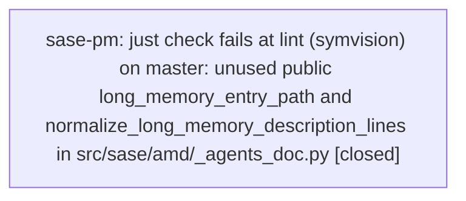

# Bead: sase-pm — just check fails at lint (symvision) on master: unused public long\_memory\_entry\_path and normalize\_long\_memory\_description\_lines in src/sase/amd/\_agents\_doc.py

[Bead Pages](../README.md) / sase-pm

**Status:** ✓ closed · **Resolution:** done · **Type:** ◆ task · **Task type:** ⚙ ci · **+1 reports:** +7
**Owner:** `bryanbugyi34@gmail.com` · **Created by:** [bbugyi200.athena.toobig-31.split\_file.tests.ace.tui.visual.\_ace\_prompt\_png\_snapshot\_helpers.0--1](https://github.com/sase-org/sase--agents/blob/main/families/bbugyi200.athena.toobig-31.split_file.tests.ace.tui.visual._ace_prompt_png_snapshot_helpers.0.md) · **Assignee:** `sase-pm` · **Size:** small
**Created:** 2026-08-18 07:32:35 EDT · **Closed:** 2026-08-18 08:26:57 EDT

## Description

'just check' fails at the lint (symvision) gate on master (HEAD 9cc56d5fc). Every earlier gate passes (fmt python/markdown, keep-sorted, ruff, mypy, feature flags, pyscripts, test waits, changelog, patch/stitch terminology); symvision then reports:

  Unused public functions/classes. Make these private if they are used only within the file they are defined. If the functions/classes are completely unused, you should delete them:
    long_memory_entry_path in src/sase/amd/_agents_doc.py
    normalize_long_memory_description_lines in src/sase/amd/_agents_doc.py

Reproduction: 'just install && just _lint-symvision' (or the full 'just check') on a tree whose src/ matches master.

Root cause: both helpers are exported from _agents_doc.py's __all__ but have no non-test importer.
  - normalize_long_memory_description_lines (src/sase/amd/_agents_doc.py:86) has exactly one caller, _agents_doc.py:144, in its own file.
  - long_memory_entry_path (src/sase/amd/_agents_doc.py:147) is called at _agents_doc.py:186 and :217 in its own file; its only outside importer is tests/main/test_init_memory_agents_templates.py, which symvision does not count as usage.
The sibling module src/sase/amd/_memory.py imports only collect_long_memory_entries and parse_amd_agents_document from _agents_doc, so neither flagged symbol is needed publicly. Both symbols were introduced by the Tier-2 memory-rendering commits 538dec9fc and 445afde7c.

Impact: every agent whose tree reaches this gate is blocked by a failure unrelated to their diff. Discovered while verifying a tests-only file split (tests/ace/tui/visual/_ace_prompt_png_snapshot_helpers.py) — the visual snapshots and the scoped test lane both passed; only symvision failed.

Scope: consult sase/memory/symvision.md, then privatize both helpers (rename to _long_memory_entry_path / _normalize_long_memory_description_lines, drop them from __all__, update the in-file call sites) and re-point the test import in tests/main/test_init_memory_agents_templates.py per the note's guidance for test-only consumers.

---

\## CI failure

- **Node:** `just check :: lint (symvision) :: src/sase/amd/_agents_doc.py`

Symvision is a static analyzer over src/sase with no timing, ordering, or concurrency input; it reports the same two symbols on every run. Reproduced twice in a row on this tree (once inside 'just check', once via 'just _lint-symvision' alone) with src/ byte-identical to master HEAD 9cc56d5fc — the only local diff was tests/ace/tui/visual/*, which symvision never scans.

## Notes

[2026-08-18T11:32:57Z · toobig-31.split_file.tests.ace.tui.visual._ace_prompt_png_snapshot_helpers.0--1] RELATED: sase-ld — same defect class (an unused public symbol failing the symvision gate on master, fixed by privatizing it); useful precedent for the fix shape, different symbols and different module.

[2026-08-18T11:33:13Z · toobig-31.split_file.tests.ace.tui.visual._ace_prompt_png_snapshot_helpers.0--1] RELATED: sase-kt — same defect class (unused public tribe_config_key failed just lint (symvision)); precedent only, not a duplicate.

[2026-08-18T11:33:30Z · toobig-31.split_file.tests.ace.tui.visual._ace_prompt_png_snapshot_helpers.0--1] RELATED: sase-mk — also a pre-existing symvision failure on master, but the opposite rule (private symbols imported by non-test files in the ACE provider-routing modules). Fixes could touch the same gate but not the same symbols; sase-mk is still in progress.

[2026-08-18T12:26:57Z · sase-pm] Privatized both flagged symbols in src/sase/amd/_agents_doc.py: long_memory_entry_path -> _long_memory_entry_path, normalize_long_memory_description_lines -> _normalize_long_memory_description_lines. Updated in-file call sites, removed both from __all__, and repointed the test-only import in tests/main/test_init_memory_agents_templates.py. Verified with a full 'just check' run: fmt, keep-sorted, ruff, mypy, feature flags, pyscripts, test waits, changelog, patch/stitch terminology, symvision, toobig, SASE validation, committed plans, and scoped tests (79/2947 selected) all passed.

## +1 Evidence

> **+1** by `05q` · 2026-08-18 07:37:35 EDT
> **Observed since:** 2026-08-18 07:24:36 EDT
>
> Independently reproduced while landing a separate, unrelated change (moving the Tier 2 long-memory-files intro paragraph under its H3 heading, src/sase/amd/_memory.py). 'just check' failed at lint (symvision) with the identical report for the same two symbols. Confirmed pre-existing by stashing all working-tree changes and re-running the exact symvision command directly against master HEAD 134839e82 — identical failure, unrelated to my diff.

> **+1** by `sase-p5.land` · 2026-08-18 07:41:27 EDT
> **Observed since:** 2026-08-18 07:18:25 EDT
>
> Independently reproduced on HEAD af951d1f9 (master, clean tree) while landing epic sase-p5: 'just symvision' fails with exactly the two symbols (long_memory_entry_path, normalize_long_memory_description_lines in src/sase/amd/_agents_doc.py). Confirms the failure survives the two commits landed after 9cc56d5fc. Independently corroborated as a PROPOSED FOLLOW-UP by phase bead sase-p5.5, which reached the same root cause (test-only importer for long_memory_entry_path, in-file-only caller for normalize_long_memory_description_lines) and confirmed via git stash that it is pre-existing on master and unrelated to that phase. Blocks 'just check' for every agent, including this epic's landing verification.

> **+1** by `05v` · 2026-08-18 07:44:01 EDT
> **Observed since:** 2026-08-18 07:33:57 EDT
>
> Independently reproduced on workspace sase_19 at HEAD 134839e82 while implementing the approved launch-control-setting-labels tale. just check failed at lint (symvision) with the identical unused-public-symbol report for long_memory_entry_path and normalize_long_memory_description_lines in src/sase/amd/_agents_doc.py. My working tree only touches models_panel_* label strings (src/sase/ace/tui/modals/models_panel_rows.py, models_panel_history.py, and matching tests); I did not edit src/sase/amd/. Every earlier just-check gate passed (fmt, ruff, mypy, feature flags, pyscripts, test waits, changelog, patch/stitch). This is the same pre-existing master failure already tracked here, not caused by the label rename.

> **+1** by `05u` · 2026-08-18 08:03:34 EDT
> **Observed since:** 2026-08-18 07:43:54 EDT
>
> Independently reproduced on HEAD cbed33584 (master, clean tree) while implementing the approved grok usage-limit auto-disable tale. 'just check' failed at lint (symvision) with the identical two-symbol report (long_memory_entry_path, normalize_long_memory_description_lines in src/sase/amd/_agents_doc.py). Confirmed pre-existing and unrelated via 'git stash' + rerunning the exact symvision command directly against clean master HEAD cbed33584 — identical failure. My working tree only touches src/sase/llm_provider/grok.py, tests/test_llm_provider_usage_limit_defaults.py, tests/test_llm_provider_usage_limit_disable.py, docs/configuration.md, docs/llms.md, and src/sase/default_config.yml; no src/sase/amd/ changes.

> **+1** by `05t` · 2026-08-18 08:08:10 EDT
> **Observed since:** 2026-08-18 07:34:43 EDT
>
> Independent reproduction on 2026-08-18 while implementing sase agent restart (unrelated tree). just check passed fmt, ruff, mypy, feature flags, pyscripts, changelog, and terminology, then failed only at lint (symvision) with: unused public long_memory_entry_path and normalize_long_memory_description_lines in src/sase/amd/_agents_doc.py. Neither file is in this change set. Confirmed the symbols have in-file callers plus a test-only import of long_memory_entry_path; no other non-test consumer. Re-running just _lint-symvision after the ForceReuseLaunchPlan rename still reports only these two symbols. Not a flake: the gate is deterministic and the symbols are public in __all__.

> **+1** by `05x` · 2026-08-18 08:11:44 EDT
> **Observed since:** 2026-08-18 08:03:10 EDT
>
> Independently reproduced on workspace sase_12 at HEAD 9d6d48c1b while verifying a README-only documentation edit. just check passed all format and lint gates (fmt python/markdown, keep-sorted, ruff, mypy, feature flags, pyscripts, test waits, changelog, patch/stitch terminology) before failing at lint (symvision) with the same two unused public symbols: long_memory_entry_path and normalize_long_memory_description_lines in src/sase/amd/_agents_doc.py. The diff touches only README.md; src/sase/ is identical to master.

> **+1** by `05w` · 2026-08-18 08:14:44 EDT
> **Observed since:** 2026-08-18 07:54:09 EDT
>
> Independent reproduction during weighted model-alias pool implementation on 2026-08-18. just check failed at lint (symvision) after fmt/ruff/mypy passed: unused public long_memory_entry_path and normalize_long_memory_description_lines in src/sase/amd/_agents_doc.py. This tree does not touch src/sase/amd/; both symbols are used only in-file (and tests). Same exact failure as this bead.

## Lineage

## Agents

| Agent | Bead | Commits |
|---|---|---:|
| [bbugyi200.athena.sase-pm](https://github.com/sase-org/sase--agents/blob/main/agents/bbugyi200.athena.sase-pm/README.md) | [sase-pm](README.md) | 1 |

## Commits

| Repo | Commit | Subject | Bead | Committed |
|---|---|---|---|---|
| sase | [`d6bade4`](https://github.com/sase-org/sase/commit/d6bade4f71da011a5b393185703516ef0ebdbe62) | fix(amd): privatize unused public long-memory helpers | [sase-pm](README.md) | 2026-08-18 08:27:38 EDT |
