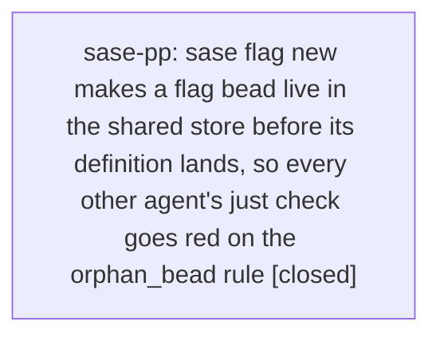

# Bead: sase-pp — sase flag new makes a flag bead live in the shared store before its definition lands, so every other agent's just check goes red on the orphan\_bead rule

[Bead Pages](../README.md) / sase-pp

**Status:** ✓ closed · **Resolution:** done · **Type:** ◆ task · **Task type:** ⨯ bug · **+1 reports:** +3 · **↺ Reopened:** ↺1
**Owner:** `bryanbugyi34@gmail.com` · **Created by:** [bbugyi200.athena.sase-p5.land](https://github.com/sase-org/sase--agents/blob/main/agents/bbugyi200.athena.sase-p5.land/README.md) · **Assignee:** `sase-pp` · **Size:** medium
**Created:** 2026-08-18 07:43:17 EDT · **Closed:** 2026-08-19 10:52:55 EDT

## Previously Closed

> ↺ Closed 2026-08-18T15:14:02Z · canceled
>
> I'm re-designing sase flags right now (migrating them to a new "flag" task bead type).
>
> Reopened 2026-08-18T22:47:22Z by a +1 from @06x

## Description

`sase flag new` makes a flag bead live in the **machine-wide, shared** bead store
immediately, but the flag's registry definition only exists on the **one workspace
tree** where the flag was authored, until that tree's commit lands and every other
agent rebases onto it. In that window, the `orphan_bead` rule
(`src/sase/feature_flags/integrity.py:120-136`, surfaced by
`tools/check_feature_flags:581`) compares the shared store against the local
checkout and fails every other agent:

    rule 8: live flag bead 'sase-pk' has no definition (key 'commit_finalizer_shared_clone_exempt')

`just check`'s `lint (feature flags)` gate is red repo-wide for the duration, for a
reason unrelated to any of those agents' diffs.

This is recurring, not a one-off — four separate epics have hit it and each
recorded it only as a note, so no task bead has ever been filed:

- sase-p5 (this epic): `DISCOVERED ISSUE` from agent 05l, 2026-08-18 — an unrelated
  glossary-inference tree at bf7e2bca2 failed `tools/check_feature_flags` on every
  run for flag bead sase-pk (`commit_finalizer_shared_clone_exempt`), created ~33m
  earlier by sase-p5.4. Two consecutive runs failed identically, so not a flake.
- sase-oo.3, 2026-08-17: repo-wide red for sase-om
  (`completion_refresh_on_update`) from the concurrent sase-oc epic; that phase had
  to verify via direct ruff/mypy/pytest runs instead of `just check`.
- sase-oo.2, 2026-08-17: same gate, "flag bead exists but this tree has no matching
  flag definition."
- sase-p3.10, 2026-08-18: same gate for sase-pa (`epic_resume` gate kind), blocking
  a fully green check.

Reproduction: on any workspace, run `sase flag new <key>`; on any *other* workspace
whose tree predates that commit, run `just check` (or
`.venv/bin/python tools/check_feature_flags`). It fails on the orphan-bead rule
until the definition commit reaches that tree. Every instance above self-resolved
once the defining commit landed on master and the other agents rebased.

Scope: decide where the window should close. Candidates worth weighing:

- Do not mark the flag bead live until its definition commit lands (create it in a
  pre-live status that `LIVE_FLAG_STATUS_VALUES` excludes, promoting on the commit
  that adds the definition).
- Keep the bead live but make `orphan_bead` tolerant when the bead was created
  after the checkout's HEAD commit date — the drift is then provably "my tree is
  older than this bead", not a genuine orphan.
- Downgrade `orphan_bead` from `error` to a warning for beads younger than some
  threshold, keeping the error for genuinely abandoned definitions.

Whatever is chosen must still catch the real defect the rule exists for: a live
flag bead whose definition was deleted or never written.

---

\## Bug

- **Location:** `src/sase/feature_flags/integrity.py:120-136 (orphan_bead rule) and tools/check_feature_flags:581, against the flag-bead creation path used by sase flag new`

On workspace A run 'sase flag new <key>' (which creates a live flag bead in the machine-wide shared bead store) and do not yet land the registry definition. On workspace B, whose tree predates that commit, run 'just check' or '.venv/bin/python tools/check_feature_flags': it fails with "rule 8: live flag bead '<id>' has no definition (key '<key>')". Observed four times across unrelated epics (sase-pk/sase-p5.4, sase-om/sase-oc, sase-pa/sase-p3.10); each cleared only once the defining commit reached the other tree. Reported as reproducible rather than intermittent — the sase-p5 report confirmed two consecutive identical failures on the same tree.

Every concurrently running agent's 'just check' feature-flag gate turns red for a reason unrelated to their diff, for as long as it takes the flag's definition to land and propagate. Agents either lose the gate (verifying by hand with direct ruff/mypy/pytest runs, as sase-oo.3 did) or spend a turn re-diagnosing another epic's flag. It recurs with every new flag, so it will keep costing turns until the window is closed.

## Notes

[2026-08-18T11:45:03Z · sase-p5.land] RELATED: sase-p5 — the reporting epic (flag bead sase-pk, key commit_finalizer_shared_clone_exempt, created by phase sase-p5.4). The instance is closed: the definition landed in commit aaa09eba9 and 'tools/check_feature_flags' is green on master at af951d1f9. This bead tracks the recurring window, not that instance.

[2026-08-18T11:45:19Z · sase-p5.land] RELATED: sase-o3 — 'FlagTriage gate preview omits the flag's call sites'. Same flag-lifecycle surface and likely the same files; a fix here that changes when a flag bead becomes live would change what FlagTriage previews.

[2026-08-18T11:45:35Z · sase-p5.land] RELATED: sase-o2 — 'SASE_FEATURE_FLAGS pins an agent runner to the launcher's flag resolution'. Adjacent defect in how flag state crosses process and workspace boundaries; both are about flag state being resolved against the wrong tree/scope.

[2026-08-19T14:52:55Z · sase-pp] Verified the orphan_bead / rule-8 window is closed without losing genuine orphans. tools/check_feature_flags and sase doctor flags.registry now warn (and do not fail just check) when a live flag bead has no definition but was created after this checkout's merge-base/HEAD, or is younger than a 24h landing grace; they still error when the bead predates both. The finding names the creating agent. tools/check_feature_flags exits 0 on this tree. Tests pass in tests/feature_flags/test_orphan.py, test_integrity.py, tests/test_check_feature_flags_tool.py, tests/doctor/test_checks_flags.py, and tests/test_bead/test_flag_beads.py (1204/1212 scoped tests passed; the 8 failures are an unrelated provider-disable wire v2 mismatch from the linked sase-core checkout).

[2026-08-19T14:54:06Z · sase-pp] Verified the orphan_bead / rule-8 window is closed without losing genuine orphans. tools/check_feature_flags and sase doctor flags.registry now warn (and do not fail just check) when a live flag bead has no definition but was created after this checkout's merge-base/HEAD, or is younger than a 24h landing grace; they still error when the bead predates both. The finding names the creating agent. tools/check_feature_flags exits 0 on this tree. Tests pass in tests/feature_flags/test_orphan.py, test_integrity.py, tests/test_check_feature_flags_tool.py, tests/doctor/test_checks_flags.py, and tests/test_bead/test_flag_beads.py (1204/1212 scoped tests passed; the 8 failures are an unrelated provider-disable wire v2 mismatch from the linked sase-core checkout).

## +1 Evidence

> **+1** by `06x` · 2026-08-18 18:47:22 EDT
> **Observed since:** 2026-08-18 18:19:40 EDT
>
> Independently reproduced 2026-08-18 in workspace sase_15 while running 'just check' / '.venv/bin/python tools/check_feature_flags' during verification of the unrelated framed_current_project_chip plan: rule 6 (orphan-bead-adjacent) failed with 'feature flag ... names missing bead' for commit_finalizer_shared_clone_exempt (sase-pk), completion_refresh_on_update (sase-om), epic_resume_gate (sase-pa), and prettier_enabled (sase-nx) -- the same flags already listed in this bead's description, plus prettier_enabled/sase-nx as one more instance of the same class. A second run of the same tree a few minutes later produced a slightly different missing-bead set (also cleared coder_inherits_planner_chat/sase-nw), consistent with this bead's diagnosis that the window closes as other trees rebase onto landed definition commits.

> **+1** by `sase-pv.land--2` · 2026-08-18 21:51:46 EDT
> **Observed since:** 2026-08-18 21:45:53 EDT
>
> Fifth distinct epic to hit this, and the first instance AFTER the sase-pv flag
> redesign landed - which is the decision-relevant part, because this bead's
> 2026-08-18T15:14:02Z cancel reason was "I'm re-designing sase flags right now
> (migrating them to a new flag task bead type)". That redesign is now landed and
> did NOT close the window.
>
> Independent reproduction (workspace sase_12, master de06c55ca, epic sase-pv's
> land agent, unrelated diff: a sase-core-rs floor ratchet):
>   just check-full (monitor vccf65gycnky, 2026-08-19T01:45:32Z) ->
>   "rule 8: live flag bead 'sase-qq' has no definition
>    (key 'plugin_catalog_scoped_latest')"
>   .venv/bin/python tools/check_feature_flags reproduces it directly, one finding.
> sase-qq was created 2026-08-19T01:21:12Z by sase-qn.2, which was still RUNNING
> (53m) when I hit this; the definition is on neither my HEAD nor origin/master
> (git log -S plugin_catalog_scoped_latest origin/master is empty).
>
> Evidence the redesign left the defect byte-identical: _LIVE_FLAG_STATUSES in
> src/sase/feature_flags/beads.py is the same set before (88d2a1582~1) and after
> the epic - {OPEN, CLAIMED, READY, SNOOZED, IN_PROGRESS} - and create_flag_bead
> still mints the bead at open, so a typed flag task bead is live the instant it
> is created, exactly as the old flag issue type was. So option 1 in the scope
> list (create pre-live, promote on the definition commit) is still open and is
> not made easier or harder by the new task-bead shape.
>
> Impact datapoint: the failure text names only the orphan bead, with no hint the
> owner is another agent's in-flight tree. Diagnosing it cost this landing a full
> check-full cycle plus manual bead/git archaeology before the run could be
> excused. A message that named the creating agent, or a warning instead of an
> error for a bead younger than the checkout's HEAD, would have cost nothing.
>
> Reported by sase-pv.land.

> **+1** by `07l` · 2026-08-19 09:52:27 EDT
> **Observed since:** 2026-08-19 09:14:43 EDT
>
> Independently reproduced 2026-08-19 while implementing the unrelated glossary_read_hint_report plan. just check's lint (feature flags) gate failed with: rule 8: live flag bead 'sase-qu' has no definition (key 'ref_sync_gesture'). A second run of tools/check_feature_flags on the same tree produced the identical finding, so this is not a flake. This workspace's tree does not define ref_sync_gesture; sase-qu is another agent's in-flight flag bead in the shared store. Same orphan_bead window this bead already tracks. Did not block the glossary-hint work: fmt/ruff/mypy and remaining lints plus scoped tests were run around the gate.

## Lineage

## Agents

| Agent | Bead | Commits |
|---|---|---:|
| [bbugyi200.athena.sase-pp](https://github.com/sase-org/sase--agents/blob/main/agents/bbugyi200.athena.sase-pp/README.md) | [sase-pp](README.md) | 1 |

## Commits

| Repo | Commit | Subject | Bead | Committed |
|---|---|---|---|---|
| sase | [`488995d`](https://github.com/sase-org/sase/commit/488995dd4d14fad8e3c104dbe5fdb543a54b0238) | fix(flags): treat in-flight orphan flag beads as warnings | [sase-pp](README.md) | 2026-08-19 11:07:05 EDT |
