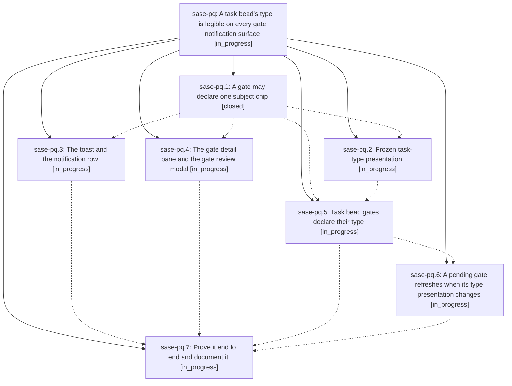

# Bead: sase-pq — A task bead's type is legible on every gate notification surface

[Bead Pages](../README.md) / sase-pq

**Status:** ◐ in_progress · **Type:** ▸ plan · **Tier:** epic
**Owner:** `bryanbugyi34@gmail.com` · **Created by:** [bbugyi200.athena.060](https://github.com/sase-org/sase--agents/blob/main/families/bbugyi200.athena.060.md) · **Assignee:** `sase-pq.land`
**Created:** 2026-08-18 09:38:04 EDT
**Plan:** [202608/task\_type\_gate\_presentation.md](https://github.com/sase-org/sase--plans/blob/main/202608/task_type_gate_presentation.md)

## Description

A typed task bead's `task_type` is visible, correct, and identically styled everywhere its triage or wake gate appears — the ACE toast, the notification row, the gate detail pane, the gate review modal, the Markdown preview, and the mobile wire — carried as presentation frozen into the gate at creation time, so no render path reads the task-type registry and no surface can disagree with another.

## Phases

| Bead | Title | Status | Size | Created | Agents | Commits |
|---|---|---|---|---|---:|---:|
| [sase-pq.1](sase-pq.1.md) | A gate may declare one subject chip | ✓ closed | medium | 2026-08-18 | 1 | 1 |
| [sase-pq.2](sase-pq.2.md) | Frozen task-type presentation | ◐ in_progress | medium | 2026-08-18 | 1 | 0 |
| [sase-pq.3](sase-pq.3.md) | The toast and the notification row | ◐ in_progress | medium | 2026-08-18 | 1 | 0 |
| [sase-pq.4](sase-pq.4.md) | The gate detail pane and the gate review modal | ◐ in_progress | medium | 2026-08-18 | 1 | 0 |
| [sase-pq.5](sase-pq.5.md) | Task bead gates declare their type | ◐ in_progress | medium | 2026-08-18 | 1 | 0 |
| [sase-pq.6](sase-pq.6.md) | A pending gate refreshes when its type presentation changes | ◐ in_progress | small | 2026-08-18 | 1 | 0 |
| [sase-pq.7](sase-pq.7.md) | Prove it end to end and document it | ◐ in_progress | medium | 2026-08-18 | 1 | 0 |

## Lineage

## Agents

| Agent | Bead | Commits |
|---|---|---:|
| [bbugyi200.athena.sase-pq.1](https://github.com/sase-org/sase--agents/blob/main/agents/bbugyi200.athena.sase-pq.1/README.md) | [sase-pq.1](sase-pq.1.md) | 1 |
| [bbugyi200.athena.sase-pq.2](https://github.com/sase-org/sase--agents/blob/main/agents/bbugyi200.athena.sase-pq.2/README.md) | [sase-pq.2](sase-pq.2.md) | 0 |
| [bbugyi200.athena.sase-pq.3](https://github.com/sase-org/sase--agents/blob/main/agents/bbugyi200.athena.sase-pq.3/README.md) | [sase-pq.3](sase-pq.3.md) | 0 |
| [bbugyi200.athena.sase-pq.4](https://github.com/sase-org/sase--agents/blob/main/agents/bbugyi200.athena.sase-pq.4/README.md) | [sase-pq.4](sase-pq.4.md) | 0 |
| [bbugyi200.athena.sase-pq.5](https://github.com/sase-org/sase--agents/blob/main/agents/bbugyi200.athena.sase-pq.5/README.md) | [sase-pq.5](sase-pq.5.md) | 0 |
| [bbugyi200.athena.sase-pq.6](https://github.com/sase-org/sase--agents/blob/main/agents/bbugyi200.athena.sase-pq.6/README.md) | [sase-pq.6](sase-pq.6.md) | 0 |
| [bbugyi200.athena.sase-pq.7](https://github.com/sase-org/sase--agents/blob/main/agents/bbugyi200.athena.sase-pq.7/README.md) | [sase-pq.7](sase-pq.7.md) | 0 |
| [bbugyi200.athena.sase-pq.land](https://github.com/sase-org/sase--agents/blob/main/agents/bbugyi200.athena.sase-pq.land/README.md) | [sase-pq](README.md) | 0 |

## Commits

| Repo | Commit | Subject | Bead | Committed |
|---|---|---|---|---|
| sase | [`4cca5f2`](https://github.com/sase-org/sase/commit/4cca5f2ce0e2fe43bf4bd192ef3d8d2f9d230a3d) | feat(notification\_gates): add generic presentation.chip subject field | [sase-pq.1](sase-pq.1.md) | 2026-08-18 10:14:00 EDT |
