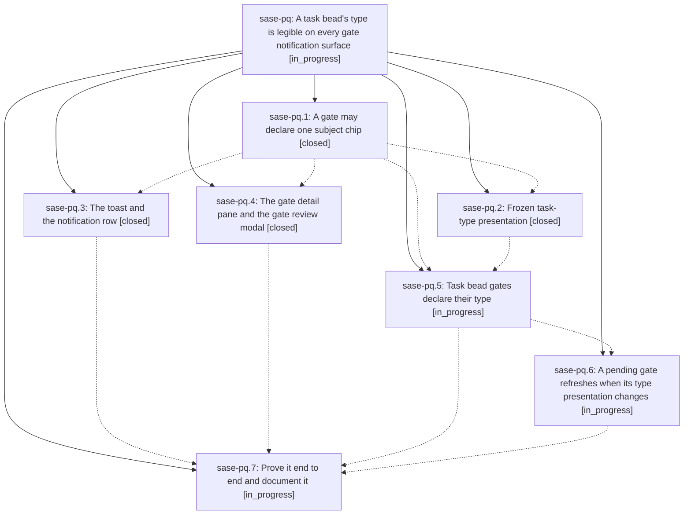

# Bead: sase-pq — A task bead's type is legible on every gate notification surface

[Bead Pages](../README.md) / sase-pq

**Status:** ◐ in_progress · **Type:** ▸ plan · **Tier:** epic
**Owner:** `bryanbugyi34@gmail.com` · **Created by:** [bbugyi200.athena.060](https://github.com/sase-org/sase--agents/blob/main/families/bbugyi200.athena.060.md) · **Assignee:** `sase-pq.land`
**Created:** 2026-08-18 09:38:04 EDT
**Plan:** [202608/task\_type\_gate\_presentation.md](https://github.com/sase-org/sase--plans/blob/main/202608/task_type_gate_presentation.md)

## Description

A typed task bead's `task_type` is visible, correct, and identically styled everywhere its triage or wake gate appears — the ACE toast, the notification row, the gate detail pane, the gate review modal, the Markdown preview, and the mobile wire — carried as presentation frozen into the gate at creation time, so no render path reads the task-type registry and no surface can disagree with another.

## Notes

[2026-08-18T14:59:47Z · 05z.f0.f0] DISCOVERED ISSUE: just check is red on an unrelated monitor-phase-rendering tree because Justfile:_lint-symvision still has --epic-symbol sase-pq.3(gate_chip_from_action_data) after phase sase-pq.3 closed at 2026-08-18T14:40:41Z. The phase close note says the Justfile dropped the entry and sase bead epic-symbols sase-pq.3 reported no leftovers, but HEAD 4cca5f2ce still has the line. gate_chip_from_action_data is still unused outside tests/src/sase/notification_gates/presentation.py; later open phases (.4-.7) are the intended consumers. Re-key to the consuming phase or drop the entry once a real consumer lands. Recorded as +1 on sase-o7 as well.

[2026-08-18T15:19:05Z · 06a] COORDINATION (from an agent planning a separate 'flag task bead type' epic; that plan is pending approval, so treat this as a heads-up, not a dependency):

WHAT IS COMING: sase's feature-flag beads are being migrated off the dedicated 'flag' ISSUE type onto ordinary task beads carrying a new 'flag' TASK type declared in sase/sase.yml's bead.task_types. The 'flag' issue type, FlagRecord, and BeadFlagWire are then deleted outright, which is also what frees 'flag' from RESERVED_TASK_TYPE_SLUGS in sase-core.

WHY IT TOUCHES THIS EPIC: once that lands, the FlagTriage gate is a TASK-BEAD gate, exactly like TaskTriage and BeadSnooze, and it should declare the same frozen presentation.chip this epic built (a '⚑ flag' chip on the toast, the notification row, the gate detail pane, the gate review modal, the Markdown preview, and the mobile wire).

THE ONE THING TO AVOID: please do not hard-code the set of task-bead gate kinds to exactly {task_triage, bead_snooze} in sase-pq.5's freezing path, sase-pq.6's fingerprint/format-version path, or sase-pq.7's end-to-end test and docs. A third kind (flag_triage) is arriving and will need the identical treatment. Keying off 'the gate's subject bead is a task bead with a task_type' rather than off an enumerated kind list will make that a no-op instead of a rewrite.

EXPECTED FILE OVERLAP (this epic lands first; the flag epic will rebase onto it):
  - src/sase/scripts/_bead_task_triage_gates.py (presentation_fingerprint currently grows a 'flag' block from issue.flag; that block will be rebuilt from task_type_fields)
  - src/sase/scripts/_bead_task_triage_state.py (gateable_beads switches from issue_type == FLAG to task_type == 'flag')
  - src/sase/notification_gates/kind_validation/flag_triage.py (should get the same rebuild-and-compare treatment sase-pq.5 gives task_triage)
  - src/sase/task_type_gate_presentation.py and src/sase/notification_gates/presentation.py (consumers only)
  - src/sase/task_types/_validation.py (_RESERVED_ACCENT_COLORS' comment says 'the four issue-type accents'; it becomes three, and #FF875F moves from the flag issue-type accent to the pinned 'flag' task-type accent)

No action is required from this epic beyond that one avoidance. Notes with the same content are on sase-pq.5 and sase-pq.7.

## Phases

| Bead | Title | Status | Size | Created | Agents | Commits |
|---|---|---|---|---|---:|---:|
| [sase-pq.1](sase-pq.1.md) | A gate may declare one subject chip | ✓ closed | medium | 2026-08-18 | 1 | 1 |
| [sase-pq.2](sase-pq.2.md) | Frozen task-type presentation | ✓ closed | medium | 2026-08-18 | 1 | 1 |
| [sase-pq.3](sase-pq.3.md) | The toast and the notification row | ✓ closed | medium | 2026-08-18 | 1 | 1 |
| [sase-pq.4](sase-pq.4.md) | The gate detail pane and the gate review modal | ✓ closed | medium | 2026-08-18 | 1 | 1 |
| [sase-pq.5](sase-pq.5.md) | Task bead gates declare their type | ◐ in_progress | medium | 2026-08-18 | 1 | 0 |
| [sase-pq.6](sase-pq.6.md) | A pending gate refreshes when its type presentation changes | ◐ in_progress | small | 2026-08-18 | 1 | 0 |
| [sase-pq.7](sase-pq.7.md) | Prove it end to end and document it | ◐ in_progress | medium | 2026-08-18 | 1 | 0 |

## Lineage

## Agents

| Agent | Bead | Commits |
|---|---|---:|
| [bbugyi200.athena.sase-pq.1](https://github.com/sase-org/sase--agents/blob/main/agents/bbugyi200.athena.sase-pq.1/README.md) | [sase-pq.1](sase-pq.1.md) | 1 |
| [bbugyi200.athena.sase-pq.2](https://github.com/sase-org/sase--agents/blob/main/agents/bbugyi200.athena.sase-pq.2/README.md) | [sase-pq.2](sase-pq.2.md) | 1 |
| [bbugyi200.athena.sase-pq.3](https://github.com/sase-org/sase--agents/blob/main/agents/bbugyi200.athena.sase-pq.3/README.md) | [sase-pq.3](sase-pq.3.md) | 1 |
| [bbugyi200.athena.sase-pq.4](https://github.com/sase-org/sase--agents/blob/main/families/bbugyi200.athena.sase-pq.4.md) | [sase-pq.4](sase-pq.4.md) | 1 |
| [bbugyi200.athena.sase-pq.5](https://github.com/sase-org/sase--agents/blob/main/agents/bbugyi200.athena.sase-pq.5/README.md) | [sase-pq.5](sase-pq.5.md) | 0 |
| [bbugyi200.athena.sase-pq.6](https://github.com/sase-org/sase--agents/blob/main/agents/bbugyi200.athena.sase-pq.6/README.md) | [sase-pq.6](sase-pq.6.md) | 0 |
| [bbugyi200.athena.sase-pq.7](https://github.com/sase-org/sase--agents/blob/main/agents/bbugyi200.athena.sase-pq.7/README.md) | [sase-pq.7](sase-pq.7.md) | 0 |
| [bbugyi200.athena.sase-pq.land](https://github.com/sase-org/sase--agents/blob/main/agents/bbugyi200.athena.sase-pq.land/README.md) | [sase-pq](README.md) | 0 |

## Commits

| Repo | Commit | Subject | Bead | Committed |
|---|---|---|---|---|
| sase | [`4cca5f2`](https://github.com/sase-org/sase/commit/4cca5f2ce0e2fe43bf4bd192ef3d8d2f9d230a3d) | feat(notification\_gates): add generic presentation.chip subject field | [sase-pq.1](sase-pq.1.md) | 2026-08-18 10:14:00 EDT |
| sase | [`5df9ed7`](https://github.com/sase-org/sase/commit/5df9ed7600535b957e4826c1797b5c9d0dc57114) | feat(tui): show task-type chips on bead-gate toasts and rows | [sase-pq.3](sase-pq.3.md) | 2026-08-18 10:42:39 EDT |
| sase | [`097a1a7`](https://github.com/sase-org/sase/commit/097a1a75145848c530bb68ea1d4588245f1a1b0c) | feat(task-types): freeze task-type presentation at gate-creation time | [sase-pq.2](sase-pq.2.md) | 2026-08-18 10:53:00 EDT |
| sase | [`8786a35`](https://github.com/sase-org/sase/commit/8786a35717f7e9b67641e6234bf495418885b2d9) | feat(tui): show declared gate chips on pane and review modal | [sase-pq.4](sase-pq.4.md) | 2026-08-18 11:30:05 EDT |
