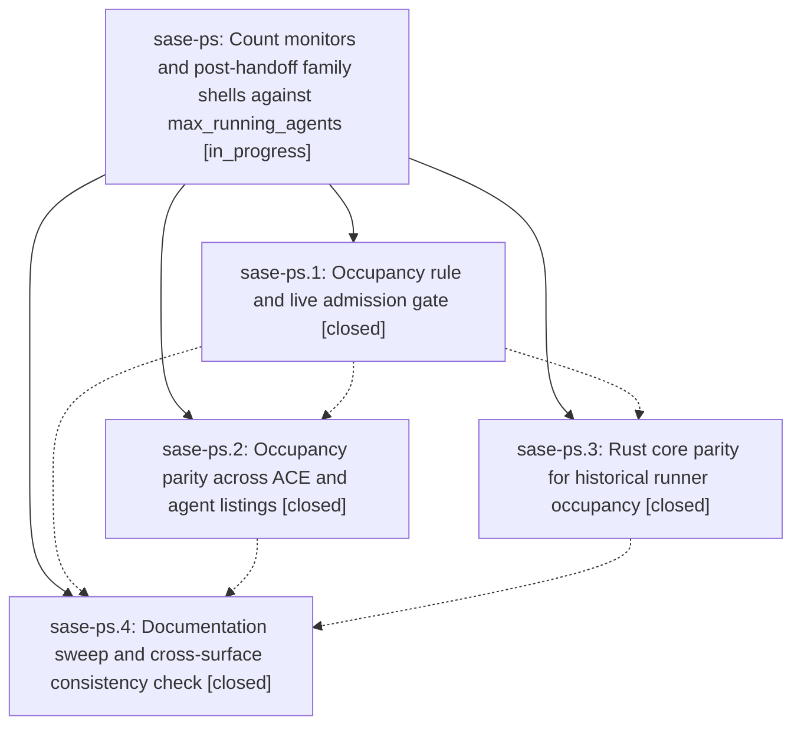

# Bead: sase-ps — Count monitors and post-handoff family shells against max\_running\_agents

[Bead Pages](../README.md) / sase-ps

**Status:** ◐ in_progress · **Type:** ▸ plan · **Tier:** epic
**Owner:** `bryanbugyi34@gmail.com` · **Created by:** [bbugyi200.athena.063](https://github.com/sase-org/sase--agents/blob/main/families/bbugyi200.athena.063.md) · **Assignee:** `sase-ps.land`
**Created:** 2026-08-18 10:20:04 EDT
**Plan:** [202608/monitor\_runner\_slots.md](https://github.com/sase-org/sase--plans/blob/main/202608/monitor_runner_slots.md)

## Description

A running sase agent holds exactly one runner slot for as long as any of its shells is alive — including its monitor proc shells and every agent shell launched after a monitor handoff — so max_running_agents is the real ceiling on concurrent agents on this host, and every surface that reports occupancy agrees with the admission gate.

## Phases

| Bead | Title | Status | Size | Created | Agents | Commits |
|---|---|---|---|---|---:|---:|
| [sase-ps.1](sase-ps.1.md) | Occupancy rule and live admission gate | ✓ closed | medium | 2026-08-18 | 1 | 1 |
| [sase-ps.2](sase-ps.2.md) | Occupancy parity across ACE and agent listings | ✓ closed | medium | 2026-08-18 | 1 | 1 |
| [sase-ps.3](sase-ps.3.md) | Rust core parity for historical runner occupancy | ✓ closed | medium | 2026-08-18 | 1 | 2 |
| [sase-ps.4](sase-ps.4.md) | Documentation sweep and cross-surface consistency check | ✓ closed | small | 2026-08-18 | 1 | 1 |

## Lineage

## Agents

| Agent | Bead | Commits |
|---|---|---:|
| [bbugyi200.athena.sase-ps.1](https://github.com/sase-org/sase--agents/blob/main/agents/bbugyi200.athena.sase-ps.1/README.md) | [sase-ps.1](sase-ps.1.md) | 1 |
| [bbugyi200.athena.sase-ps.2](https://github.com/sase-org/sase--agents/blob/main/families/bbugyi200.athena.sase-ps.2.md) | [sase-ps.2](sase-ps.2.md) | 1 |
| [bbugyi200.athena.sase-ps.3](https://github.com/sase-org/sase--agents/blob/main/agents/bbugyi200.athena.sase-ps.3/README.md) | [sase-ps.3](sase-ps.3.md) | 2 |
| [bbugyi200.athena.sase-ps.4](https://github.com/sase-org/sase--agents/blob/main/agents/bbugyi200.athena.sase-ps.4/README.md) | [sase-ps.4](sase-ps.4.md) | 1 |
| [bbugyi200.athena.sase-ps.land](https://github.com/sase-org/sase--agents/blob/main/agents/bbugyi200.athena.sase-ps.land/README.md) | [sase-ps](README.md) | 1 |

## Commits

| Repo | Commit | Subject | Bead | Committed |
|---|---|---|---|---|
| sase | [`63accbf`](https://github.com/sase-org/sase/commit/63accbfc9979f46e1ee39204f3786a269de8c624) | fix(runner-slots): count monitors and post-handoff shells against max\_running\_agents | [sase-ps.1](sase-ps.1.md) | 2026-08-18 11:02:26 EDT |
| sase-core | [`sase-core@769b9bc`](https://github.com/sase-org/sase-core/commit/769b9bc8fb2195e8deb91a67044f98e937e7448c) | fix(agent\_stats): count family shells in historical runner occupancy | [sase-ps.3](sase-ps.3.md) | 2026-08-18 12:00:26 EDT |
| sase | [`746c807`](https://github.com/sase-org/sase/commit/746c807051fc11b107bec62c475cd738d8716296) | test(stats): assert Rust historical occupancy matches Python slot count | [sase-ps.3](sase-ps.3.md) | 2026-08-18 12:03:38 EDT |
| sase | [`f9a1afa`](https://github.com/sase-org/sase/commit/f9a1afae747f49021ca96a203ca76a8ace3a08e9) | fix(agent): count runner-slot occupancy the same way in ACE and agent listing | [sase-ps.2](sase-ps.2.md) | 2026-08-18 12:07:08 EDT |
| sase | [`5bb381f`](https://github.com/sase-org/sase/commit/5bb381f4a22eb2943a13e4eefcaaae5c34cfd86e) | docs(runner-slots): document serial-family occupancy including monitors | [sase-ps.4](sase-ps.4.md) | 2026-08-18 12:44:05 EDT |
| sase | [`da8be0e`](https://github.com/sase-org/sase/commit/da8be0ea95115c10257fe6e4b9af6f65ba6e744b) | test(visual): rebaseline the Statistics runners golden for the new legend | [sase-ps](README.md) | 2026-08-18 14:44:34 EDT |
