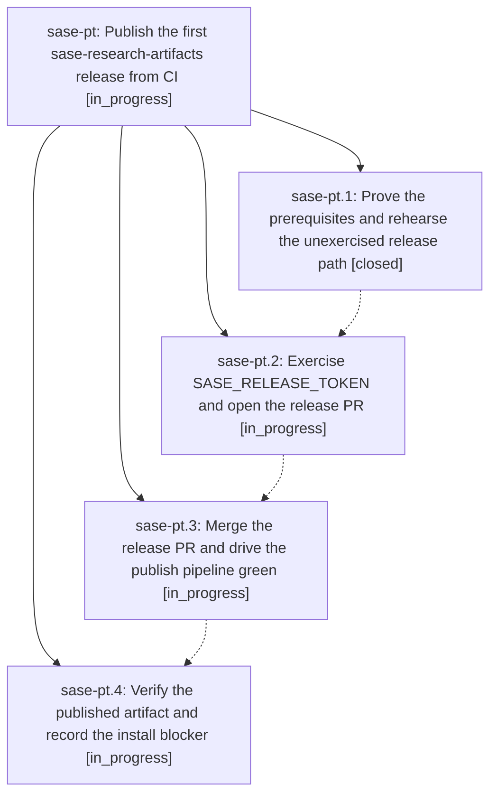

# Bead: sase-pt — Publish the first sase-research-artifacts release from CI

[Bead Pages](../README.md) / sase-pt

**Status:** ◐ in_progress · **Type:** ▸ plan · **Tier:** epic
**Owner:** `bryanbugyi34@gmail.com` · **Created by:** [bbugyi200.athena.064](https://github.com/sase-org/sase--agents/blob/main/families/bbugyi200.athena.064.md) · **Assignee:** `sase-pt.land`
**Created:** 2026-08-18 10:34:46 EDT
**Plan:** [202608/research\_artifacts\_first\_release.md](https://github.com/sase-org/sase--plans/blob/main/202608/research_artifacts_first_release.md)

## Description

sase-research-artifacts has a real GitHub release and a matching distribution on PyPI, published end to end by the repo's own Publish workflow, with the SASE_RELEASE_TOKEN and trusted-publishing prerequisites proven rather than assumed.

## Phases

| Bead | Title | Status | Size | Created | Agents | Commits |
|---|---|---|---|---|---:|---:|
| [sase-pt.1](sase-pt.1.md) | Prove the prerequisites and rehearse the unexercised release path | ✓ closed | medium | 2026-08-18 | 1 | 0 |
| [sase-pt.2](sase-pt.2.md) | Exercise SASE\_RELEASE\_TOKEN and open the release PR | ◐ in_progress | small | 2026-08-18 | 1 | 2 |
| [sase-pt.3](sase-pt.3.md) | Merge the release PR and drive the publish pipeline green | ◐ in_progress | medium | 2026-08-18 | 1 | 0 |
| [sase-pt.4](sase-pt.4.md) | Verify the published artifact and record the install blocker | ◐ in_progress | small | 2026-08-18 | 1 | 0 |

## Lineage

## Agents

| Agent | Bead | Commits |
|---|---|---:|
| [bbugyi200.athena.sase-pt.1](https://github.com/sase-org/sase--agents/blob/main/families/bbugyi200.athena.sase-pt.1.md) | [sase-pt.1](sase-pt.1.md) | 0 |
| [bbugyi200.athena.sase-pt.2](https://github.com/sase-org/sase--agents/blob/main/families/bbugyi200.athena.sase-pt.2.md) | [sase-pt.2](sase-pt.2.md) | 2 |
| [bbugyi200.athena.sase-pt.3](https://github.com/sase-org/sase--agents/blob/main/agents/bbugyi200.athena.sase-pt.3/README.md) | [sase-pt.3](sase-pt.3.md) | 0 |
| [bbugyi200.athena.sase-pt.4](https://github.com/sase-org/sase--agents/blob/main/agents/bbugyi200.athena.sase-pt.4/README.md) | [sase-pt.4](sase-pt.4.md) | 0 |
| [bbugyi200.athena.sase-pt.land](https://github.com/sase-org/sase--agents/blob/main/agents/bbugyi200.athena.sase-pt.land/README.md) | [sase-pt](README.md) | 0 |

## Commits

| Repo | Commit | Subject | Bead | Committed |
|---|---|---|---|---|
| sase-research-artifacts | [`sase-research-artifacts@a5a6b1b`](https://github.com/sase-org/sase-research-artifacts/commit/a5a6b1b65dbf0c67e8375cc9c15b2a8604122f4d) | docs: mention the optional wait argument on #research\_swarm | [sase-pt.2](sase-pt.2.md) | 2026-08-18 10:58:08 EDT |
| sase-research-artifacts | [`sase-research-artifacts@23367af`](https://github.com/sase-org/sase-research-artifacts/commit/23367aff1ac6ae588dc290d59886738771e4ad35) | docs: state the Python and sase version requirements in the README | [sase-pt.2](sase-pt.2.md) | 2026-08-18 11:03:10 EDT |
