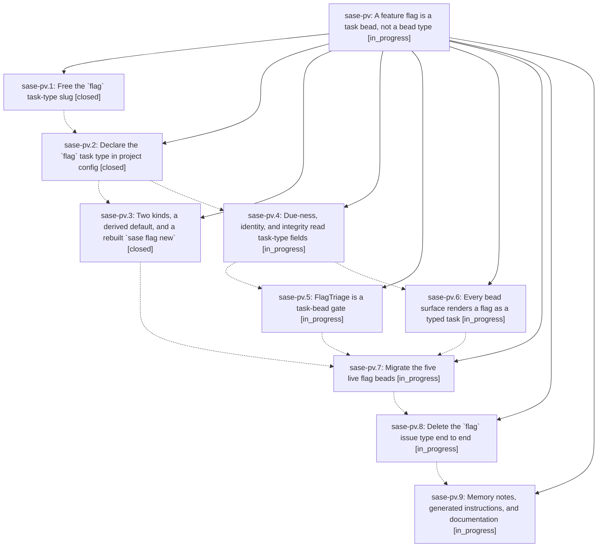

# Bead: sase-pv — A feature flag is a task bead, not a bead type

[Bead Pages](../README.md) / sase-pv

**Status:** ◐ in_progress · **Type:** ▸ plan · **Tier:** epic
**Owner:** `bryanbugyi34@gmail.com` · **Created by:** [bbugyi200.athena.06a](https://github.com/sase-org/sase--agents/blob/main/families/bbugyi200.athena.06a.md) · **Assignee:** `sase-pv.land`
**Created:** 2026-08-18 11:26:02 EDT
**Plan:** [202608/flag\_task\_type.md](https://github.com/sase-org/sase--plans/blob/main/202608/flag_task_type.md)

## Description

SASE feature flags stop being a bespoke bead type and become ordinary task beads of a project-local `flag` task type whose required fields force every new flag to record what its two branches do and what has to be true before the losing branch is deleted. The `flag` issue type, `FlagRecord`, and `BeadFlagWire` are gone; only `beta` and `sunset` kinds survive; and the five live flag beads are migrated in place.

## Phases

| Bead | Title | Status | Size | Created | Agents | Commits |
|---|---|---|---|---|---:|---:|
| [sase-pv.1](sase-pv.1.md) | Free the \`flag\` task-type slug | ✓ closed | small | 2026-08-18 | 1 | 2 |
| [sase-pv.2](sase-pv.2.md) | Declare the \`flag\` task type in project config | ✓ closed | small | 2026-08-18 | 1 | 1 |
| [sase-pv.3](sase-pv.3.md) | Two kinds, a derived default, and a rebuilt \`sase flag new\` | ✓ closed | medium | 2026-08-18 | 1 | 1 |
| [sase-pv.4](sase-pv.4.md) | Due-ness, identity, and integrity read task-type fields | ◐ in_progress | medium | 2026-08-18 | 1 | 0 |
| [sase-pv.5](sase-pv.5.md) | FlagTriage is a task-bead gate | ◐ in_progress | medium | 2026-08-18 | 1 | 0 |
| [sase-pv.6](sase-pv.6.md) | Every bead surface renders a flag as a typed task | ◐ in_progress | medium | 2026-08-18 | 1 | 0 |
| [sase-pv.7](sase-pv.7.md) | Migrate the five live flag beads | ◐ in_progress | medium | 2026-08-18 | 1 | 0 |
| [sase-pv.8](sase-pv.8.md) | Delete the \`flag\` issue type end to end | ◐ in_progress | medium | 2026-08-18 | 1 | 0 |
| [sase-pv.9](sase-pv.9.md) | Memory notes, generated instructions, and documentation | ◐ in_progress | medium | 2026-08-18 | 1 | 0 |

## Lineage

## Agents

| Agent | Bead | Commits |
|---|---|---:|
| [bbugyi200.athena.sase-pv.1](https://github.com/sase-org/sase--agents/blob/main/families/bbugyi200.athena.sase-pv.1.md) | [sase-pv.1](sase-pv.1.md) | 2 |
| [bbugyi200.athena.sase-pv.2](https://github.com/sase-org/sase--agents/blob/main/agents/bbugyi200.athena.sase-pv.2/README.md) | [sase-pv.2](sase-pv.2.md) | 1 |
| [bbugyi200.athena.sase-pv.3](https://github.com/sase-org/sase--agents/blob/main/agents/bbugyi200.athena.sase-pv.3/README.md) | [sase-pv.3](sase-pv.3.md) | 1 |
| [bbugyi200.athena.sase-pv.4](https://github.com/sase-org/sase--agents/blob/main/agents/bbugyi200.athena.sase-pv.4/README.md) | [sase-pv.4](sase-pv.4.md) | 0 |
| [bbugyi200.athena.sase-pv.5](https://github.com/sase-org/sase--agents/blob/main/agents/bbugyi200.athena.sase-pv.5/README.md) | [sase-pv.5](sase-pv.5.md) | 0 |
| [bbugyi200.athena.sase-pv.6](https://github.com/sase-org/sase--agents/blob/main/agents/bbugyi200.athena.sase-pv.6/README.md) | [sase-pv.6](sase-pv.6.md) | 0 |
| [bbugyi200.athena.sase-pv.7](https://github.com/sase-org/sase--agents/blob/main/agents/bbugyi200.athena.sase-pv.7/README.md) | [sase-pv.7](sase-pv.7.md) | 0 |
| [bbugyi200.athena.sase-pv.8](https://github.com/sase-org/sase--agents/blob/main/agents/bbugyi200.athena.sase-pv.8/README.md) | [sase-pv.8](sase-pv.8.md) | 0 |
| [bbugyi200.athena.sase-pv.9](https://github.com/sase-org/sase--agents/blob/main/agents/bbugyi200.athena.sase-pv.9/README.md) | [sase-pv.9](sase-pv.9.md) | 0 |
| [bbugyi200.athena.sase-pv.land](https://github.com/sase-org/sase--agents/blob/main/agents/bbugyi200.athena.sase-pv.land/README.md) | [sase-pv](README.md) | 0 |

## Commits

| Repo | Commit | Subject | Bead | Committed |
|---|---|---|---|---|
| sase-core | [`sase-core@3f4e773`](https://github.com/sase-org/sase-core/commit/3f4e7733703454904a15848a33298713591895e6) | feat(task\_type): drop flag from reserved task-type slugs | [sase-pv.1](sase-pv.1.md) | 2026-08-18 12:25:44 EDT |
| sase | [`24ce7e0`](https://github.com/sase-org/sase/commit/24ce7e0569ed94368acbbe518607d29594753bbe) | test: accept flag as a claimable task-type slug | [sase-pv.1](sase-pv.1.md) | 2026-08-18 12:29:18 EDT |
| sase | [`88d2a15`](https://github.com/sase-org/sase/commit/88d2a1582a1d4a94f75e55fc61c230f049b75691) | feat(task-types): declare the project-local flag task type | [sase-pv.2](sase-pv.2.md) | 2026-08-18 12:57:33 EDT |
| sase | [`98b27e8`](https://github.com/sase-org/sase/commit/98b27e849c3a3b562dc9f9a1c389945a73f26d4a) | feat(feature-flags)!: collapse flag kinds and rebuild flag new on typed task beads | [sase-pv.3](sase-pv.3.md) | 2026-08-18 13:40:50 EDT |
