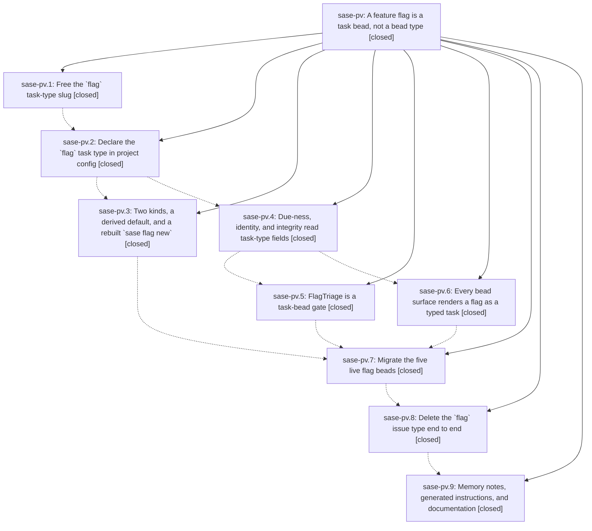

# Bead: sase-pv — A feature flag is a task bead, not a bead type

[Bead Pages](../README.md) / sase-pv

**Status:** ✓ closed · **Resolution:** done · **Type:** ▸ plan · **Tier:** epic
**Owner:** `bryanbugyi34@gmail.com` · **Created by:** [bbugyi200.athena.06a](https://github.com/sase-org/sase--agents/blob/main/families/bbugyi200.athena.06a.md) · **Assignee:** `sase-pv.land`
**Created:** 2026-08-18 11:26:02 EDT · **Closed:** 2026-08-18 22:18:53 EDT
**Plan:** [202608/flag\_task\_type.md](https://github.com/sase-org/sase--plans/blob/main/202608/flag_task_type.md)

## Description

SASE feature flags stop being a bespoke bead type and become ordinary task beads of a project-local `flag` task type whose required fields force every new flag to record what its two branches do and what has to be true before the losing branch is deleted. The `flag` issue type, `FlagRecord`, and `BeadFlagWire` are gone; only `beta` and `sunset` kinds survive; and the five live flag beads are migrated in place.

## Notes

[2026-08-18T19:25:37Z · sase-ps.land] DISCOVERED ISSUE: three tests fail deterministically on master a2357e214, all from this epic's flag-CLI rebuild (98b27e849 'feat(feature-flags)!: collapse flag kinds and rebuild flag new on typed task beads' / c5a0dcf4a 'feat(flags): read flag identity and due-ness from task fields').

REPRODUCTION (workspace sase_14, clean tree at a2357e214, after 'just install'). Serial run, no parallelism, 2.60s — not the full-parallel-lane flake that task sase-pr describes:
  .venv/bin/python -m pytest -q -n 0 tests/feature_flags/test_integrity.py::test_kind_mismatch_when_default_disagrees_with_kind tests/completion/test_snapshot.py
  -> 3 failed, 2 passed

1) tests/feature_flags/test_integrity.py::test_kind_mismatch_when_default_disagrees_with_kind
   TypeError: demo_flag() got an unexpected keyword argument 'default' (tests/feature_flags/test_integrity.py:34). The test helper's signature no longer accepts 'default' after the kind collapse; the test was not updated with it.

2+3) tests/completion/test_snapshot.py::test_checked_in_snapshot_has_no_drift and ::test_current_structural_view_matches_checked_in_snapshot
   The checked-in CLI completion snapshot (tests/completion/snapshots/cli_spec.json) is stale. I diffed it structurally against the live argparse tree: no commands or options changed anywhere in the CLI except under 'sase flag new', where every difference is this epic's — kind choices went from 4 to 2 with 'ops' replaced by 'sunset'; '-r/--remove-by' became '--remove-when'; '-s/--scope' became '--when-disabled'; '-z/--size' became '--remove-when'; a '--when-enabled' option was added; the option count went 6 -> 8; and the description digest moved efa8d71a3d020af7 -> bebc50f4c03bd8c8. Regenerate with 'just' recipe at Justfile:310 / tools/sync_completion_spec.

IMPACT: 'just check-full' and any full 'just test' are red for every agent until these are fixed; 'just check' is red for anyone whose scoped selection reaches either file.

FOUND BY the sase-ps land agent (2026-08-18) during that epic's landing verification: a full 'just test' on a2357e214 gave 3 failed, 33525 passed, 13 skipped, and these were the only three. sase-ps (runner-slot occupancy) touches no flag or completion code, and all 105 runner-slot tests pass on the same tree. Recorded here rather than as a task because this epic is active and owns the change.

[2026-08-18T22:28:15Z · sase-pv.7.f0] DESIGN CHANGE (project owner directive, 2026-08-18): the `migrate` phase no longer rewrites the five flag bead event streams in place. The plan's `migrate` section considered and rejected close-old-create-new; the owner instead directed create-new + delete-old, and that is what shipped. The original design could not ship at all: `sase.bead._stream_integrity.prepare_event_streams_for_commit` refuses any edit to an already-published event (full analysis in sase-pv.7's BLOCKED note), so `issue_type` is immutable after `issue_created` through every sanctioned path.

WHAT SHIPPED IN sase-pv.7: each old flag bead was deleted with `sase bead rm` and re-created as a typed `flag` task bead through `create_flag_bead`, the same creation path `sase flag new` uses. Title, size, kind, `remove_by_date` and `remove_by_release` are preserved exactly; `when_enabled` / `when_disabled` / `remove_when` are the plan's drafts after per-flag verification against the code. Bead IDs necessarily changed, so `src/sase/feature_flags/registry.py` and `tests/feature_flags/test_consumers.py` were repointed:

  sase-nw -> sase-qe  coder_inherits_planner_chat          beta    medium  2026-11-14 / 0.18.0
  sase-nx -> sase-qf  prettier_enabled                     sunset  medium  2026-11-14 / 0.18.0
  sase-om -> sase-qg  completion_refresh_on_update         beta    small   2026-11-15 / 0.18.0
  sase-pa -> sase-qh  epic_resume_gate                     beta    small   2026-11-15 / 0.18.0
  sase-pk -> sase-qi  commit_finalizer_shared_clone_exempt sunset  medium  2026-11-16 / 0.18.0

Those two files were the only references to the old IDs anywhere in the repo.

CARRY-OVER FOR `retire` (sase-pv.8): `sase bead rm` does not delete a bead's event stream, so five tombstoned streams still carry `issue_type: "flag"` in their `issue_created` payload. `sase-pv.8` has a note with the full analysis; that phase must prune them before `IssueTypeWire::Flag` can be deleted.

[2026-08-19T02:18:53Z · sase-pv.land--3] LANDED epic sase-pv. All nine phases closed; every phase note re-read and checked
against the source and the epic's nine commits (24ce7e056, 88d2a1582, 98b27e849,
c5a0dcf4a, 65a34b909, 2b2c5edef, a469015dc, a317a2e35, 281f3c197).

VERIFIED (step 1)
- The `flag` issue type is gone, not merely unused. `IssueType` is exactly
  {plan, phase, task}; `FlagRecord`, `BeadFlagWire`, `flag_codec`, `FlagScope`,
  and the `flag(...)` create grammar have no remaining reference in src/ or
  tools/. sase-core shipped the matching wire deletion and it is RELEASED, not
  just committed: v0.29.0 (d80fa83 "feat(bead)!: delete the flag issue type",
  3f4e773 reserved-slug drop, c121e0e task_type_fields on update). The linked
  sase-core checkout is clean at fa7ced2 with no uncommitted work, closing out
  sase-pv.4's "still uncommitted" caveat.
- Only `beta` and `sunset` kinds survive and `default` is derived from `kind`.
  `sase flag new` requires --when-enabled/--when-disabled/--remove-when (each
  accepting @<path>), offers -k {beta,sunset}, and has no --scope.
- The seven-field `flag` task type is declared in this project's sase/sase.yml
  with glyph U+2691, accent #FF875F, agent_creatable false, triage
  min_plus_ones 0, and the committed sase/task_types.json snapshot agrees.
- The five live flags are typed task beads: sase-qe, sase-qf, sase-qg, sase-qh,
  sase-qi. `sase bead list -T flag` shows all five with their preserved sizes
  and countdowns (88d/88d/89d/89d/90d, all v0.18.0); `sase bead show sase-qe`
  renders the typed FLAG block plus the rendered body template and its
  PROVENANCE note naming sase-nw.
- sase-pv.7's CARRY-OVER is discharged: the five tombstoned flag event streams
  (sase-nw, sase-nx, sase-om, sase-pa, sase-pk) are gone from the store, so
  nothing still carries issue_type "flag".
- `just _lint-flags` green; `sase bead doctor` reports nothing flag-related
  (its remaining warnings are pre-existing and unrelated).
- The epic's own DISCOVERED ISSUE note (three deterministic failures at
  a2357e214: the completion-spec drift and the demo_flag(default=...) integrity
  test) was fixed inside sase-pv.6 and is confirmed dead: tests/feature_flags,
  tests/completion, tests/task_types, and tests/test_bead/test_flag_fields.py
  run 287 passed, 1 skipped.
- Memory and docs are regenerated: sase/memory/sase_flags.md and
  feature_flags.md describe two kinds and the Off-branch removal rule, and no
  doc, memory note, or AGENTS.md text still calls a flag an issue type.

INTEGRATED (step 2)
- Real gap found and fixed. sase-pv.8 added
  `require_rust_binding("bead_needs_drop_flag_type_migration")` and
  `..._drop_flag_type_migration_sql")`, which exist only in sase-core 0.29.0,
  but pyproject.toml still declared `sase-core-rs>=0.27.18,<0.28.0`. The window
  excluded every release that has them, so CI's release-core-floor-smoke leg
  (`tools/check_sase_core_rs_bindings` against the exact declared floor) would
  have failed and a published install would have crashed on the first bead
  read. This is precisely the skew that gate was written for. No phase could
  have caught it: sase-core-rs 0.29.0 was not uploaded to PyPI until
  2026-08-19T00:50:15Z, after sase-pv.8 closed. Fixed with the sanctioned tool,
  `tools/ratchet_core_window`, taking the window to `>=0.29.0,<0.30.0` and
  regenerating uv.lock. `tools/probe_core_floor --advisory` went from
  "stale_actionable: missing 11 capability(s)" to clean; it had named this
  epic's d80fa83 for two of the eleven. The other nine belonged to the
  task-type and workspace-occupancy epics and are fixed by the same ratchet.
- That ratchet exposed a second defect it had to fix to land:
  tests/test_powerful_variables_landing.py hardcoded the ceiling
  (`,<0\.28\.0$`) in _CORE_FLOOR_RE, so any window move made the guard fail
  with "sase-core-rs dependency is missing from pyproject.toml". That defeats
  the guard's own documented intent ("Compare rather than pin ... an
  exact-string guard would fail every ratchet"). The regex now accepts any
  ceiling and still compares the floor.
- Reviewed every non-epic commit since 24ce7e056 for conflict or duplication.
  Nothing else needed rework: `sase flag new`'s @<path> support already routes
  through the shared `sase.cli_file_values.read_at_path_value` added by
  771454166 rather than duplicating it; 509170484's flake triage bump does not
  touch the flag type's `triage.min_plus_ones: 0`; and the stale --epic-symbol
  entries sase-pv.1 and sase-pv.5 had re-keyed to sase-pq and sase-pw are gone,
  resolved by a3765f857 and 8437cfd9c.

FOLLOW-UPS (step 3) - both phase proposals routed, no new bead created
- sase-pv.8's flake, test_ace_page_fast_startup_is_structurally_quiet: duplicate
  of open task sase-oz. Corroborated with `sase bead +1 sase-oz` (now +7),
  contributing the detail earlier reports lacked - the leftover work is a
  cancelled `sase-artifacts-project-choices` task, not just "a worker".
- sase-pv.9's flake,
  test_cross_navigation_and_escape_surface_disabled_workspaces: duplicate of
  sase-qo, which sase-qd.land root-caused and fixed at 2026-08-19T01:12:58Z
  (ec048b168's resolve-completion repaint overtaking OptionHighlighted and
  repainting from the stale bookmark). Not +1'd: the bead is closed with a real
  fix and my repro tree predates it, so a +1 would only record stale-window
  evidence. It reproduces 2/3 on master de06c55ca because that fix has not been
  committed yet; it is sase-qd's to land, not this epic's.
- Every other PROPOSED FOLLOW-UP across the nine phases was

… and 6967 more characters

## Phases

| Bead | Title | Status | Size | Created | Agents | Commits |
|---|---|---|---|---|---:|---:|
| [sase-pv.1](sase-pv.1.md) | Free the \`flag\` task-type slug | ✓ closed | small | 2026-08-18 | 1 | 2 |
| [sase-pv.2](sase-pv.2.md) | Declare the \`flag\` task type in project config | ✓ closed | small | 2026-08-18 | 1 | 1 |
| [sase-pv.3](sase-pv.3.md) | Two kinds, a derived default, and a rebuilt \`sase flag new\` | ✓ closed | medium | 2026-08-18 | 1 | 1 |
| [sase-pv.4](sase-pv.4.md) | Due-ness, identity, and integrity read task-type fields | ✓ closed | medium | 2026-08-18 | 1 | 2 |
| [sase-pv.5](sase-pv.5.md) | FlagTriage is a task-bead gate | ✓ closed | medium | 2026-08-18 | 1 | 1 |
| [sase-pv.6](sase-pv.6.md) | Every bead surface renders a flag as a typed task | ✓ closed | medium | 2026-08-18 | 1 | 1 |
| [sase-pv.7](sase-pv.7.md) | Migrate the five live flag beads | ✓ closed | medium | 2026-08-18 | 1 | 0 |
| [sase-pv.8](sase-pv.8.md) | Delete the \`flag\` issue type end to end | ✓ closed | medium | 2026-08-18 | 1 | 2 |
| [sase-pv.9](sase-pv.9.md) | Memory notes, generated instructions, and documentation | ✓ closed | medium | 2026-08-18 | 1 | 1 |

## Lineage

## Agents

| Agent | Bead | Commits |
|---|---|---:|
| [bbugyi200.athena.sase-pv.1](https://github.com/sase-org/sase--agents/blob/main/families/bbugyi200.athena.sase-pv.1.md) | [sase-pv.1](sase-pv.1.md) | 2 |
| [bbugyi200.athena.sase-pv.2](https://github.com/sase-org/sase--agents/blob/main/agents/bbugyi200.athena.sase-pv.2/README.md) | [sase-pv.2](sase-pv.2.md) | 1 |
| [bbugyi200.athena.sase-pv.3](https://github.com/sase-org/sase--agents/blob/main/agents/bbugyi200.athena.sase-pv.3/README.md) | [sase-pv.3](sase-pv.3.md) | 1 |
| [bbugyi200.athena.sase-pv.4](https://github.com/sase-org/sase--agents/blob/main/agents/bbugyi200.athena.sase-pv.4/README.md) | [sase-pv.4](sase-pv.4.md) | 2 |
| [bbugyi200.athena.sase-pv.5](https://github.com/sase-org/sase--agents/blob/main/agents/bbugyi200.athena.sase-pv.5/README.md) | [sase-pv.5](sase-pv.5.md) | 1 |
| [bbugyi200.athena.sase-pv.6](https://github.com/sase-org/sase--agents/blob/main/agents/bbugyi200.athena.sase-pv.6/README.md) | [sase-pv.6](sase-pv.6.md) | 1 |
| [bbugyi200.athena.sase-pv.7](https://github.com/sase-org/sase--agents/blob/main/agents/bbugyi200.athena.sase-pv.7/README.md) | [sase-pv.7](sase-pv.7.md) | 0 |
| [bbugyi200.athena.sase-pv.8](https://github.com/sase-org/sase--agents/blob/main/families/bbugyi200.athena.sase-pv.8.md) | [sase-pv.8](sase-pv.8.md) | 2 |
| [bbugyi200.athena.sase-pv.9](https://github.com/sase-org/sase--agents/blob/main/agents/bbugyi200.athena.sase-pv.9/README.md) | [sase-pv.9](sase-pv.9.md) | 1 |
| [bbugyi200.athena.sase-pv.land](https://github.com/sase-org/sase--agents/blob/main/families/bbugyi200.athena.sase-pv.land.md) | [sase-pv](README.md) | 1 |

## Commits

| Repo | Commit | Subject | Bead | Committed |
|---|---|---|---|---|
| sase-core | [`sase-core@3f4e773`](https://github.com/sase-org/sase-core/commit/3f4e7733703454904a15848a33298713591895e6) | feat(task\_type): drop flag from reserved task-type slugs | [sase-pv.1](sase-pv.1.md) | 2026-08-18 12:25:44 EDT |
| sase | [`24ce7e0`](https://github.com/sase-org/sase/commit/24ce7e0569ed94368acbbe518607d29594753bbe) | test: accept flag as a claimable task-type slug | [sase-pv.1](sase-pv.1.md) | 2026-08-18 12:29:18 EDT |
| sase | [`88d2a15`](https://github.com/sase-org/sase/commit/88d2a1582a1d4a94f75e55fc61c230f049b75691) | feat(task-types): declare the project-local flag task type | [sase-pv.2](sase-pv.2.md) | 2026-08-18 12:57:33 EDT |
| sase | [`98b27e8`](https://github.com/sase-org/sase/commit/98b27e849c3a3b562dc9f9a1c389945a73f26d4a) | feat(feature-flags)!: collapse flag kinds and rebuild flag new on typed task beads | [sase-pv.3](sase-pv.3.md) | 2026-08-18 13:40:50 EDT |
| sase | [`c5a0dcf`](https://github.com/sase-org/sase/commit/c5a0dcf4a4f3b56f548af1e02377c1c0daa9188f) | feat(flags): read flag identity and due-ness from task fields | [sase-pv.4](sase-pv.4.md) | 2026-08-18 14:13:11 EDT |
| sase-core | [`sase-core@c121e0e`](https://github.com/sase-org/sase-core/commit/c121e0ed6bfbd1e11fa4ca27ab166f7dcf63db8d) | feat(bead): persist task\_type\_fields on bead update | [sase-pv.4](sase-pv.4.md) | 2026-08-18 14:16:26 EDT |
| sase | [`65a34b9`](https://github.com/sase-org/sase/commit/65a34b9096c0ab8a301725697495d4bb340bcf64) | feat(flags): treat FlagTriage as a task-bead gate | [sase-pv.5](sase-pv.5.md) | 2026-08-18 15:32:29 EDT |
| sase | [`2b2c5ed`](https://github.com/sase-org/sase/commit/2b2c5edefe1b4e94b83c6e3016bb5245d92c75cf) | feat(beads)!: render flags as typed tasks on every bead surface | [sase-pv.6](sase-pv.6.md) | 2026-08-18 15:55:19 EDT |
| sase | [`a317a2e`](https://github.com/sase-org/sase/commit/a317a2e359e8dfc1f8428473a7ebbdd106a94b0f) | feat(bead)!: delete the flag issue type | [sase-pv.8](sase-pv.8.md) | 2026-08-18 20:18:15 EDT |
| sase-core | [`sase-core@d80fa83`](https://github.com/sase-org/sase-core/commit/d80fa834775591af9b744d5c819f3cc30cad4b71) | feat(bead)!: delete the flag issue type | [sase-pv.8](sase-pv.8.md) | 2026-08-18 20:19:13 EDT |
| sase | [`281f3c1`](https://github.com/sase-org/sase/commit/281f3c1976767bf33b68dbd2fddf9e3dc44fef6b) | docs(flags): treat flag beads as task(flag), not a fourth issue type | [sase-pv.9](sase-pv.9.md) | 2026-08-18 20:59:32 EDT |
| sase | [`915cdee`](https://github.com/sase-org/sase/commit/915cdeeefd711ea8ede50b90cad9449699712922) | build(deps): ratchet the sase-core-rs window to \>=0.29.0,\<0.30.0 | [sase-pv](README.md) | 2026-08-18 22:23:12 EDT |
