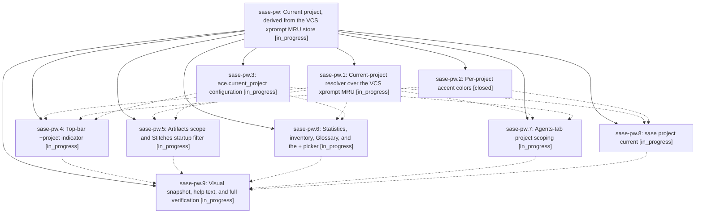

# Bead: sase-pw — Current project, derived from the VCS xprompt MRU store

[Bead Pages](../README.md) / sase-pw

**Status:** ◐ in_progress · **Type:** ▸ plan · **Tier:** epic
**Owner:** `bryanbugyi34@gmail.com` · **Created by:** [bbugyi200.athena.062.f1](https://github.com/sase-org/sase--agents/blob/main/families/bbugyi200.athena.062.f1.md) · **Assignee:** `sase-pw.land`
**Created:** 2026-08-18 11:30:28 EDT
**Plan:** [202608/current\_project.md](https://github.com/sase-org/sase--plans/blob/main/202608/current_project.md)

## Description

SASE has one "current project" derived from the VCS xprompt MRU head, shown as a uniquely colored `+<project>` chip in the ACE top bar, and used as the default project filter on every TUI surface that can filter by project.

## Phases

| Bead | Title | Status | Size | Created | Agents | Commits |
|---|---|---|---|---|---:|---:|
| [sase-pw.1](sase-pw.1.md) | Current-project resolver over the VCS xprompt MRU | ◐ in_progress | medium | 2026-08-18 | 1 | 0 |
| [sase-pw.2](sase-pw.2.md) | Per-project accent colors | ✓ closed | small | 2026-08-18 | 1 | 1 |
| [sase-pw.3](sase-pw.3.md) | ace.current\_project configuration | ◐ in_progress | small | 2026-08-18 | 1 | 0 |
| [sase-pw.4](sase-pw.4.md) | Top-bar +project indicator | ◐ in_progress | medium | 2026-08-18 | 1 | 0 |
| [sase-pw.5](sase-pw.5.md) | Artifacts scope and Stitches startup filter | ◐ in_progress | medium | 2026-08-18 | 1 | 0 |
| [sase-pw.6](sase-pw.6.md) | Statistics, inventory, Glossary, and the + picker | ◐ in_progress | medium | 2026-08-18 | 1 | 0 |
| [sase-pw.7](sase-pw.7.md) | Agents-tab project scoping | ◐ in_progress | medium | 2026-08-18 | 1 | 0 |
| [sase-pw.8](sase-pw.8.md) | sase project current | ◐ in_progress | small | 2026-08-18 | 1 | 0 |
| [sase-pw.9](sase-pw.9.md) | Visual snapshot, help text, and full verification | ◐ in_progress | small | 2026-08-18 | 1 | 0 |

## Lineage

## Agents

| Agent | Bead | Commits |
|---|---|---:|
| [bbugyi200.athena.sase-pw.1](https://github.com/sase-org/sase--agents/blob/main/agents/bbugyi200.athena.sase-pw.1/README.md) | [sase-pw.1](sase-pw.1.md) | 0 |
| [bbugyi200.athena.sase-pw.2](https://github.com/sase-org/sase--agents/blob/main/agents/bbugyi200.athena.sase-pw.2/README.md) | [sase-pw.2](sase-pw.2.md) | 1 |
| [bbugyi200.athena.sase-pw.3](https://github.com/sase-org/sase--agents/blob/main/agents/bbugyi200.athena.sase-pw.3/README.md) | [sase-pw.3](sase-pw.3.md) | 0 |
| [bbugyi200.athena.sase-pw.4](https://github.com/sase-org/sase--agents/blob/main/agents/bbugyi200.athena.sase-pw.4/README.md) | [sase-pw.4](sase-pw.4.md) | 0 |
| [bbugyi200.athena.sase-pw.5](https://github.com/sase-org/sase--agents/blob/main/agents/bbugyi200.athena.sase-pw.5/README.md) | [sase-pw.5](sase-pw.5.md) | 0 |
| [bbugyi200.athena.sase-pw.6](https://github.com/sase-org/sase--agents/blob/main/agents/bbugyi200.athena.sase-pw.6/README.md) | [sase-pw.6](sase-pw.6.md) | 0 |
| [bbugyi200.athena.sase-pw.7](https://github.com/sase-org/sase--agents/blob/main/agents/bbugyi200.athena.sase-pw.7/README.md) | [sase-pw.7](sase-pw.7.md) | 0 |
| [bbugyi200.athena.sase-pw.8](https://github.com/sase-org/sase--agents/blob/main/agents/bbugyi200.athena.sase-pw.8/README.md) | [sase-pw.8](sase-pw.8.md) | 0 |
| [bbugyi200.athena.sase-pw.9](https://github.com/sase-org/sase--agents/blob/main/agents/bbugyi200.athena.sase-pw.9/README.md) | [sase-pw.9](sase-pw.9.md) | 0 |
| [bbugyi200.athena.sase-pw.land](https://github.com/sase-org/sase--agents/blob/main/agents/bbugyi200.athena.sase-pw.land/README.md) | [sase-pw](README.md) | 0 |

## Commits

| Repo | Commit | Subject | Bead | Committed |
|---|---|---|---|---|
| sase | [`129bb63`](https://github.com/sase-org/sase/commit/129bb631d3725417e77b7d97ef8e184f52dbf339) | feat(tui): add per-project accent color palette | [sase-pw.2](sase-pw.2.md) | 2026-08-18 11:52:46 EDT |
