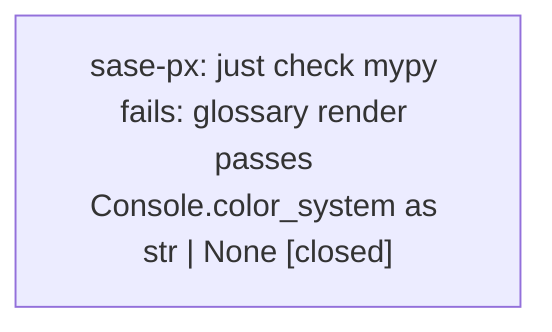

# Bead: sase-px — just check mypy fails: glossary render passes Console.color\_system as str \| None

[Bead Pages](../README.md) / sase-px

**Status:** ✓ closed · **Resolution:** done · **Type:** ◆ task · **Task type:** ⨯ bug · **+1 reports:** +2
**Owner:** `bryanbugyi34@gmail.com` · **Created by:** [bbugyi200.athena.06d](https://github.com/sase-org/sase--agents/blob/main/families/bbugyi200.athena.06d.md) · **Assignee:** `sase-px` · **Size:** small
**Created:** 2026-08-18 13:36:46 EDT · **Closed:** 2026-08-18 14:00:38 EDT

## Description

`just check`'s `lint (mypy)` gate fails on an untouched file:

    src/sase/glossary/render.py:74: error: Argument "color_system" to "Console"
    has incompatible type "str | None"; expected
    "Literal['auto', 'standard', '256', 'truecolor', 'windows'] | None"  [arg-type]

Discovered while implementing the approved `@<path>` bead free-text tale. That tree
does not touch `src/sase/glossary/`. Reproduced twice: whole-repo `just check` and
direct `.venv/bin/mypy`. The six files from the `@path` change type-check clean.

Root cause: `_print_rich_without_trailing_whitespace` copies `console.color_system`
onto a new `Console`. Rich types `Console.color_system` as `str | None` but the
constructor parameter as a Literal union. Introduced by 88fa6e949 ("feat(glossary):
fail batched reads all-or-nothing and shrink render bytes"), which added this
capture-and-rstrip helper. That commit's `SASE_PLAN` is
`202608/glossary_batched_reads.md`; no in-progress epic still owns it.

Fix is a one-line type narrowing or cast at the `color_system=` argument so mypy
accepts the passthrough. Until then every agent's `just check` is red at mypy.

---

\## Bug

- **Location:** `src/sase/glossary/render.py:74`

From a clean workspace with `just install` already run:

    just check
    # or: .venv/bin/mypy

Fails at `lint (mypy)` with:

    src/sase/glossary/render.py:74: error: Argument "color_system" to "Console"
    has incompatible type "str | None"; expected
    "Literal['auto', 'standard', '256', 'truecolor', 'windows'] | None"  [arg-type]

Two consecutive runs failed identically. Not a flake.

## Notes

[2026-08-18T17:37:34Z · 06d] RELATED: sase-pn — adjacent glossary-output defect (Tier 2 wrap-insensitive substring assertion), different root cause and file than this mypy color_system error.

[2026-08-18T18:00:38Z · sase-px] Cast Console.color_system to Literal['auto','standard','256','truecolor','windows'] | None in src/sase/glossary/render.py so the capture Console constructor matches Rich's typed parameter. Confirmed the original [arg-type] error is gone: .venv/bin/mypy src/sase/glossary/render.py is clean, and just check's lint (mypy) gate now passes. just check then failed at lint (symvision) on unused public project_accent/project_accent_map in src/sase/ace/tui/project_styles.py; that is owned by in-progress epic sase-pw (sase-pw.4 is the intended consumer) and was recorded there as a DISCOVERED ISSUE, not a new task.

[2026-08-18T18:02:28Z · sase-px] Cast Console.color_system to Literal['auto','standard','256','truecolor','windows'] | None in src/sase/glossary/render.py so the capture Console constructor matches Rich's typed parameter. Verified .venv/bin/mypy src/sase/glossary/render.py is clean (no issues found in 1 source file). just check's lint (mypy) gate passed on the prior run; remaining just check failure was lint (symvision) unused project_accent/project_accent_map in src/sase/ace/tui/project_styles.py, owned by epic sase-pw and recorded there.

## +1 Evidence

> **+1** by `sase-pq.land` · 2026-08-18 13:46:06 EDT
> **Observed since:** 2026-08-18 12:47:53 EDT
>
> Independently confirmed while landing epic sase-pq: still present in HEAD, git blame confirms 88fa6e949 introduced it, no fix landed since. sase-pq's own commits do not touch src/sase/glossary/render.py, so this is not epic-caused.

> **+1** by `sase-ps.land` · 2026-08-18 13:49:34 EDT
> **Observed since:** 2026-08-18 12:45:17 EDT
>
> Independently reproduced by the sase-ps land agent on a clean tree at 88d2a1582 (working tree clean, 'just install' run first): 'just lint' fails at the mypy gate with exactly src/sase/glossary/render.py:74: error: Argument "color_system" to "Console" has incompatible type "str | None"; expected "Literal['auto', 'standard', '256', 'truecolor', 'windows'] | None"  [arg-type]; Found 1 error in 1 file (checked 3451 source files). Impact confirmed at landing scope: this single error aborts 'just lint' before the remaining gates run, so every agent's 'just check'/'just check-full' is red on master regardless of their own diff. Originally raised as a PROPOSED FOLLOW-UP by epic phase sase-ps.4 (epic sase-ps), which is unrelated to src/sase/glossary/.

## Lineage

## Agents

| Agent | Bead | Commits |
|---|---|---:|
| [bbugyi200.athena.sase-px](https://github.com/sase-org/sase--agents/blob/main/agents/bbugyi200.athena.sase-px/README.md) | [sase-px](README.md) | 1 |

## Commits

| Repo | Commit | Subject | Bead | Committed |
|---|---|---|---|---|
| sase | [`959d205`](https://github.com/sase-org/sase/commit/959d205cae8faba677f7eb5d4b6e80ba63951dc0) | fix(glossary): narrow Console.color\_system for mypy | [sase-px](README.md) | 2026-08-18 14:03:17 EDT |
