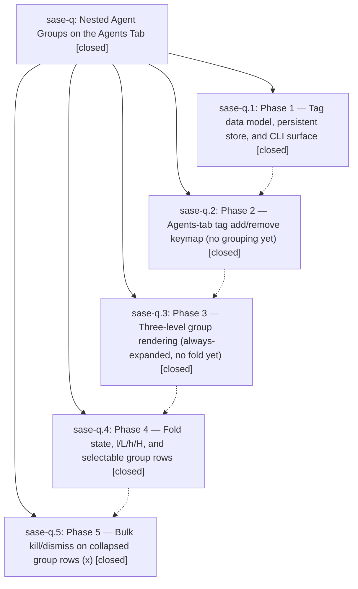

# Bead: sase-q — Nested Agent Groups on the Agents Tab

[Bead Pages](../README.md) / sase-q

**Status:** ✓ closed · **Resolution:** (unrecorded) · **Type:** plan · **Tier:** epic
**Owner:** `bryanbugyi34@gmail.com`
**Created:** 2026-04-25 20:14:43 UTC · **Closed:** 2026-04-25 21:30:20 UTC
**Plan:** [202604/agents\_tab\_nested\_groups.md](https://github.com/sase-org/sase--plans/blob/main/202604/agents_tab_nested_groups.md)

## Phases

| Bead | Title | Status | Size | Agents | Commits |
|---|---|---|---|---:|---:|
| [sase-q.1](sase-q.1.md) | Phase 1 — Tag data model, persistent store, and CLI surface | ✓ closed | small | 0 | 0 |
| [sase-q.2](sase-q.2.md) | Phase 2 — Agents-tab tag add/remove keymap (no grouping yet) | ✓ closed | small | 0 | 0 |
| [sase-q.3](sase-q.3.md) | Phase 3 — Three-level group rendering (always-expanded, no fold yet) | ✓ closed | small | 0 | 0 |
| [sase-q.4](sase-q.4.md) | Phase 4 — Fold state, l/L/h/H, and selectable group rows | ✓ closed | small | 0 | 1 |
| [sase-q.5](sase-q.5.md) | Phase 5 — Bulk kill/dismiss on collapsed group rows (x) | ✓ closed | small | 0 | 1 |

## Lineage

## Commits

| Commit | Subject | Bead | Committed (UTC) |
|---|---|---|---|
| [`c87ac8f`](https://github.com/sase-org/sase/commit/c87ac8f30fb579e2921269a74d842a20ce607f64) | feat: agents-tab group fold (l/L/h/H) with selectable banners (sase-q.4) | [sase-q.4](sase-q.4.md) | 2026-04-25 21:15:05 |
| [`171af0f`](https://github.com/sase-org/sase/commit/171af0f08f339d3d8c0d7c72acfd418f1ddd635a) | feat: agents-tab \`x\` bulk kill/dismiss on focused group banners (sase-q.5) | [sase-q.5](sase-q.5.md) | 2026-04-25 21:27:40 |
