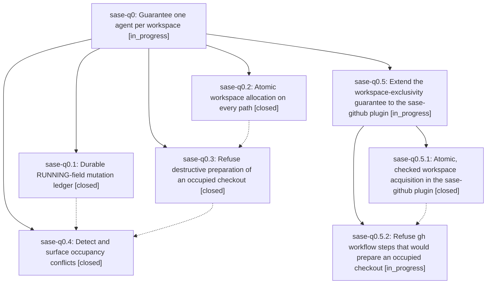

# Bead: sase-q0 — Guarantee one agent per workspace

[Bead Pages](../README.md) / sase-q0

**Status:** ◐ in_progress · **Type:** ▸ plan · **Tier:** epic
**Owner:** `bryanbugyi34@gmail.com` · **Created by:** [bbugyi200.athena.06g](https://github.com/sase-org/sase--agents/blob/main/families/bbugyi200.athena.06g.md) · **Assignee:** `sase-q0.land`
**Created:** 2026-08-18 13:44:17 EDT
**Plan:** [202608/workspace\_exclusivity.md](https://github.com/sase-org/sase--plans/blob/main/202608/workspace_exclusivity.md)

## Description

Two SASE agents can never run in the same workspace checkout: workspace allocation is atomic on every path, a destructive workspace preparation refuses to run when another live agent occupies the checkout, and every RUNNING-field mutation is recorded so a future occupancy incident is diagnosable from the ledger alone.

## Notes

[2026-08-18T18:41:12Z · sase-ps.land] DISCOVERED ISSUE: 'just check'/'just check-full' is red at the lint (symvision) gate on master 725cdb11d, caused by this epic's phase sase-q0.1. REPRODUCTION (workspace sase_14, clean tree at 725cdb11d, after 'just install'): 'just symvision' exits 1 with — Unused public functions/classes: ledger_path in src/sase/logs/workspace_claim_ledger.py, read_ledger_records in src/sase/logs/workspace_claim_ledger.py. Both symbols landed in 725cdb11d ('feat(running-field): record every workspace claim mutation to a durable ledger', SASE_BEAD=sase-q0.1) and have no non-test caller; the Justfile symvision line carries no --epic-symbol entry for either. CAUSAL LINK: the symbols are this epic's own new ledger-read API, presumably intended for a later phase that reads the ledger back. Fix per the Symvision epic-whitelist policy: add --epic-symbol "sase-q0.<N>(ledger_path)" and --epic-symbol "sase-q0.<N>(read_ledger_records)" keyed to the open phase that will consume them, or privatize them if the ledger is write-only. Found by the sase-ps land agent on 2026-08-18 while verifying that epic's landing; sase-ps touches none of these files. Note: the mypy and project_accent symvision reds this host saw earlier today are both already resolved upstream, so this is now the only gate blocking 'just check' for every agent.

[2026-08-18T19:39:34Z · 06n] DISCOVERED ISSUE: Independently reproduced while implementing the Alias History model-usage strip (workspace sase_23, dirty tree that does not touch src/sase/logs/workspace_claim_ledger.py). just check passed fmt/ruff/mypy/flags/pyscripts/test-waits/changelog/terminology, then failed lint (symvision) with unused public ledger_path and read_ledger_records in src/sase/logs/workspace_claim_ledger.py. Same root cause as the 2026-08-18T18:41:12Z note: sase-q0.1 landed a write-only public read API with no non-test consumer and no --epic-symbol whitelist. Confirming this remains the host-wide just check blocker.

[2026-08-18T20:56:22Z · toobig-33.split_file.src.sase.agent.restart.0] DISCOVERED ISSUE: 7a2906e13 (feat(core): guard destructive workspace prep against occupied checkouts, phase sase-q0.3) left three unused public symbols that fail just check's symvision gate on master 7beaf2ac7. Reproduced with a clean tree (all local changes stashed) in workspace sase_13: just install && just _lint-symvision reports 'Unused public functions/classes ... OccupantRecord in src/sase/workspace_provider/occupant.py, occupant_marker_path in src/sase/workspace_provider/occupant.py, WorkspaceOccupiedError in src/sase/core/occupancy_guard.py' (alongside the two ledger symbols already tracked as ready task sase-q5). Per the symvision decision hierarchy each needs a judgment call — wire up the intended non-test consumer, make it private, or delete it with its tests — not a blind rename. This blocks every agent's just check until it is resolved.

[2026-08-18T21:37:01Z · sase-q0.land] LANDING (in progress, sase-q0.land): steps 1-2 done. Verification and follow-up triage below; the epic is NOT closed because step 2 found unfinished in-scope work (see "REMAINING EPIC WORK").

VERIFIED (read the source and each commit, not just the phase notes):
- sase-q0.1 / 725cdb11d — src/sase/logs/workspace_claim_ledger.py appends a record for every mutation of all five helpers in running_field/_operations.py (claim_workspace, release_workspace, hold_workspace_claim, transfer_workspace_claim, claim_next_axe_workspace), inside the lock, with before/after claim rows for the affected workspace, actor pid/ppid, claim pid, outcome, error, and a caller tag; record_running_field_mutation swallows every exception, so a ledger write can never fail a claim. read_ledger_records + ledger_path are real, filtered readers.
- sase-q0.2 / 75e1db1ef — claim_deferred_workspace now claims via claim_next_axe_workspace BEFORE materializing and releases the slot when materialization throws (_claim_next_deferred_workspace); the family-attach pin is a single-shot checked claim that names the occupant and exits (_claim_pinned_deferred_workspace + _describe_workspace_occupant). Re-ran the sweep the plan asked for: the only surviving get_first_available_* callers in this repo are ace/operations.py:46 and ace/tui/actions/agent_workflow/_ref_resolution.py:57, and both are documented read-only previews.
- sase-q0.3 / 7a2906e13 — .sase/occupant.json written on the launcher-preclaim/transfer path (agent/launch_spawn.py:326) and the deferred path (axe/run_agent_phases.py:154), cleared at the three release funnels; .sase/ is in SASE_GIT_INFO_EXCLUDE_PATTERNS so git clean cannot remove it. decide_workspace_occupant_conflict lives in sase-core (crates/sase_core/src/agent_launch/mod.rs:2054, commit 35c09db, pushed and in sync with origin/master) with 7 unit tests; occupancy_guard.ensure_workspace_not_occupied cross-checks the marker against the RUNNING row and raises WorkspaceOccupiedError. Guard runs before prepare_workspace at run_agent_runner_setup.py:133 and :215 and before both retry re-preps at run_agent_exec_retry.py:349 and :397. Retry-spawn children skip prep entirely (retry_handoff early return), which is what covers the plan's "retry-chain parent is the same lineage" case.
- sase-q0.4 / 716e9de98 — workspace.occupancy_conflicts doctor check registered at doctor/checks_workspace.py:63, report-only, three conflict shapes, annotated from the ledger; concurrency + incident-shape tests present.
- Gates: just install && just _lint-symvision is GREEN on 716e9de98 ("All public/private classes/functions are used properly!"), and sase bead epic-symbols sase-q0 reports no --epic-symbol entries. The 146 tests across the epic's 11 test files all pass.

INTEGRATION (commits since 725cdb11d, excluding the epic's own): only daa095ec3 (restart.py split) and ea31a2b5b (kill-and-edit identity) touch src/sase/agent/**, and neither claims, releases, or prepares a workspace — grep for claim_workspace/release_workspace/prepare_workspace/occupant over restart.py, relaunch_prompt.py and the six new _restart_*.py modules returns nothing. No integration edits were needed in this repo.

REMAINING EPIC WORK (why this epic is not closed): the atomic and guard sweeps covered only the sase repo. The sase-github linked plugin holds the workflow steps the epic plan names by name — gh__setup / gh__prepare / gh__checkout — and they were never converted:
- sase_github/scripts/gh_setup.py: the n=None branch is a textbook check-then-claim (get_first_available_axe_workspace -> ensure_workspace_checkout materializes -> claim_workspace) AND discards the claim result, so a losing racer proceeds inside the winner's workspace; the n=<num> branch claims a pinned number with no availability check and no result check. No caller_tag, so these mutations are unattributable in the ledger, and no occupant record is written.
- sase_github/workspace_plugin.py ws_submit_changespec (~:539): still the get_first_available_axe_workspace -> get_workspace_directory_for_num -> claim_workspace pattern, while its sibling src/sase/workspace_provider/plugins/bare_git_submit.py:159 was converted to claim_next_axe_workspace_dir by phase sase-q0.2. Its provider.checkout is unguarded.
- sase_github/xprompts/gh.yml: the prepare step runs `git stash push --include-untracked` + `git pull --rebase` and the checkout step runs provider.checkout + pull, both against a checkout that may hold another live agent, with no ensure_workspace_not_occupied; the release step passes no caller_tag and never clears the occupant record.
This resolves the sase-q0.3 PROPOSED FOLLOW-UP that asked the land agent to confirm the gh__* reading: those hooks are real, they just live in the sase-github plugin rather than in this repo, so the phase's "coverage is equivalent" conclusion holds only for agent launches (which take the SASE_GH_PRE_ALLOCATED branch and skip claiming) and not for direct #gh invocations or ACE submit. Swept the other plugin repos too — sase-telegram, sase-nvim and sase-research-artifacts contain zero claim/release/prepare call sites.

PROPOSED FOLLOW-UP triage (every entry from all four phase beads):
- glossary/render.py mypy (sase-q0.1, sase-q0.2): already fixed upstream by 959d205ca. No action.
- unused public project_accent/project_accent_map + stale --epic-symbol "sase-pw.8(project_accent_map)" (sase-q0.2, sase-q0.3, sase-q0.4): already fixed upstream by a3765f857 and 8437cfd9c. Confirmed green. No action.
- tests/completion/test_snapshot.py drift and tests/feature_flags/test_integrity.py::test_kind_mismatch_when_default_disagrees_with_kind (sase-q0.2, sase-q0.3): both now pass on 716e9de98 (9 passed). No action.
- RUNNING rows dropped for unrecognized artifacts-timestamp shapes (sase-q0.2): confirmed and materially worse than reported — WorkspaceClaimLine::parse discards the WHOLE row for any unrecognized trailing part, and the already-claimed guard in plan_claim_workspace_from_content parses through the same function, so it fails open into double allocation. Filed as task sase-qa (small), per this plan's own instruction to file rather than widen the epic.
- tests/_agent_cleanup_proc_helpers.py ModuleNotFoundError on standalone collection (sase-q0.1): confirmed still reproducing; root-caused to the sys.modules stub at tests/ace/tui/conftest.py:134 covering for proc_queue.py, deleted in 8c4840458. Filed as task sase-qb (small).
- gh__setup/gh__prepare/gh__checkout discrepancy (sase-q0.3): NOT a follow-up — it is the remaining epic work above.
- centralize occupant.json write/clear inside running_field/_operations.py so all ~60 release paths clear it (sase-q0.3): DECLINED, no bead filed. It has no demonstrated defect — every release funnel that is not already wired kills or outlives the agent first, so the occupant pid is dead and the guard already treats that as a legitimate takeover; and the one residual shape (a live occupant whose claim was released elsewhere) refuses the next agent's

… and 668 more characters

## Phases

| Bead | Title | Status | Size | Created | Agents | Commits |
|---|---|---|---|---|---:|---:|
| [sase-q0.1](sase-q0.1.md) | Durable RUNNING-field mutation ledger | ✓ closed | small | 2026-08-18 | 1 | 1 |
| [sase-q0.2](sase-q0.2.md) | Atomic workspace allocation on every path | ✓ closed | medium | 2026-08-18 | 1 | 1 |
| [sase-q0.3](sase-q0.3.md) | Refuse destructive preparation of an occupied checkout | ✓ closed | medium | 2026-08-18 | 1 | 2 |
| [sase-q0.4](sase-q0.4.md) | Detect and surface occupancy conflicts | ✓ closed | small | 2026-08-18 | 1 | 1 |

## Lineage

## Agents

| Agent | Bead | Commits |
|---|---|---:|
| [bbugyi200.athena.sase-q0.1](https://github.com/sase-org/sase--agents/blob/main/families/bbugyi200.athena.sase-q0.1.md) | [sase-q0.1](sase-q0.1.md) | 1 |
| [bbugyi200.athena.sase-q0.2](https://github.com/sase-org/sase--agents/blob/main/agents/bbugyi200.athena.sase-q0.2/README.md) | [sase-q0.2](sase-q0.2.md) | 1 |
| [bbugyi200.athena.sase-q0.3](https://github.com/sase-org/sase--agents/blob/main/agents/bbugyi200.athena.sase-q0.3/README.md) | [sase-q0.3](sase-q0.3.md) | 2 |
| [bbugyi200.athena.sase-q0.4](https://github.com/sase-org/sase--agents/blob/main/families/bbugyi200.athena.sase-q0.4.md) | [sase-q0.4](sase-q0.4.md) | 1 |
| [bbugyi200.athena.sase-q0.5.1](https://github.com/sase-org/sase--agents/blob/main/agents/bbugyi200.athena.sase-q0.5.1/README.md) | [sase-q0.5.1](sase-q0.5.1.md) | 1 |
| [bbugyi200.athena.sase-q0.5.2](https://github.com/sase-org/sase--agents/blob/main/agents/bbugyi200.athena.sase-q0.5.2/README.md) | [sase-q0.5.2](sase-q0.5.2.md) | 0 |
| [bbugyi200.athena.sase-q0.5.land](https://github.com/sase-org/sase--agents/blob/main/agents/bbugyi200.athena.sase-q0.5.land/README.md) | [sase-q0.5](sase-q0.5.md) | 0 |
| [bbugyi200.athena.sase-q0.land](https://github.com/sase-org/sase--agents/blob/main/families/bbugyi200.athena.sase-q0.land.md) | [sase-q0](README.md) | 0 |

## Commits

| Repo | Commit | Subject | Bead | Committed |
|---|---|---|---|---|
| sase | [`725cdb1`](https://github.com/sase-org/sase/commit/725cdb11da3778e48705e5fc8e71f6f39f807d78) | feat(running-field): record every workspace claim mutation to a durable ledger | [sase-q0.1](sase-q0.1.md) | 2026-08-18 14:25:25 EDT |
| sase | [`75e1db1`](https://github.com/sase-org/sase/commit/75e1db1ef0e593a0a84f3b5bd7e6e13f3b66b102) | fix(workspace): claim slots before materializing checkouts | [sase-q0.2](sase-q0.2.md) | 2026-08-18 14:33:03 EDT |
| sase | [`7a2906e`](https://github.com/sase-org/sase/commit/7a2906e136854a6904f5d3eda3146ac8fc63aa6a) | feat(core): guard destructive workspace prep against occupied checkouts | [sase-q0.3](sase-q0.3.md) | 2026-08-18 16:27:01 EDT |
| sase-core | [`sase-core@35c09db`](https://github.com/sase-org/sase-core/commit/35c09db103126d4f7238729b76eec50df94da043) | feat(agent\_launch): add pure workspace-occupant conflict decision | [sase-q0.3](sase-q0.3.md) | 2026-08-18 16:32:24 EDT |
| sase | [`716e9de`](https://github.com/sase-org/sase/commit/716e9de98f2f6346ef0ae23ba92be08f17397730) | feat(doctor): detect workspace occupancy conflicts | [sase-q0.4](sase-q0.4.md) | 2026-08-18 17:14:53 EDT |
| sase-github | [`sase-github@61dd36f`](https://github.com/sase-org/sase-github/commit/61dd36fa1aef7ec71475608e19de3ddf91b67b74) | feat: claim GitHub workspaces atomically | [sase-q0.5.1](sase-q0.5.1.md) | 2026-08-18 18:03:55 EDT |
