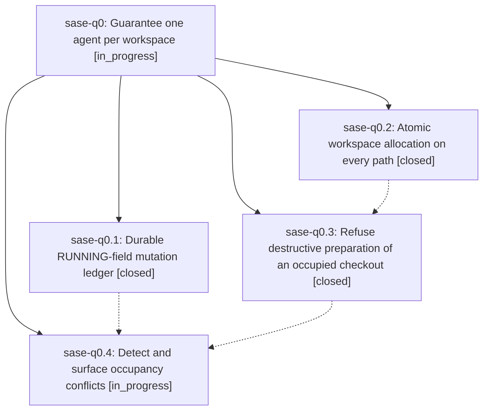

# Bead: sase-q0 — Guarantee one agent per workspace

[Bead Pages](../README.md) / sase-q0

**Status:** ◐ in_progress · **Type:** ▸ plan · **Tier:** epic
**Owner:** `bryanbugyi34@gmail.com` · **Created by:** [bbugyi200.athena.06g](https://github.com/sase-org/sase--agents/blob/main/families/bbugyi200.athena.06g.md) · **Assignee:** `sase-q0.land`
**Created:** 2026-08-18 13:44:17 EDT
**Plan:** [202608/workspace\_exclusivity.md](https://github.com/sase-org/sase--plans/blob/main/202608/workspace_exclusivity.md)

## Description

Two SASE agents can never run in the same workspace checkout: workspace allocation is atomic on every path, a destructive workspace preparation refuses to run when another live agent occupies the checkout, and every RUNNING-field mutation is recorded so a future occupancy incident is diagnosable from the ledger alone.

## Notes

[2026-08-18T18:41:12Z · sase-ps.land] DISCOVERED ISSUE: 'just check'/'just check-full' is red at the lint (symvision) gate on master 725cdb11d, caused by this epic's phase sase-q0.1. REPRODUCTION (workspace sase_14, clean tree at 725cdb11d, after 'just install'): 'just symvision' exits 1 with — Unused public functions/classes: ledger_path in src/sase/logs/workspace_claim_ledger.py, read_ledger_records in src/sase/logs/workspace_claim_ledger.py. Both symbols landed in 725cdb11d ('feat(running-field): record every workspace claim mutation to a durable ledger', SASE_BEAD=sase-q0.1) and have no non-test caller; the Justfile symvision line carries no --epic-symbol entry for either. CAUSAL LINK: the symbols are this epic's own new ledger-read API, presumably intended for a later phase that reads the ledger back. Fix per the Symvision epic-whitelist policy: add --epic-symbol "sase-q0.<N>(ledger_path)" and --epic-symbol "sase-q0.<N>(read_ledger_records)" keyed to the open phase that will consume them, or privatize them if the ledger is write-only. Found by the sase-ps land agent on 2026-08-18 while verifying that epic's landing; sase-ps touches none of these files. Note: the mypy and project_accent symvision reds this host saw earlier today are both already resolved upstream, so this is now the only gate blocking 'just check' for every agent.

[2026-08-18T19:39:34Z · 06n] DISCOVERED ISSUE: Independently reproduced while implementing the Alias History model-usage strip (workspace sase_23, dirty tree that does not touch src/sase/logs/workspace_claim_ledger.py). just check passed fmt/ruff/mypy/flags/pyscripts/test-waits/changelog/terminology, then failed lint (symvision) with unused public ledger_path and read_ledger_records in src/sase/logs/workspace_claim_ledger.py. Same root cause as the 2026-08-18T18:41:12Z note: sase-q0.1 landed a write-only public read API with no non-test consumer and no --epic-symbol whitelist. Confirming this remains the host-wide just check blocker.

## Phases

| Bead | Title | Status | Size | Created | Agents | Commits |
|---|---|---|---|---|---:|---:|
| [sase-q0.1](sase-q0.1.md) | Durable RUNNING-field mutation ledger | ✓ closed | small | 2026-08-18 | 1 | 1 |
| [sase-q0.2](sase-q0.2.md) | Atomic workspace allocation on every path | ✓ closed | medium | 2026-08-18 | 1 | 1 |
| [sase-q0.3](sase-q0.3.md) | Refuse destructive preparation of an occupied checkout | ✓ closed | medium | 2026-08-18 | 1 | 2 |
| [sase-q0.4](sase-q0.4.md) | Detect and surface occupancy conflicts | ◐ in_progress | small | 2026-08-18 | 1 | 0 |

## Lineage

## Agents

| Agent | Bead | Commits |
|---|---|---:|
| [bbugyi200.athena.sase-q0.1](https://github.com/sase-org/sase--agents/blob/main/families/bbugyi200.athena.sase-q0.1.md) | [sase-q0.1](sase-q0.1.md) | 1 |
| [bbugyi200.athena.sase-q0.2](https://github.com/sase-org/sase--agents/blob/main/agents/bbugyi200.athena.sase-q0.2/README.md) | [sase-q0.2](sase-q0.2.md) | 1 |
| [bbugyi200.athena.sase-q0.3](https://github.com/sase-org/sase--agents/blob/main/agents/bbugyi200.athena.sase-q0.3/README.md) | [sase-q0.3](sase-q0.3.md) | 2 |
| [bbugyi200.athena.sase-q0.4](https://github.com/sase-org/sase--agents/blob/main/agents/bbugyi200.athena.sase-q0.4/README.md) | [sase-q0.4](sase-q0.4.md) | 0 |
| [bbugyi200.athena.sase-q0.land](https://github.com/sase-org/sase--agents/blob/main/agents/bbugyi200.athena.sase-q0.land/README.md) | [sase-q0](README.md) | 0 |

## Commits

| Repo | Commit | Subject | Bead | Committed |
|---|---|---|---|---|
| sase | [`725cdb1`](https://github.com/sase-org/sase/commit/725cdb11da3778e48705e5fc8e71f6f39f807d78) | feat(running-field): record every workspace claim mutation to a durable ledger | [sase-q0.1](sase-q0.1.md) | 2026-08-18 14:25:25 EDT |
| sase | [`75e1db1`](https://github.com/sase-org/sase/commit/75e1db1ef0e593a0a84f3b5bd7e6e13f3b66b102) | fix(workspace): claim slots before materializing checkouts | [sase-q0.2](sase-q0.2.md) | 2026-08-18 14:33:03 EDT |
| sase | [`7a2906e`](https://github.com/sase-org/sase/commit/7a2906e136854a6904f5d3eda3146ac8fc63aa6a) | feat(core): guard destructive workspace prep against occupied checkouts | [sase-q0.3](sase-q0.3.md) | 2026-08-18 16:27:01 EDT |
| sase-core | [`sase-core@35c09db`](https://github.com/sase-org/sase-core/commit/35c09db103126d4f7238729b76eec50df94da043) | feat(agent\_launch): add pure workspace-occupant conflict decision | [sase-q0.3](sase-q0.3.md) | 2026-08-18 16:32:24 EDT |
