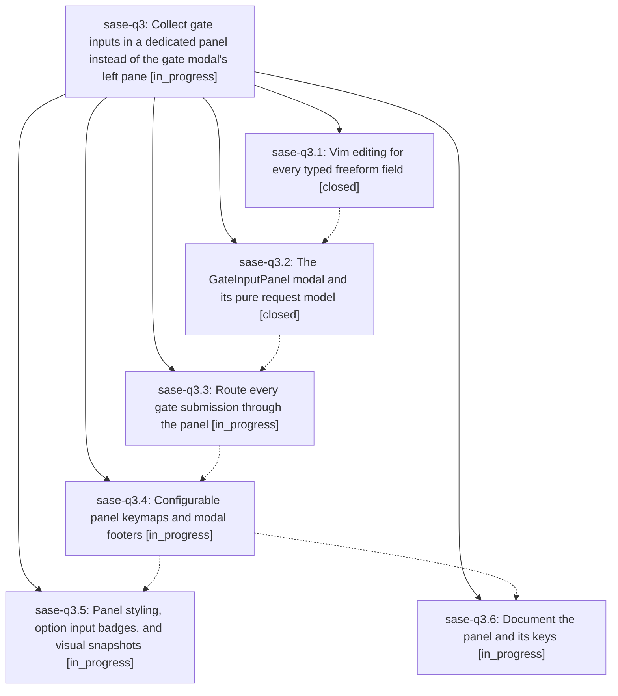

# Bead: sase-q3 — Collect gate inputs in a dedicated panel instead of the gate modal's left pane

[Bead Pages](../README.md) / sase-q3

**Status:** ◐ in_progress · **Type:** ▸ plan · **Tier:** epic
**Owner:** `bryanbugyi34@gmail.com` · **Created by:** [bbugyi200.athena.06q](https://github.com/sase-org/sase--agents/blob/main/families/bbugyi200.athena.06q.md) · **Assignee:** `sase-q3.land`
**Created:** 2026-08-18 15:29:37 EDT
**Plan:** [202608/gate\_input\_panel.md](https://github.com/sase-org/sase--plans/blob/main/202608/gate_input_panel.md)

## Description

Selecting a gate option opens a wide, dedicated input panel that shows exactly that selection's input components under their owning option, navigable with <tab> and <shift+tab>, with full vim insert/normal editing in every freeform box; the gate modal's left pane shows only decisions.

## Phases

| Bead | Title | Status | Size | Created | Agents | Commits |
|---|---|---|---|---|---:|---:|
| [sase-q3.1](sase-q3.1.md) | Vim editing for every typed freeform field | ✓ closed | medium | 2026-08-18 | 1 | 1 |
| [sase-q3.2](sase-q3.2.md) | The GateInputPanel modal and its pure request model | ✓ closed | medium | 2026-08-18 | 1 | 1 |
| [sase-q3.3](sase-q3.3.md) | Route every gate submission through the panel | ◐ in_progress | medium | 2026-08-18 | 1 | 0 |
| [sase-q3.4](sase-q3.4.md) | Configurable panel keymaps and modal footers | ◐ in_progress | small | 2026-08-18 | 1 | 0 |
| [sase-q3.5](sase-q3.5.md) | Panel styling, option input badges, and visual snapshots | ◐ in_progress | medium | 2026-08-18 | 1 | 0 |
| [sase-q3.6](sase-q3.6.md) | Document the panel and its keys | ◐ in_progress | small | 2026-08-18 | 1 | 0 |

## Lineage

## Agents

| Agent | Bead | Commits |
|---|---|---:|
| [bbugyi200.athena.sase-q3.1](https://github.com/sase-org/sase--agents/blob/main/agents/bbugyi200.athena.sase-q3.1/README.md) | [sase-q3.1](sase-q3.1.md) | 1 |
| [bbugyi200.athena.sase-q3.2](https://github.com/sase-org/sase--agents/blob/main/agents/bbugyi200.athena.sase-q3.2/README.md) | [sase-q3.2](sase-q3.2.md) | 1 |
| [bbugyi200.athena.sase-q3.3](https://github.com/sase-org/sase--agents/blob/main/agents/bbugyi200.athena.sase-q3.3/README.md) | [sase-q3.3](sase-q3.3.md) | 0 |
| [bbugyi200.athena.sase-q3.4](https://github.com/sase-org/sase--agents/blob/main/agents/bbugyi200.athena.sase-q3.4/README.md) | [sase-q3.4](sase-q3.4.md) | 0 |
| [bbugyi200.athena.sase-q3.5](https://github.com/sase-org/sase--agents/blob/main/agents/bbugyi200.athena.sase-q3.5/README.md) | [sase-q3.5](sase-q3.5.md) | 0 |
| [bbugyi200.athena.sase-q3.6](https://github.com/sase-org/sase--agents/blob/main/agents/bbugyi200.athena.sase-q3.6/README.md) | [sase-q3.6](sase-q3.6.md) | 0 |
| [bbugyi200.athena.sase-q3.land](https://github.com/sase-org/sase--agents/blob/main/agents/bbugyi200.athena.sase-q3.land/README.md) | [sase-q3](README.md) | 0 |

## Commits

| Repo | Commit | Subject | Bead | Committed |
|---|---|---|---|---|
| sase | [`c6bee00`](https://github.com/sase-org/sase/commit/c6bee0051d828ac1faa2818c8040a4463a8ee842) | feat(tui): use vim editors for every typed freeform field | [sase-q3.1](sase-q3.1.md) | 2026-08-18 16:31:37 EDT |
| sase | [`76ac5bb`](https://github.com/sase-org/sase/commit/76ac5bbc61d62018047a5b6473803dadbe66bd39) | feat(tui): add GateInputPanel for per-option gate inputs | [sase-q3.2](sase-q3.2.md) | 2026-08-18 17:04:30 EDT |
