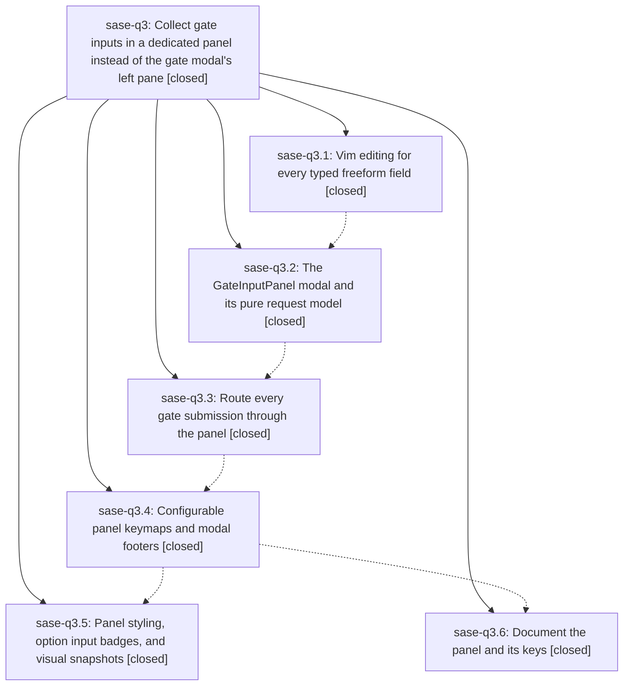

# Bead: sase-q3 — Collect gate inputs in a dedicated panel instead of the gate modal's left pane

[Bead Pages](../README.md) / sase-q3

**Status:** ✓ closed · **Resolution:** done · **Type:** ▸ plan · **Tier:** epic
**Owner:** `bryanbugyi34@gmail.com` · **Created by:** [bbugyi200.athena.06q](https://github.com/sase-org/sase--agents/blob/main/families/bbugyi200.athena.06q.md) · **Assignee:** `sase-q3.land`
**Created:** 2026-08-18 15:29:37 EDT · **Closed:** 2026-08-18 19:50:08 EDT
**Plan:** [202608/gate\_input\_panel.md](https://github.com/sase-org/sase--plans/blob/main/202608/gate_input_panel.md)

## Description

Selecting a gate option opens a wide, dedicated input panel that shows exactly that selection's input components under their owning option, navigable with <tab> and <shift+tab>, with full vim insert/normal editing in every freeform box; the gate modal's left pane shows only decisions.

## Notes

[2026-08-18T23:50:08Z · sase-q3.land] Verified all six phases against source and commits (c6bee0051, 76ac5bbc6, ae2916200, 3f913c7b2, 11f78656d, 732e9ccf4): q3.1 routes SecretVimTextArea/_MultilineInput through TypedInputForm; q3.2 landed gate_input_panel{,_model,_sections}.py with lazy modal registration; q3.3 deleted gate_branch_input_section.py and #gate-feedback-input, GateBranchControls._resolve_branch now builds a request and opens the panel; q3.4 added gate.open_inputs/next_input/previous_input across app_keymaps.py, metadata.py, bindings.py, default_config.yml and both modal footers; q3.5 added the styles.tcss panel block, the dim '✎ n inputs' badges, and 3 panel goldens; q3.6 updated notifications.md, configuration.md and ace.md. 39 direct tests in test_gate_input_panel.py + test_gate_branch_inputs.py cover the plan's bullets.

INTEGRATION: reviewed all 16 non-epic commits since c6bee0051. None touch the gate input surface, TypedInputForm, the vim editors, or the gate keymaps (the only 'gate' overlap is bead snooze gates in 530c574d2/5b2d297ae, a different concept), so nothing needed rewiring. Fixed three pieces of epic-caused drift: (1) ace.md:3239 still described the deleted inline feedback input, now describes the Decision-column-plus-panel flow; (2) GateInputPanel's CSS was duplicated verbatim in DEFAULT_CSS and styles.tcss — deleted the DEFAULT_CSS copy; (3) the vim-mode routing mixin and its label map were byte-identical in gate_input_panel.py, gate_input_panel_sections.py, and typed_input_form.py — consolidated into sase.ace.tui.widgets.vim_mode_routing.VimModeRoutingMixin.

FOLLOW-UP DISPOSITION (from child notes): project_accent_map import break (q3.1/q3.2) resolved by landed a3765f857 + 8437cfd9c — mypy green. sase-q0 unused occupant symbols OccupantRecord/WorkspaceOccupiedError/occupant_marker_path/ledger_path/read_ledger_records (q3.1/q3.2/q3.3) resolved by landed 716e9de98 + 7563372f1 — lint (symvision) green. Feature-flag registry beads sase-nw/om/pa/nx (q3.5/q3.6) resolved by landed a469015dc — lint (feature flags) green. The stale --epic-symbol sase-pw.8(project_accent_map) re-key (q3.1) resolved by a3765f857. The ace.md stale paragraph (q3.6) was epic-caused and is fixed here, not filed. tests/_suite_gate.py toobig (q3.3/q3.4/q3.5/q3.6) is the one live proposal: it is a pre-existing failure already tracked by in-progress task sase-q7 (now +10), so I recorded an independently-reproduced corroboration there rather than filing a duplicate — declined as a new task solely on duplication grounds.

VERIFICATION: sase bead epic-symbols sase-q3 reports no entries. just check is green through every gate (fmt python/markdown, keep-sorted, ruff, mypy, feature flags, pyscripts, test waits, changelog, patch/stitch terminology, symvision) and fails only at lint (toobig) on the pre-existing tests/_suite_gate.py 1197-line violation tracked by sase-q7. just test-scoped: 823 passed across 67 selected test files. just test-visual on test_ace_png_snapshots_custom_gate.py: 15 passed, including test_gate_input_panel_note_png_snapshot — confirming the DEFAULT_CSS deletion changed no rendering because styles.tcss was already winning.

## Phases

| Bead | Title | Status | Size | Created | Agents | Commits |
|---|---|---|---|---|---:|---:|
| [sase-q3.1](sase-q3.1.md) | Vim editing for every typed freeform field | ✓ closed | medium | 2026-08-18 | 1 | 1 |
| [sase-q3.2](sase-q3.2.md) | The GateInputPanel modal and its pure request model | ✓ closed | medium | 2026-08-18 | 1 | 1 |
| [sase-q3.3](sase-q3.3.md) | Route every gate submission through the panel | ✓ closed | medium | 2026-08-18 | 1 | 1 |
| [sase-q3.4](sase-q3.4.md) | Configurable panel keymaps and modal footers | ✓ closed | small | 2026-08-18 | 1 | 1 |
| [sase-q3.5](sase-q3.5.md) | Panel styling, option input badges, and visual snapshots | ✓ closed | medium | 2026-08-18 | 1 | 1 |
| [sase-q3.6](sase-q3.6.md) | Document the panel and its keys | ✓ closed | small | 2026-08-18 | 1 | 1 |

## Lineage

## Agents

| Agent | Bead | Commits |
|---|---|---:|
| [bbugyi200.athena.sase-q3.1](https://github.com/sase-org/sase--agents/blob/main/agents/bbugyi200.athena.sase-q3.1/README.md) | [sase-q3.1](sase-q3.1.md) | 1 |
| [bbugyi200.athena.sase-q3.2](https://github.com/sase-org/sase--agents/blob/main/agents/bbugyi200.athena.sase-q3.2/README.md) | [sase-q3.2](sase-q3.2.md) | 1 |
| [bbugyi200.athena.sase-q3.3](https://github.com/sase-org/sase--agents/blob/main/agents/bbugyi200.athena.sase-q3.3/README.md) | [sase-q3.3](sase-q3.3.md) | 1 |
| [bbugyi200.athena.sase-q3.4](https://github.com/sase-org/sase--agents/blob/main/agents/bbugyi200.athena.sase-q3.4/README.md) | [sase-q3.4](sase-q3.4.md) | 1 |
| [bbugyi200.athena.sase-q3.5](https://github.com/sase-org/sase--agents/blob/main/agents/bbugyi200.athena.sase-q3.5/README.md) | [sase-q3.5](sase-q3.5.md) | 1 |
| [bbugyi200.athena.sase-q3.6](https://github.com/sase-org/sase--agents/blob/main/agents/bbugyi200.athena.sase-q3.6/README.md) | [sase-q3.6](sase-q3.6.md) | 1 |
| [bbugyi200.athena.sase-q3.land](https://github.com/sase-org/sase--agents/blob/main/agents/bbugyi200.athena.sase-q3.land/README.md) | [sase-q3](README.md) | 1 |

## Commits

| Repo | Commit | Subject | Bead | Committed |
|---|---|---|---|---|
| sase | [`c6bee00`](https://github.com/sase-org/sase/commit/c6bee0051d828ac1faa2818c8040a4463a8ee842) | feat(tui): use vim editors for every typed freeform field | [sase-q3.1](sase-q3.1.md) | 2026-08-18 16:31:37 EDT |
| sase | [`76ac5bb`](https://github.com/sase-org/sase/commit/76ac5bbc61d62018047a5b6473803dadbe66bd39) | feat(tui): add GateInputPanel for per-option gate inputs | [sase-q3.2](sase-q3.2.md) | 2026-08-18 17:04:30 EDT |
| sase | [`ae29162`](https://github.com/sase-org/sase/commit/ae2916200c38bb7b969367eac1e2ea5347dd9e8c) | feat(tui): collect gate inputs in GateInputPanel | [sase-q3.3](sase-q3.3.md) | 2026-08-18 17:39:59 EDT |
| sase | [`3f913c7`](https://github.com/sase-org/sase/commit/3f913c7b29516b4db7fb686fb959da587fb15b2b) | feat(tui): add remappable gate input-panel keymaps and footer hints | [sase-q3.4](sase-q3.4.md) | 2026-08-18 18:11:08 EDT |
| sase | [`732e9cc`](https://github.com/sase-org/sase/commit/732e9ccf4ab1e9852b2ac8a43ab938dc6de29552) | docs(gate): document panel-based input collection and keys | [sase-q3.6](sase-q3.6.md) | 2026-08-18 18:36:52 EDT |
| sase | [`11f7865`](https://github.com/sase-org/sase/commit/11f78656d780ddd4f546f9f044e13bf275517047) | feat(tui): style gate input panel and badge options that take input | [sase-q3.5](sase-q3.5.md) | 2026-08-18 19:13:28 EDT |
| sase | [`a2b8b1b`](https://github.com/sase-org/sase/commit/a2b8b1bccb369cca7ccf49f1c7ceafff90b0f22c) | refactor(tui): share one vim-mode routing mixin across gate input editors | [sase-q3](README.md) | 2026-08-18 19:52:15 EDT |
