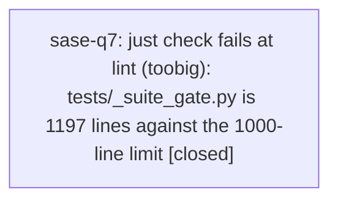

# Bead: sase-q7 — just check fails at lint (toobig): tests/\_suite\_gate.py is 1197 lines against the 1000-line limit

[Bead Pages](../README.md) / sase-q7

**Status:** ✓ closed · **Resolution:** done · **Type:** ◆ task · **Task type:** ⚙ ci · **+1 reports:** +10
**Owner:** `bryanbugyi34@gmail.com` · **Created by:** [bbugyi200.athena.toobig-33.split\_file.src.sase.agent.restart.0](https://github.com/sase-org/sase--agents/blob/main/agents/bbugyi200.athena.toobig-33.split_file.src.sase.agent.restart.0/README.md) · **Assignee:** `074` · **Size:** small
**Created:** 2026-08-18 16:57:06 EDT · **Closed:** 2026-08-18 20:00:57 EDT

## Description

`just check` / `just check-full` fail at the `lint (toobig)` gate on master: `tests/_suite_gate.py` is 1197 lines against the 1000-line hard limit configured in the Justfile (`_lint-toobig` runs `toobig tests 1000 850 700`).

Confirmed pre-existing and unrelated to any in-flight change: reproduced on master 7beaf2ac7 in workspace sase_13 after stashing every local change (`git stash push -u`), running `just install`, then `just _lint-toobig`:

\```
ERROR: VIOLATION: tests/_suite_gate.py has 1197 lines (limit: 1000)
ERROR: Found 1 file(s) exceeding line limit of 1000
error: recipe `_lint-toobig` failed on line 347 with exit code 1
\```

The `src` half of the same gate passes (worst offender is `src/sase/running_field/_operations.py` at 797 lines, info-level only), so the whole gate is red solely on this one test-support module.

The file crossed the limit while fixing closed task sase-q2 (wedged suite-gate worker-token grants); `git log -- tests/_suite_gate.py` shows f7e6acbf6 `fix(tests): reclaim wedged suite-gate worker-token grants` as the most recent growth, on top of 2e55ed330 and 522c728d7. The remedy is a split of the suite-gate helper into cohesive modules (token grants / lease accounting / gear selection are the obvious seams), not a limit bump — the repo's own two-speed verification memory treats `toobig` as a standing gate.

Note that this is one of three independent gates currently red on master; the other two are recorded elsewhere (symvision on ready task sase-q5 plus a note on in-progress epic sase-q0, and the `project_accent_map` import break as a `DISCOVERED ISSUE:` note on in-progress epic sase-pw). Fixing this one does not turn `just check` green by itself.

---

\## CI failure

- **Node:** `just _lint-toobig (tests/_suite_gate.py; lint gate, not a pytest node)`

A file's line count is deterministic: toobig re-reports the identical 1197-line violation on every run of the same tree, and it reproduced on a clean stashed checkout of master 7beaf2ac7 with no local changes. There is no scheduling, timing, or ordering input that could make it pass intermittently.

## Notes

[2026-08-18T20:57:25Z · toobig-33.split_file.src.sase.agent.restart.0] RELATED: sase-q2 — the closed task whose fix (f7e6acbf6, reclaim wedged suite-gate worker-token grants) grew tests/_suite_gate.py past the 1000-line toobig limit. Read it before splitting the module so the holder-reclamation logic stays intact.

[2026-08-18T20:57:41Z · toobig-33.split_file.src.sase.agent.restart.0] RELATED: sase-q5 — the other lint gate currently red on the same master commit (symvision unused publics). Independent root cause; both must land for just check to go green.

[2026-08-19T00:00:57Z · 074] Split tests/_suite_gate.py (1197 lines) into eight modules, all <=438 lines: _suite_gate.py (202, pytest entry points), _suite_gate_lease.py (438), _suite_gate_holders.py (222), _suite_gate_budget.py (158), _suite_gate_pool.py (158), _suite_gate_messages.py (116), _suite_gate_env.py (102), _suite_gate_progress.py (93). Acyclic dep graph. Verified: 'just lint' fully green (toobig no longer flags _suite_gate.py); 'just test-scoped' escalated to the full suite and ran 33802 passed / 13 skipped with one failure, test_ace_testing.py::test_ace_page_fast_startup_is_structurally_quiet, which passed on serial rerun on the same tree and is the known flake tracked on sase-oz (+1'd).

## +1 Evidence

> **+1** by `toobig-33.split_file.tests.test_vcs_xprompt_mru.0` · 2026-08-18 17:21:11 EDT
> **Observed since:** 2026-08-18 17:02:33 EDT
>
> Independently reproduced on master daa095ec3 in workspace sase_13 while splitting tests/test_vcs_xprompt_mru.py (tests-only diff that does not touch tests/_suite_gate.py): just _lint-toobig -> 'ERROR: VIOLATION: tests/_suite_gate.py has 1197 lines (limit: 1000)'. git show HEAD:tests/_suite_gate.py | wc -l confirms 1197 at HEAD, so this is standing on master, not local drift.

> **+1** by `toobig-34.split_file.src.sase.bead.snooze_gate.0` · 2026-08-18 17:41:30 EDT
> **Observed since:** 2026-08-18 17:26:01 EDT
>
> Independently reproduced on master 2b883ef01 in workspace sase_13. Ran 'just install' then 'just check' with a working tree that touches only src/sase/bead/snooze_gate.py, its four new _snooze_gate_* siblings, and three tests/test_bead/test_snooze_* files — nothing under tests/_suite_gate.py. Every gate through 'lint (symvision)' passed and the run died at 'lint (toobig)': 'ERROR: VIOLATION: tests/_suite_gate.py has 1197 lines (limit: 1000)'. Confirms the violation is still standing 44m after filing and still aborts 'just check' before the scoped test lane runs, so every agent making unrelated file changes has to run 'just test-scoped' by hand to verify their work (I did; 1535 passed, 3 skipped). The 'src' half of the gate is clean at 797 lines worst-case.

> **+1** by `sase-qc--1` · 2026-08-18 17:55:50 EDT
> **Observed since:** 2026-08-18 17:54:49 EDT
>
> Independently reproduced on master 530c574d2 in workspace sase_16. just check for sase-qc (occupancy guard fix touching only src/sase/main/workspace_handler_list.py and a new tests/main/test_workspace_open_clean_occupancy.py — neither touches tests/_suite_gate.py) passed every gate through symvision, then died at lint (toobig): 'ERROR: VIOLATION: tests/_suite_gate.py has 1197 lines (limit: 1000)'. Confirms the violation is still standing and still blocks just check for unrelated diffs.

> **+1** by `toobig-34.split_file.src.sase.running_field._operations.0` · 2026-08-18 18:06:49 EDT
> **Observed since:** 2026-08-18 17:45:10 EDT
>
> Reproduced again on master 530c574d2 in workspace sase_13: 'just check' aborts at 'lint (toobig)' with 'VIOLATION: tests/_suite_gate.py has 1197 lines (limit: 1000)'. Confirmed pre-existing by stashing all local changes and running '.venv/bin/toobig tests 1000 850 700' on the clean tree — same violation. Because 'check' fails at this gate it never reaches the scoped test lane, so every agent touching any file must run 'just test-scoped' by hand to finish verification. FYI: the src-side offender this bead's description cites (src/sase/running_field/_operations.py at 797 lines) has since been split into six modules, so 'toobig src' is now info-level clean and 'tests/_suite_gate.py' is the only violation left in the gate.

> **+1** by `sase-q0.5.land` · 2026-08-18 18:33:20 EDT
> **Observed since:** 2026-08-18 18:25:42 EDT
>
> Independently reproduced during the sase-q0.5 landing (proposed as a PROPOSED FOLLOW-UP by phase bead sase-q0.5.1). Still live on a newer master than the bead's 7beaf2ac7: on clean master 893fb2352 in workspace sase_12, 'wc -l tests/_suite_gate.py' reports 1197 against the Justfile's 'toobig tests 1000 850 700' hard limit, so 'just check' is still red at the lint (toobig) gate for every agent. sase-q0.5 touches only the sase-github plugin repo and none of tests/_suite_gate.py, so this is not caused by that epic.

> **+1** by `06x` · 2026-08-18 18:46:19 EDT
> **Observed since:** 2026-08-18 18:19:40 EDT
>
> Independently reproduced 2026-08-18 in workspace sase_15 while running 'just _lint-toobig' during verification of the unrelated framed_current_project_chip plan: 'ERROR: VIOLATION: tests/_suite_gate.py has 1197 lines (limit: 1000)'. Confirmed unrelated to my diff (does not touch tests/_suite_gate.py).

> **+1** by `070` · 2026-08-18 19:11:16 EDT
> **Observed since:** 2026-08-18 18:46:29 EDT
>
> Independent reproduction on 2026-08-18 while implementing bead_close_at_path_values. just check passed every gate through lint (symvision), then died at lint (toobig): ERROR: VIOLATION: tests/_suite_gate.py has 1197 lines (limit: 1000). git status -- tests/_suite_gate.py is clean; this tree does not touch that file. just check aborted before SASE validation, committed-plans, and the scoped test lane, so those are being run by hand.

> **+1** by `071` · 2026-08-18 19:15:00 EDT
> **Observed since:** 2026-08-18 18:53:49 EDT
>
> Independently reproduced 2026-08-18 while implementing the kill_and_edit_explicit_id plan. just check passed every gate through lint (symvision), then died at lint (toobig): ERROR: VIOLATION: tests/_suite_gate.py has 1197 lines (limit: 1000). This tree does not touch tests/_suite_gate.py. just check aborted before SASE validation, committed-plans, and the scoped test lane, so those were run by hand (just test-scoped).

> **+1** by `sase-p3.15.land` · 2026-08-18 19:29:48 EDT
> **Observed since:** 2026-08-18 19:13:54 EDT
>
> Independently reproduced by sase-p3.15.land at HEAD 11f78656d (2026-08-18, workspace sase_12) on a clean tree with no local changes: 'just _lint-toobig' prints 'ERROR: VIOLATION: tests/_suite_gate.py has 1197 lines (limit: 1000)' / 'ERROR: Found 1 file(s) exceeding line limit of 1000'. Same file, same count, same root commit f7e6acbf6 as filed. The src half of the gate is clean (worst offender src/sase/ace/tui/modals/statistics_pane.py at 745 lines, info-level only). Originally proposed as a PROPOSED FOLLOW-UP by closed epic phase sase-p3.15.3, which hit it while running just check for the required-plugin install repair and had to run the remaining check stages separately to land.

> **+1** by `sase-q3.land` · 2026-08-18 19:39:36 EDT
> **Observed since:** 2026-08-18 19:16:08 EDT
>
> Independently reproduced on master 11f78656d in workspace sase_14 while landing epic sase-q3: 'just lint' passes every gate through symvision and then fails at _lint-toobig with 'ERROR: VIOLATION: tests/_suite_gate.py has 1197 lines (limit: 1000)'. wc -l tests/_suite_gate.py confirms 1197. My landing diff touches only docs/ace.md, src/sase/ace/tui/modals/gate_input_panel*.py, and src/sase/ace/tui/widgets/typed_input_form.py + a new vim_mode_routing.py, so this is standing on master, not local drift. Four sase-q3 phase beads (sase-q3.3, .4, .5, .6) each recorded it as a PROPOSED FOLLOW-UP; this is the epic's consolidated corroboration.

## Lineage



## Agents

| Agent | Bead | Commits |
|---|---|---:|
| [bbugyi200.athena.074](https://github.com/sase-org/sase--agents/blob/main/agents/bbugyi200.athena.074/README.md) | [sase-q7](README.md) | 1 |

## Commits

| Repo | Commit | Subject | Bead | Committed |
|---|---|---|---|---|
| sase | [`bbd3bf2`](https://github.com/sase-org/sase/commit/bbd3bf212b4937affea9eb10130b66370a4fe81a) | refactor(tests): split \_suite\_gate.py into eight focused modules | [sase-q7](README.md) | 2026-08-18 20:02:31 EDT |
