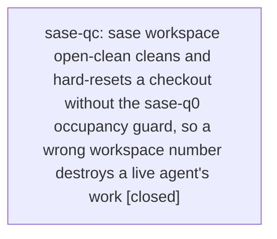

# Bead: sase-qc — sase workspace open-clean cleans and hard-resets a checkout without the sase-q0 occupancy guard, so a wrong workspace number destroys a live agent's work

[Bead Pages](../README.md) / sase-qc

**Status:** ✓ closed · **Resolution:** done · **Type:** ◆ task · **Task type:** ⨯ bug
**Owner:** `bryanbugyi34@gmail.com` · **Created by:** [bbugyi200.athena.sase-q0.land](https://github.com/sase-org/sase--agents/blob/main/families/bbugyi200.athena.sase-q0.land.md) · **Assignee:** `sase-qc` · **Size:** small
**Created:** 2026-08-18 17:34:07 EDT · **Closed:** 2026-08-18 18:04:08 EDT

## Description

Found by the sase-q0 land agent ("Guarantee one agent per workspace") while sweeping every destructive workspace-preparation call site.

Epic sase-q0 added `sase.core.occupancy_guard.ensure_workspace_not_occupied` and wired it in front of every destructive prep site the epic plan named:

- `prepare_workspace_if_needed` and `prepare_linked_repo_workspaces_if_needed` (`src/sase/axe/run_agent_runner_setup.py`)
- both retry re-prep sites in `handle_workflow_error` (`src/sase/axe/run_agent_exec_retry.py`)

One further `prepare_workspace` caller was not in the plan's list and is still unguarded: `prepare_opened_checkout(..., preparation="runner")` in `src/sase/main/workspace_handler_list.py:377-386`, reached from `handle_open_clean` (`sase workspace open-clean <N>`). It runs `prepare_workspace(path, clean_label, VCS_DEFAULT_REVISION, backup_suffix="workspace-open", ...)`, i.e. `git clean` plus a hard reset to the default revision, on workspace `N` of the given project, with no check of the RUNNING field or of that checkout's `.sase/occupant.json`.

`sase repo open` is NOT affected — `src/sase/main/repo_handler_open.py:119` passes `preparation="none"`.

The command name says "clean", so a human running it against their own idle workspace is doing exactly what they asked for. The hazard is a mistyped or stale workspace number: today that silently destroys a live agent's uncommitted work, which is the same data loss the epic's guard was built to make impossible. The epic already supplies the machinery, so guarding this site is a small, self-contained change.

SUGGESTED FIX: call `ensure_workspace_not_occupied` (with an `OccupancyCaller` for the invoking process) before the `preparation == "runner"` branch runs `prepare_workspace`, and fail with the occupant named. Decide deliberately whether an explicit `--force` escape hatch is wanted for the "I know it is stale, clean it anyway" case; the epic's own guard deliberately has none because a dead recorded pid is already treated as a legitimate takeover.

---

\## Bug

- **Location:** `src/sase/main/workspace_handler_list.py:377-386 (prepare_opened_checkout, preparation="runner"), reached from handle_open_clean at :317-325`

Static, verified by reading master 716e9de98:

- `src/sase/main/workspace_handler_list.py:317-325` — `handle_open_clean` calls `prepare_opened_checkout(..., preparation="runner")`.
- `src/sase/main/workspace_handler_list.py:377-386` — that branch calls `prepare_workspace(path, clean_label, VCS_DEFAULT_REVISION, backup_suffix="workspace-open", project_basename=ctx.project_name)`.
- `grep -rn "ensure_workspace_not_occupied" src/` returns only `src/sase/core/occupancy_guard.py`, `src/sase/axe/run_agent_runner_setup.py`, and `src/sase/axe/run_agent_exec_retry.py` — `workspace_handler_list.py` is absent.

To reproduce the data loss: start any agent in workspace N, make an uncommitted edit in its checkout, then run `sase workspace open-clean N` for that project from another shell. The tree is cleaned and hard-reset with no occupancy error, even though `.sase/occupant.json` in that checkout names a live pid and the RUNNING field still holds the claim.

A mistyped or stale workspace number silently git-cleans and hard-resets a checkout a live agent is working in, losing its uncommitted work — the exact data loss epic sase-q0 was built to prevent. sase repo open is unaffected (preparation="none").

## Notes

[2026-08-18T21:35:08Z · sase-q0.land] RELATED: sase-q0.3 — the guard phase that added ensure_workspace_not_occupied and wired it into the four prep sites the epic plan named. This site was outside that list, so the machinery exists and only needs one call.

[2026-08-18T22:04:08Z · sase-qc--2] Added ensure_workspace_not_occupied guard to prepare_opened_checkout (preparation=runner) in src/sase/main/workspace_handler_list.py, matching the pattern in run_agent_runner_setup.py/run_agent_exec_retry.py; added regression test tests/main/test_workspace_open_clean_occupancy.py verifying handle_open_clean/prepare_opened_checkout refuses when the checkout is occupied by a live agent. Verified via just test-scoped (scoped test lane passed: 33755 passed, 12 skipped). Note: just check separately fails at lint (toobig) on tests/_suite_gate.py (1197 lines, limit 1000) — this is a pre-existing, unrelated failure already tracked as sase-q7 (I added a +1 corroboration); it does not touch this bead's diff.

## Lineage

## Agents

| Agent | Bead | Commits |
|---|---|---:|
| [bbugyi200.athena.sase-qc](https://github.com/sase-org/sase--agents/blob/main/families/bbugyi200.athena.sase-qc.md) | [sase-qc](README.md) | 1 |

## Commits

| Repo | Commit | Subject | Bead | Committed |
|---|---|---|---|---|
| sase | [`7563372`](https://github.com/sase-org/sase/commit/7563372f12e7c8b259dcd2bf9654a73d3a110c02) | fix(workspace): guard prepare\_opened\_checkout against occupied checkouts | [sase-qc](README.md) | 2026-08-18 18:05:01 EDT |
