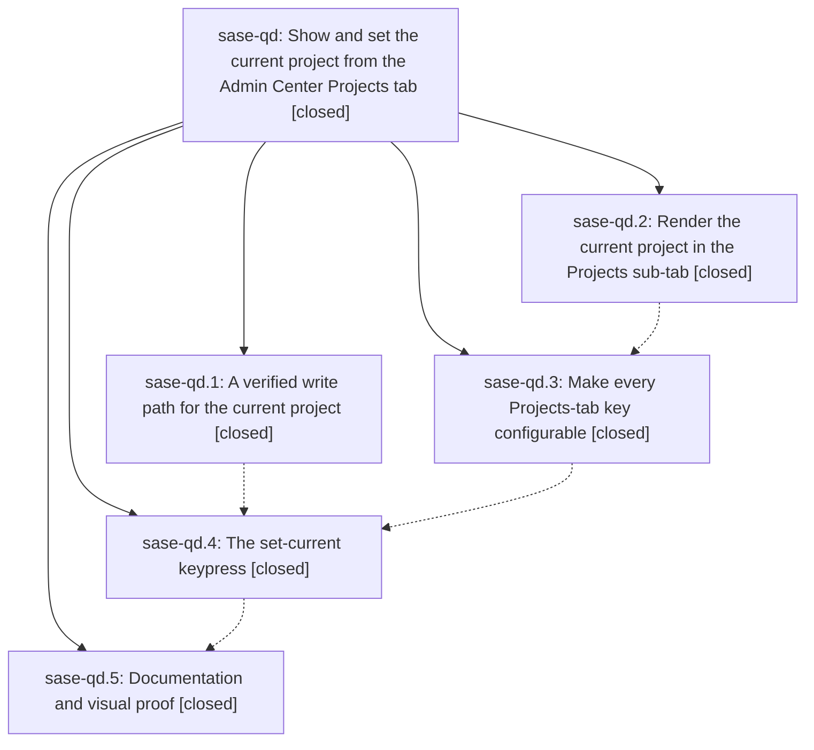

# Bead: sase-qd — Show and set the current project from the Admin Center Projects tab

[Bead Pages](../README.md) / sase-qd

**Status:** ✓ closed · **Resolution:** done · **Type:** ▸ plan · **Tier:** epic
**Owner:** `bryanbugyi34@gmail.com` · **Created by:** [bbugyi200.athena.06w](https://github.com/sase-org/sase--agents/blob/main/families/bbugyi200.athena.06w.md) · **Assignee:** `sase-qd.land`
**Created:** 2026-08-18 18:14:39 EDT · **Closed:** 2026-08-18 21:27:13 EDT
**Plan:** [202608/projects\_tab\_current\_project.md](https://github.com/sase-org/sase--plans/blob/main/202608/projects_tab_current_project.md)

## Description

The Projects tab of the SASE Admin Center says which project is current — in the project's own accent color, the same one the top-bar `+<project>` chip uses — and one configurable keypress on any row makes that project current, everywhere, at once.

## Notes

[2026-08-19T01:27:13Z · sase-qd.land] Landed. Verified all five phases against the source at HEAD rather than their reports: sase-qd.1's set_current_project/SetCurrentProjectOutcome write path plus the `sase project set-current` CLI; sase-qd.2's CUR column, summary segment and detail block; sase-qd.3's ace.keymaps.projects scope with keymap-driven hints; sase-qd.4's `c` keypress with its thread worker and CurrentProjectIndicator.invalidate(); and sase-qd.5's docs plus the new PNG golden. Every child note was addressed.

Integration: ten non-epic commits landed since ce534441f. The one that overlapped — the framed-chip revert 4ae3bda07 — landed before the phases that touched the same files, so invalidate() and project_accent survived intact. One real integration gap found and fixed: the top-bar chip's tooltip still said 'Launch an agent on a project to make it current', the same claim this epic retired everywhere else; it now names both routes (launch an agent, or press c on the Projects tab), with docs/ace.md and the indicator tests updated to match.

One epic-caused regression found and fixed. sase-qd.3 filed its flake as pre-existing while naming sase-qd.2's own code as the cause, and it was independently filed as sase-qo. It is this epic's: _apply_current_project_display repainted via a bare _refresh_options(), which prefers the session bookmark over the live OptionList.highlighted. Because OptionHighlighted only reaches the pane after bubbling out of the option list's queue, a resolve can overtake it and snap the selection back to row 0 — on mount, on R, and after a successful c, so it is user-facing, not just a test artifact. Fixed by routing both resolve paths through _repaint_for_current_project(), which pins the live highlight the way the inventory worker's completion already does. Added a deterministic regression test that drives the seam directly; confirmed it fails on the pre-fix tree (highlighted == 0, expected 1) and passes with the fix.

Verification run in full this pass: fmt (python/markdown), keep-sorted, ruff, mypy (3481 + 43 files), feature flags, pyscripts, test waits, changelog, patch/stitch terminology, symvision, toobig, sase validate, committed plans — all green; test-scoped 1244 passed; the three touched test files 32 passed. sase bead epic-symbols sase-qd reports no entries.

Follow-up disposition: the _suite_gate.py toobig and _lint-flags items are already fixed on master (both gates green here). The logs-pane flake is deliberately baselined debt under sase-jb. The axe visual flake was corroborated on its exact duplicate sase-ol rather than filed anew. sase-qo is closed with this root cause. sase-qp was filed for a suite-gate heartbeat flake hit during verification (1 parallel-lane failure, 5/5 serial passes, not epic-caused). No proposal was declined.

## Phases

| Bead | Title | Status | Size | Created | Agents | Commits |
|---|---|---|---|---|---:|---:|
| [sase-qd.1](sase-qd.1.md) | A verified write path for the current project | ✓ closed | medium | 2026-08-18 | 1 | 1 |
| [sase-qd.2](sase-qd.2.md) | Render the current project in the Projects sub-tab | ✓ closed | medium | 2026-08-18 | 1 | 1 |
| [sase-qd.3](sase-qd.3.md) | Make every Projects-tab key configurable | ✓ closed | medium | 2026-08-18 | 1 | 1 |
| [sase-qd.4](sase-qd.4.md) | The set-current keypress | ✓ closed | medium | 2026-08-18 | 1 | 1 |
| [sase-qd.5](sase-qd.5.md) | Documentation and visual proof | ✓ closed | small | 2026-08-18 | 1 | 1 |

## Lineage

## Agents

| Agent | Bead | Commits |
|---|---|---:|
| [bbugyi200.athena.sase-qd.1](https://github.com/sase-org/sase--agents/blob/main/agents/bbugyi200.athena.sase-qd.1/README.md) | [sase-qd.1](sase-qd.1.md) | 1 |
| [bbugyi200.athena.sase-qd.2](https://github.com/sase-org/sase--agents/blob/main/agents/bbugyi200.athena.sase-qd.2/README.md) | [sase-qd.2](sase-qd.2.md) | 1 |
| [bbugyi200.athena.sase-qd.3](https://github.com/sase-org/sase--agents/blob/main/agents/bbugyi200.athena.sase-qd.3/README.md) | [sase-qd.3](sase-qd.3.md) | 1 |
| [bbugyi200.athena.sase-qd.4](https://github.com/sase-org/sase--agents/blob/main/agents/bbugyi200.athena.sase-qd.4/README.md) | [sase-qd.4](sase-qd.4.md) | 1 |
| [bbugyi200.athena.sase-qd.5](https://github.com/sase-org/sase--agents/blob/main/agents/bbugyi200.athena.sase-qd.5/README.md) | [sase-qd.5](sase-qd.5.md) | 1 |
| [bbugyi200.athena.sase-qd.land](https://github.com/sase-org/sase--agents/blob/main/agents/bbugyi200.athena.sase-qd.land/README.md) | [sase-qd](README.md) | 1 |

## Commits

| Repo | Commit | Subject | Bead | Committed |
|---|---|---|---|---|
| sase | [`ce53444`](https://github.com/sase-org/sase/commit/ce534441fbcf47356f8628a52bd5619416990bcb) | feat(project): add set\_current\_project and sase project set-current | [sase-qd.1](sase-qd.1.md) | 2026-08-18 18:50:20 EDT |
| sase | [`ec048b1`](https://github.com/sase-org/sase/commit/ec048b168c365fe09dd068fd64c9a51e178e99ae) | feat(tui): show current project in Admin Center Projects tab | [sase-qd.2](sase-qd.2.md) | 2026-08-18 18:57:10 EDT |
| sase | [`3df6abe`](https://github.com/sase-org/sase/commit/3df6abe123b9497d095a2cbb966fd0b525e65311) | feat(tui): make every Projects-tab key configurable | [sase-qd.3](sase-qd.3.md) | 2026-08-18 19:39:46 EDT |
| sase | [`5d7812a`](https://github.com/sase-org/sase/commit/5d7812a2c39260ce8aba72bfba31bac1d0c43ef5) | feat(ace): set current project from the Projects tab | [sase-qd.4](sase-qd.4.md) | 2026-08-18 20:09:18 EDT |
| sase | [`60bc311`](https://github.com/sase-org/sase/commit/60bc311503c9e32fc121d943da6fe336bd7ae971) | docs(ace): document current-project display and add its visual golden | [sase-qd.5](sase-qd.5.md) | 2026-08-18 20:31:08 EDT |
| sase | [`b6779c4`](https://github.com/sase-org/sase/commit/b6779c4d6d0e40ed4e625298b380b137128bda41) | fix(tui): keep the Projects highlight when a current-project resolve lands | [sase-qd](README.md) | 2026-08-18 21:29:14 EDT |
