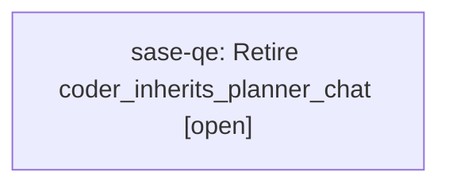

# Bead: sase-qe — Retire coder\_inherits\_planner\_chat

[Bead Pages](../README.md) / sase-qe

**Status:** ○ open · **Type:** ◆ task · **Task type:** ⚑ flag · **Flag:** ⚑ `coder_inherits_planner_chat`
**Owner:** `bryanbugyi34@gmail.com` · **Created by:** [bbugyi200.athena.sase-pv.7.f0](https://github.com/sase-org/sase--agents/blob/main/agents/bbugyi200.athena.sase-pv.7.f0/README.md) · **Size:** medium
**Created:** 2026-08-18 18:15:29 EDT

## Flag

- **Key:** `coder_inherits_planner_chat`
- **Remove by date:** `2026-11-14`
- **Remove by release:** `v0.18.0`
- **Due states:** `live`, `soon`, `due`

## Description

Opt-in beta: the follow-up coder inherits the planner's chat via #fork instead of starting from the approved plan file alone.

---

\## Feature flag `coder_inherits_planner_chat` · beta

- **On:** The follow-up coder launched after plan approval inherits the planner's chat through `#fork`, so it starts with the planner's full reasoning context in addition to the approved plan file reference.
- **Off:** The follow-up coder starts from the approved plan file alone, with no planner chat context.

**Remove when:** Forked coders have landed several epics with no plan-fidelity regression against the plan-file-only path, and the `#fork` context cost is acceptable at typical planner chat lengths.

Removal deletes the **Off** branch and makes the **On** branch unconditional.

## Lineage

