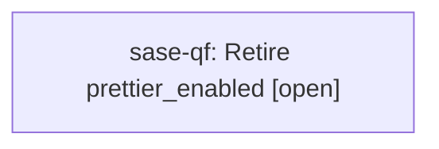

# Bead: sase-qf — Retire prettier\_enabled

[Bead Pages](../README.md) / sase-qf

**Status:** ○ open · **Type:** ◆ task · **Task type:** ⚑ flag · **Flag:** ⚑ `prettier_enabled`
**Owner:** `bryanbugyi34@gmail.com` · **Created by:** [bbugyi200.athena.sase-pv.7.f0](https://github.com/sase-org/sase--agents/blob/main/agents/bbugyi200.athena.sase-pv.7.f0/README.md) · **Size:** medium
**Created:** 2026-08-18 18:16:07 EDT

## Flag

- **Key:** `prettier_enabled`
- **Remove by date:** `2026-11-14`
- **Remove by release:** `v0.18.0`
- **Due states:** `live`, `soon`, `due`

## Description

Format markdown with prettier when it is installed. SASE_DISABLE_PRETTIER remains a deprecated alias.

---

\## Feature flag `prettier_enabled` · sunset

- **On:** Markdown is formatted with prettier whenever prettier is installed.
- **Off:** Markdown formatting skips prettier entirely; the deprecated `SASE_DISABLE_PRETTIER` environment variable is the alias that reaches this branch.

**Remove when:** No workflow still needs a prettier escape hatch and `SASE_DISABLE_PRETTIER` is no longer exported anywhere.

Removal deletes the **Off** branch and makes the **On** branch unconditional.

## Lineage

