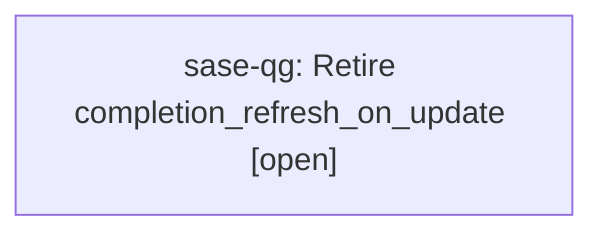

# Bead: sase-qg — Retire completion\_refresh\_on\_update

[Bead Pages](../README.md) / sase-qg

**Status:** ○ open · **Type:** ◆ task · **Task type:** ⚑ flag · **Flag:** ⚑ `completion_refresh_on_update`
**Owner:** `bryanbugyi34@gmail.com` · **Created by:** [bbugyi200.athena.sase-pv.7.f0](https://github.com/sase-org/sase--agents/blob/main/agents/bbugyi200.athena.sase-pv.7.f0/README.md) · **Size:** small
**Created:** 2026-08-18 18:16:38 EDT

## Flag

- **Key:** `completion_refresh_on_update`
- **Remove by date:** `2026-11-15`
- **Remove by release:** `v0.18.0`
- **Due states:** `live`, `soon`, `due`

## Description

After a successful sase update, regenerate, zcompile, and restamp installed shell completion scripts. Off by default while the generator soaks.

---

\## Feature flag `completion_refresh_on_update` · beta

- **On:** After a successful `sase update`, installed shell completion scripts are regenerated, zcompiled, and restamped.
- **Off:** `sase update` leaves installed completion scripts untouched; they refresh only on an explicit `sase completion install`.

**Remove when:** The generator has soaked through several `sase update` runs without producing a broken or stale completion script on any supported shell.

Removal deletes the **Off** branch and makes the **On** branch unconditional.

## Lineage

