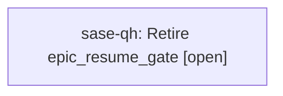

# Bead: sase-qh — Retire epic\_resume\_gate

[Bead Pages](../README.md) / sase-qh

**Status:** ○ open · **Type:** ◆ task · **Task type:** ⚑ flag · **Flag:** ⚑ `epic_resume_gate`
**Owner:** `bryanbugyi34@gmail.com` · **Created by:** [bbugyi200.athena.sase-pv.7.f0](https://github.com/sase-org/sase--agents/blob/main/agents/bbugyi200.athena.sase-pv.7.f0/README.md) · **Size:** small
**Created:** 2026-08-18 18:17:09 EDT

## Flag

- **Key:** `epic_resume_gate`
- **Remove by date:** `2026-11-15`
- **Remove by release:** `v0.18.0`
- **Due states:** `live`, `soon`, `due`

## Description

Opt-in beta: the epic_resume chop raises an EpicResume gate when a failed phase agent stalls an epic.

---

\## Feature flag `epic_resume_gate` · beta

- **On:** The `epic_resume` chop raises an `EpicResume` gate when a failed phase agent has stalled an epic.
- **Off:** A stalled epic raises no gate; recovery is entirely manual through `sase bead work <epic-id>`.

**Remove when:** The chop has gated real stalls without false positives on handoff races or fast retries at the configured `bead.epic_resume.settle_seconds`.

Removal deletes the **Off** branch and makes the **On** branch unconditional.

## Lineage

