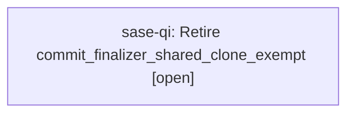

# Bead: sase-qi — Retire commit\_finalizer\_shared\_clone\_exempt

[Bead Pages](../README.md) / sase-qi

**Status:** ○ open · **Type:** ◆ task · **Task type:** ⚑ flag · **Flag:** ⚑ `commit_finalizer_shared_clone_exempt`
**Owner:** `bryanbugyi34@gmail.com` · **Created by:** [bbugyi200.athena.sase-pv.7.f0](https://github.com/sase-org/sase--agents/blob/main/agents/bbugyi200.athena.sase-pv.7.f0/README.md) · **Size:** medium
**Created:** 2026-08-18 18:17:41 EDT

## Flag

- **Key:** `commit_finalizer_shared_clone_exempt`
- **Remove by date:** `2026-11-16`
- **Remove by release:** `v0.18.0`
- **Due states:** `live`, `soon`, `due`

## Description

Classify foreign-agent commits and already-published/pending-publication transitions in machine-wide shared clones (opened-external and sdd-kind repos) as races rather than discards in the commit finalizer's dirty-work guard. Disable to fall back to strict single-owner classification.

---

\## Feature flag `commit_finalizer_shared_clone_exempt` · sunset

- **On:** In machine-wide shared clones (opened-external and sdd-kind repos), the commit finalizer's dirty-work guard classifies foreign-agent commits and already-published or pending-publication transitions as races.
- **Off:** The guard falls back to strict single-owner classification and reports those same transitions as discards.

**Remove when:** Shared-clone race classification has run without a real discard being misreported as a race, so the strict single-owner branch can be deleted.

Removal deletes the **Off** branch and makes the **On** branch unconditional.

## Lineage

