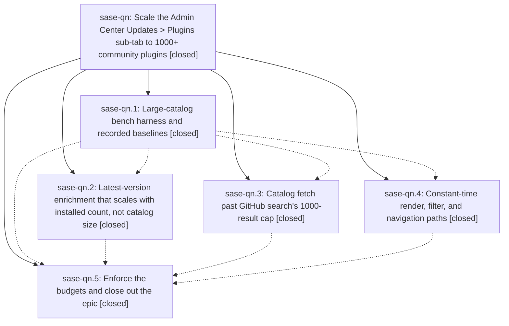

# Bead: sase-qn — Scale the Admin Center Updates \> Plugins sub-tab to 1000+ community plugins

[Bead Pages](../README.md) / sase-qn

**Status:** ✓ closed · **Resolution:** done · **Type:** ▸ plan · **Tier:** epic
**Owner:** `bryanbugyi34@gmail.com` · **Created by:** [bbugyi200.athena.075](https://github.com/sase-org/sase--agents/blob/main/families/bbugyi200.athena.075.md) · **Assignee:** `sase-qn.land`
**Created:** 2026-08-18 20:12:38 EDT · **Closed:** 2026-08-18 23:50:44 EDT
**Plan:** [202608/plugin\_catalog\_scale.md](https://github.com/sase-org/sase--plans/blob/main/202608/plugin_catalog_scale.md)

## Description

The Updates tab's Plugins sub-tab loads, filters, and navigates a catalog of 1000+ community plugins without silent truncation, without a per-catalog-entry network storm, and with j/k key-to-paint p95 under 16 ms.

## Notes

[2026-08-19T02:30:05Z · toobig-34.split_file.tests.test_config_schema.0] DISCOVERED ISSUE: tests/ace/tui/test_plugins_browser_pane_detail.py::test_plugins_pane_lazy_fetches_highlighted_latest_when_flag_on fails reproducibly on clean master (17592d904), not a flake: 3/3 serial isolated runs failed under '.venv/bin/python -m pytest <node> -q -p no:randomly', and it also failed inside a full 'just check' run. It fails on a stashed, unmodified tree, so it is not caused by the in-flight test-file split that found it.

Symptom: the lazy worker does run (the test's wait_for on 'calls' passes), but pane._entry_by_name('nvim').latest is still LatestInfo(checked=False, version=None) instead of the fetched '2.0.0'.

Root cause: phase sase-qn.2 (664180532) added _apply_plugin_latest in src/sase/ace/tui/modals/plugins_browser_latest.py, which rewrites self._catalog and self._grouped with the enriched entry. Phase sase-qn.4 (41d9f9141) then added the name-keyed identity map self._plugin_entry_by_name, built only in _rebuild_plugin_identity_maps (src/sase/ace/tui/modals/plugins_browser_rendering.py:212-231) and read by _entry_by_name (line 587). _apply_plugin_latest never refreshes that map, so the map keeps the pre-enrichment entry.

Impact is user-visible, not test-only: _current_entry -> _entry_by_name (line 585) feeds _render_detail_now, so the Updates > Plugins detail panel re-renders from the stale entry after a lazy fetch completes and never shows the fetched latest version while the plugin_catalog_scoped_latest flag is on. Fix belongs with phase sase-qn.5's close-out: have _apply_plugin_latest update _plugin_entry_by_name (and any sibling identity map keyed on the replaced entry) alongside _catalog and _grouped.

[2026-08-19T03:32:50Z · toobig-35.split_file.src.sase.ace.tui.modals.statistics_pane.0] CORROBORATION of the 2026-08-19T02:30:05Z DISCOVERED ISSUE above (test_plugins_pane_lazy_fetches_highlighted_latest_when_flag_on): independently reproduced from a different workspace (sase_12) at HEAD bdc3f2f74 during an unrelated statistics_pane.py module split. 'just check' failed the node in the full parallel lane, it failed again serially with -p no:randomly, and it still failed after 'git stash -u' left a clean, unmodified master tree — same assertion (entry.latest.version is None, LatestInfo(checked=False, ...), expected '2.0.0'). No new root-cause information; recording only that a second reporter hit it on a clean tree, so it is deterministic rather than workspace-local.

[2026-08-19T03:50:44Z · sase-qn.land] VERIFIED (step 1). Read all five phase beads, their notes, and the source at HEAD. Phase 1's harness records the 10/250/1000/2000 curve; phase 2's enrichment is O(installed) (the quadratic _installed_version_for_key is gone, replaced by a one-shot installed_versions dict) with eager work flag-scoped behind an 8s deadline and a 4xTTL cache prune; phase 3's GitHub fetch shards past the 1000-result search cap and surfaces truncation as PluginCatalog.warnings instead of silently dropping repos; phase 4's TUI does batched add_options, precomputed filter haystacks, name-keyed identity maps, a debounced filter, and an LRU-bounded incoming-commit cache. The epic bead's own DISCOVERED ISSUE (stale _plugin_entry_by_name after a lazy fetch, corroborated from a second workspace) is fixed in ce5ddf13c and its node passes 3/3 serially.

TWO GAPS THE GUARD PHASE LEFT, both fixed in this landing. (1) tests/perf/plugin_catalog_scale.py hardcoded scan_work = 0.0 after phase 2 deleted the function the harness instrumented, so the floor's 'enrich scan_work stays 0' gate compared a constant to a constant and the epic's sub-quadratic criterion enforced nothing. Replaced with a CountingEntries tuple that counts real catalog-row visits plus a linear 4n ceiling, and proved it end-to-end: patching the per-miss rescan back into latest.py reds the floor (7990 > 4000 at n=1000, 15990 > 8000 at n=2000). A new test, test_enrich_scan_work_detects_a_reintroduced_per_miss_rescan, pins that the measuring stick fails when the quadratic returns. (2) The baseline's enrich wall-clock rows still carried the pre-fix quadratic curve (317 ms / 1260 ms at n=1000/2000) labeled as current; a fresh capture reads 8.2 ms / 16.8 ms.

INTEGRATED (step 2). Reviewed all 11 non-epic commits since 42a81937b. None touch src/sase/plugins/ or plugins_browser_*. Two mattered: 915cdeeef baselined three of this epic's four proposed flakes (under sase-og, sase-qm, sase-qo) and 509170484 raised the flake triage bar to +3. b6779c4d6's _repaint_for_current_project pattern does not apply, because _apply_plugin_latest patches one row rather than rebuilding and so cannot yank the highlight.

FOLLOW-UPS. Five of six phase proposals were already covered (three by 915cdeeef, test_ace_page_fast_startup by sase-oz, the lazy-latest one by this epic's own fix); filed sase-qr for the one genuinely open node. Recorded the flag reconciliation on sase-qq: plugin_catalog_scoped_latest stays beta/default-off because sase bead update has no kind mutation and flipping only the registry fails integrity with kind_mismatch. Separately, the flake baseline gate went red during this landing on tests/test_provider_disable.py::test_facade_try_disable_one_winner_under_process_contention, which this epic did not cause; per /sase_new_task's active-epic branch I filed no duplicate task and instead corroborated the existing DISCOVERED ISSUE on sase-n4.5 with a second independent failure record (workspace sase_18 at 24f0c9539656, 2026-08-17, unrelated glossary changes), then baselined the node attributed to that bead.

GATES. sase bead epic-symbols sase-qn reports no entries. just lint exit 0 including symvision; just plugin-catalog-scale-check all PASS; just selection-health --fail-on-new-flake exit 0 (13 current, 26 allowed); the touched perf suites 15 passed and the flake-baseline consumer suites 22 passed.

## Phases

| Bead | Title | Status | Size | Created | Agents | Commits |
|---|---|---|---|---|---:|---:|
| [sase-qn.1](sase-qn.1.md) | Large-catalog bench harness and recorded baselines | ✓ closed | small | 2026-08-18 | 1 | 1 |
| [sase-qn.2](sase-qn.2.md) | Latest-version enrichment that scales with installed count, not catalog size | ✓ closed | medium | 2026-08-18 | 1 | 1 |
| [sase-qn.3](sase-qn.3.md) | Catalog fetch past GitHub search's 1000-result cap | ✓ closed | medium | 2026-08-18 | 1 | 1 |
| [sase-qn.4](sase-qn.4.md) | Constant-time render, filter, and navigation paths | ✓ closed | medium | 2026-08-18 | 1 | 1 |
| [sase-qn.5](sase-qn.5.md) | Enforce the budgets and close out the epic | ✓ closed | small | 2026-08-18 | 1 | 2 |

## Lineage

## Agents

| Agent | Bead | Commits |
|---|---|---:|
| [bbugyi200.athena.sase-qn.1](https://github.com/sase-org/sase--agents/blob/main/agents/bbugyi200.athena.sase-qn.1/README.md) | [sase-qn.1](sase-qn.1.md) | 1 |
| [bbugyi200.athena.sase-qn.2](https://github.com/sase-org/sase--agents/blob/main/agents/bbugyi200.athena.sase-qn.2/README.md) | [sase-qn.2](sase-qn.2.md) | 1 |
| [bbugyi200.athena.sase-qn.3](https://github.com/sase-org/sase--agents/blob/main/agents/bbugyi200.athena.sase-qn.3/README.md) | [sase-qn.3](sase-qn.3.md) | 1 |
| [bbugyi200.athena.sase-qn.4](https://github.com/sase-org/sase--agents/blob/main/agents/bbugyi200.athena.sase-qn.4/README.md) | [sase-qn.4](sase-qn.4.md) | 1 |
| [bbugyi200.athena.sase-qn.5](https://github.com/sase-org/sase--agents/blob/main/families/bbugyi200.athena.sase-qn.5.md) | [sase-qn.5](sase-qn.5.md) | 2 |
| [bbugyi200.athena.sase-qn.land](https://github.com/sase-org/sase--agents/blob/main/agents/bbugyi200.athena.sase-qn.land/README.md) | [sase-qn](README.md) | 1 |

## Commits

| Repo | Commit | Subject | Bead | Committed |
|---|---|---|---|---|
| sase | [`42a8193`](https://github.com/sase-org/sase/commit/42a81937b9dedd61eb8a77b3d691565e793acb0e) | test(perf): add plugins catalog scale bench harness | [sase-qn.1](sase-qn.1.md) | 2026-08-18 20:52:44 EDT |
| sase | [`ea95b16`](https://github.com/sase-org/sase/commit/ea95b16ce2ba58101b805f65cd6f628577696517) | feat(plugins): shard GitHub catalog search past the 1000-result cap | [sase-qn.3](sase-qn.3.md) | 2026-08-18 21:32:42 EDT |
| sase | [`41d9f91`](https://github.com/sase-org/sase/commit/41d9f9141b537785164d83ca665c6c30cf81d211) | perf(tui): make plugins-browser render, filter, and navigation paths constant-time | [sase-qn.4](sase-qn.4.md) | 2026-08-18 21:37:23 EDT |
| sase | [`6641805`](https://github.com/sase-org/sase/commit/66418053282c2937c4ca79a179e5c9a21bea02a8) | feat(plugins): scale latest-version enrichment to installed count | [sase-qn.2](sase-qn.2.md) | 2026-08-18 21:53:45 EDT |
| sase | [`ce5ddf1`](https://github.com/sase-org/sase/commit/ce5ddf13cd8030b385c430da1a5909b07849a3c1) | perf(plugins): enforce catalog-scale budgets and keep lazy latest | [sase-qn.5](sase-qn.5.md) | 2026-08-18 23:02:02 EDT |
| sase | [`0e36971`](https://github.com/sase-org/sase/commit/0e36971e0ba2b75ffa9cc09d33ff2a00c6bcce65) | chore(perf): ignore plugin catalog scale floor-check report | [sase-qn.5](sase-qn.5.md) | 2026-08-18 23:06:15 EDT |
| sase | [`3186c1c`](https://github.com/sase-org/sase/commit/3186c1c41f298de09f268ab77e16e08d25220c28) | test(perf): count real catalog walks in the plugin scale floor | [sase-qn](README.md) | 2026-08-18 23:52:17 EDT |
