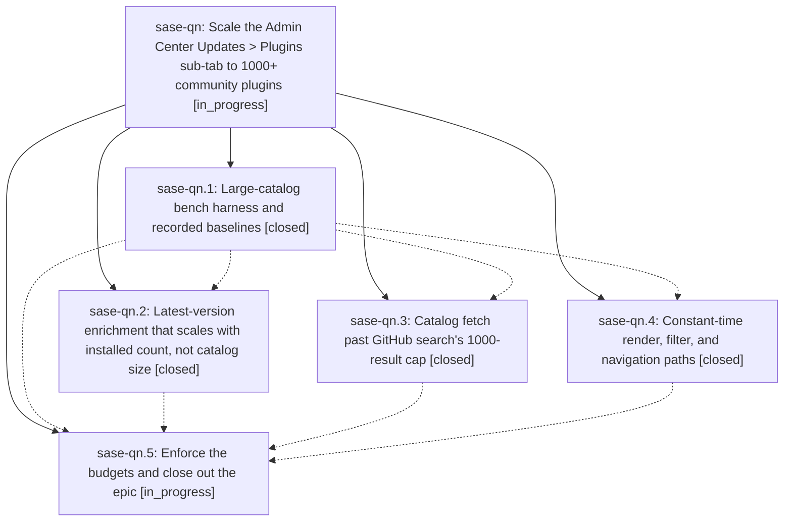

# Bead: sase-qn — Scale the Admin Center Updates \> Plugins sub-tab to 1000+ community plugins

[Bead Pages](../README.md) / sase-qn

**Status:** ◐ in_progress · **Type:** ▸ plan · **Tier:** epic
**Owner:** `bryanbugyi34@gmail.com` · **Created by:** [bbugyi200.athena.075](https://github.com/sase-org/sase--agents/blob/main/families/bbugyi200.athena.075.md) · **Assignee:** `sase-qn.land`
**Created:** 2026-08-18 20:12:38 EDT
**Plan:** [202608/plugin\_catalog\_scale.md](https://github.com/sase-org/sase--plans/blob/main/202608/plugin_catalog_scale.md)

## Description

The Updates tab's Plugins sub-tab loads, filters, and navigates a catalog of 1000+ community plugins without silent truncation, without a per-catalog-entry network storm, and with j/k key-to-paint p95 under 16 ms.

## Phases

| Bead | Title | Status | Size | Created | Agents | Commits |
|---|---|---|---|---|---:|---:|
| [sase-qn.1](sase-qn.1.md) | Large-catalog bench harness and recorded baselines | ✓ closed | small | 2026-08-18 | 1 | 1 |
| [sase-qn.2](sase-qn.2.md) | Latest-version enrichment that scales with installed count, not catalog size | ✓ closed | medium | 2026-08-18 | 1 | 1 |
| [sase-qn.3](sase-qn.3.md) | Catalog fetch past GitHub search's 1000-result cap | ✓ closed | medium | 2026-08-18 | 1 | 1 |
| [sase-qn.4](sase-qn.4.md) | Constant-time render, filter, and navigation paths | ✓ closed | medium | 2026-08-18 | 1 | 1 |
| [sase-qn.5](sase-qn.5.md) | Enforce the budgets and close out the epic | ◐ in_progress | small | 2026-08-18 | 1 | 0 |

## Lineage

## Agents

| Agent | Bead | Commits |
|---|---|---:|
| [bbugyi200.athena.sase-qn.1](https://github.com/sase-org/sase--agents/blob/main/agents/bbugyi200.athena.sase-qn.1/README.md) | [sase-qn.1](sase-qn.1.md) | 1 |
| [bbugyi200.athena.sase-qn.2](https://github.com/sase-org/sase--agents/blob/main/agents/bbugyi200.athena.sase-qn.2/README.md) | [sase-qn.2](sase-qn.2.md) | 1 |
| [bbugyi200.athena.sase-qn.3](https://github.com/sase-org/sase--agents/blob/main/agents/bbugyi200.athena.sase-qn.3/README.md) | [sase-qn.3](sase-qn.3.md) | 1 |
| [bbugyi200.athena.sase-qn.4](https://github.com/sase-org/sase--agents/blob/main/agents/bbugyi200.athena.sase-qn.4/README.md) | [sase-qn.4](sase-qn.4.md) | 1 |
| [bbugyi200.athena.sase-qn.5](https://github.com/sase-org/sase--agents/blob/main/agents/bbugyi200.athena.sase-qn.5/README.md) | [sase-qn.5](sase-qn.5.md) | 0 |
| [bbugyi200.athena.sase-qn.land](https://github.com/sase-org/sase--agents/blob/main/agents/bbugyi200.athena.sase-qn.land/README.md) | [sase-qn](README.md) | 0 |

## Commits

| Repo | Commit | Subject | Bead | Committed |
|---|---|---|---|---|
| sase | [`42a8193`](https://github.com/sase-org/sase/commit/42a81937b9dedd61eb8a77b3d691565e793acb0e) | test(perf): add plugins catalog scale bench harness | [sase-qn.1](sase-qn.1.md) | 2026-08-18 20:52:44 EDT |
| sase | [`ea95b16`](https://github.com/sase-org/sase/commit/ea95b16ce2ba58101b805f65cd6f628577696517) | feat(plugins): shard GitHub catalog search past the 1000-result cap | [sase-qn.3](sase-qn.3.md) | 2026-08-18 21:32:42 EDT |
| sase | [`41d9f91`](https://github.com/sase-org/sase/commit/41d9f9141b537785164d83ca665c6c30cf81d211) | perf(tui): make plugins-browser render, filter, and navigation paths constant-time | [sase-qn.4](sase-qn.4.md) | 2026-08-18 21:37:23 EDT |
| sase | [`6641805`](https://github.com/sase-org/sase/commit/66418053282c2937c4ca79a179e5c9a21bea02a8) | feat(plugins): scale latest-version enrichment to installed count | [sase-qn.2](sase-qn.2.md) | 2026-08-18 21:53:45 EDT |
