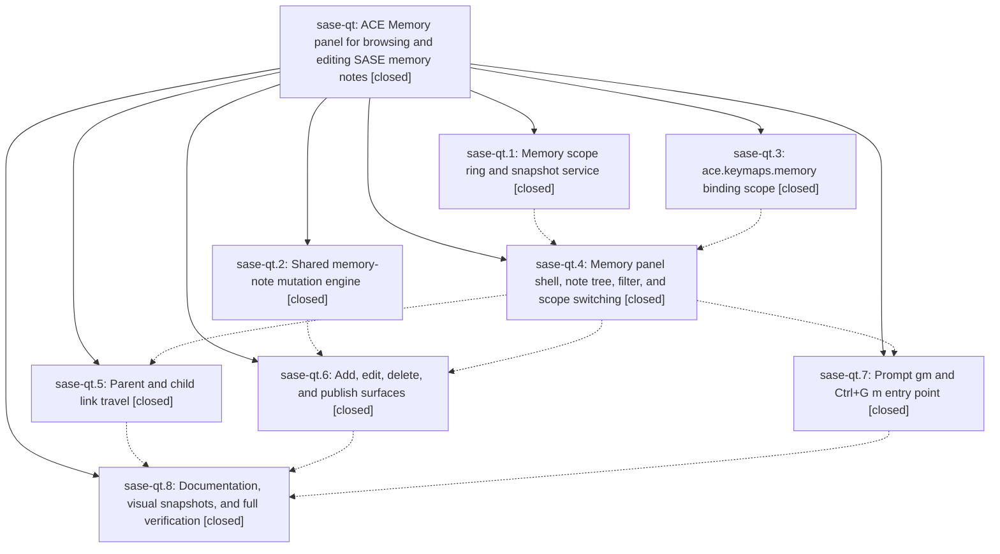

# Bead: sase-qt — ACE Memory panel for browsing and editing SASE memory notes

[Bead Pages](../README.md) / sase-qt

**Status:** ✓ closed · **Resolution:** done · **Type:** ▸ plan · **Tier:** epic
**Owner:** `bryanbugyi34@gmail.com` · **Created by:** [bbugyi200.athena.07j](https://github.com/sase-org/sase--agents/blob/main/families/bbugyi200.athena.07j.md) · **Assignee:** `sase-qt.land`
**Created:** 2026-08-19 08:16:36 EDT · **Closed:** 2026-08-19 15:03:12 EDT
**Plan:** [202608/ace\_memory\_panel.md](https://github.com/sase-org/sase--plans/blob/main/202608/ace_memory_panel.md)

## Description

A prompt-launched Memory panel lets a user browse, add, modify, and delete SASE memory notes for any memory-bearing scope, defaulting to the current project, with parent/child link travel and a publish step that keeps AGENTS.md and provider shims in sync.

## Notes

[2026-08-19T17:34:46Z · sase-qt.land] LAND INTEGRATION: commit fee21a898 'feat(memory): generate glossary.md as a short Tier 1 note' landed mid-epic (after phase sase-qt.2 created generated_memory_note_relative_paths, before phase sase-qt.1 built the catalog), adding sase/memory/glossary.md as a fifth generated memory note. Neither phase noticed, so the panel's read-only contract still listed only sase.md, task_types.md, sase_beads.md, and sase_sizes.md: the Memory panel rendered the generated glossary note as an ordinary editable note, and src/sase/memory/mutation.py would have let a user edit or delete it, with the next 'sase memory init' silently overwriting the edit or regenerating the deleted file. Verified empirically before the fix (_is_generated_relative_path('sase/memory/glossary.md', include_project_memory=True) returned False). Fixed by adding generated_glossary_memory_relative_path() to the project-memory branch of generated_memory_note_relative_paths() in src/sase/main/init_memory/root_rendering.py, plus a drift guard (test_generated_paths_cover_every_note_sase_memory_init_generates) that asserts the panel contract covers every path generated_short_notes() and render_generated_project_long_memory_contents() actually write, so the next generated note cannot slip through the same way. glossary.md is project-only: init passes glossary_terms to the project root plan only, so the Home scope contract is unchanged.

[2026-08-19T18:56:03Z · sase-qw.land--2] DISCOVERED ISSUE: tests/ace/tui/visual/test_ace_png_snapshots_prompt_stack.py::test_prompt_stack_g_prefix_hints_png_snapshot is stale because of this epic. Phase sase-qt.7 (b419802f3) added the `gm  memory…` row to the prompt g-prefix which-key hint panel but did not regenerate the golden, so the actual frame has an extra hint row and everything below it shifts (266181/1520532 changed px, 17.51%; 205754 material). Found by the sase-qw land agent running `just test-visual` as its pre-land gate at 3285244e3 (monitor 0a4wh1amen35) and re-confirmed at 4950f060c; deterministic content diff, not renderer noise or timing drift. Not caused by sase-qw. The same commit's binding_common.py help row also contributed to the help_keymaps_changespecs_120x40 golden going stale; sase-qw regenerated that one in 4950f060c because its own ,L leader row was the other half of that diff. Fix here: `just test-visual tests/ace/tui/visual/test_ace_png_snapshots_prompt_stack.py::test_prompt_stack_g_prefix_hints_png_snapshot --sase-update-visual-snapshots` before this epic lands. Note the visual suite is excluded from both `just check` and `just check-full`, which is why it landed red.

[2026-08-19T19:03:12Z · sase-qt.land] LANDED. All 8 phases closed and verified against the source and their commits.

VERIFICATION (step 1). Each phase maps to a landed commit: sase-qt.3 -> f388474d6 (ace.keymaps.memory scope), sase-qt.2 -> 1ee5a729c (CLI-free mutation engine), sase-qt.1 -> 6f72aa5eb (catalog, load seed, note filter), sase-qt.4 -> edf64fa1c (panel shell, note rail, filter, scope switching), sase-qt.5 -> b2b8415b7 (parent/child link travel), sase-qt.7 -> b419802f3 (prompt gm / Ctrl+G m entry), sase-qt.6 -> 3ca09ff47 (add/edit/delete/publish surfaces), sase-qt.8 -> a67ba351f (docs/ace.md + PNG goldens). Commit 4245a6dfe additionally fixed the validate_sase_core_rs probe mid-epic. Read every child note; each was addressed. No --epic-symbol entries remain for the epic or any phase.

INTEGRATION (step 2) -- one real gap found and fixed. Commit fee21a898 ('feat(memory): generate glossary.md as a short Tier 1 note') landed mid-epic, after sase-qt.2 created generated_memory_note_relative_paths and before sase-qt.1 built the panel catalog, adding sase/memory/glossary.md as a fifth generated memory note. Neither phase noticed, so the panel's read-only contract still listed only sase.md, task_types.md, sase_beads.md, and sase_sizes.md. The Memory panel therefore rendered the generated glossary note as an ordinary editable note, and src/sase/memory/mutation.py would have let a user edit or delete it, with the next 'sase memory init' silently overwriting the edit or regenerating the deleted file. Verified empirically before fixing. Fixed by adding generated_glossary_memory_relative_path() to the project-memory branch of generated_memory_note_relative_paths(), plus a drift guard (test_generated_paths_cover_every_note_sase_memory_init_generates) asserting the contract covers every path generated_short_notes() and render_generated_project_long_memory_contents() actually write, so the next generated note cannot slip through the same way. glossary.md is project-only, so the Home scope contract is unchanged; confirmed the only two callers of the contract are src/sase/memory/mutation.py and src/sase/ace/tui/memory_panel_catalog.py.

FOLLOW-UP OUTCOMES (step 3). Nine PROPOSED FOLLOW-UP entries across the phases:
- Feature-flag lint on live flag bead sase-qu (qt.1, qt.2, qt.3): DECLINED as already fixed; 'lint (feature flags)' passes on HEAD.
- Stale tests/contract_manifest.txt (qt.1, qt.2, qt.3): DECLINED as already fixed; the three test_suite_gate_* entries are present on HEAD.
- ~800-825 'unsupported provider-disable snapshot version 2' failures (qt.5, qt.6, qt.7): DECLINED as already fixed by 11d610757; the full lane is clean of them.
- sase-core 0.29.1 provider_disable positional-arg drift (qt.4): DECLINED as already fixed by 4245a6dfe.
- symvision on classify_flat_query_tokens (qt.8): DECLINED as already fixed; 'lint (symvision)' passes on HEAD.
- Flake test_ace_page_fast_startup_is_structurally_quiet (qt.1, qt.3): corroborated with +1 on existing task sase-oz (now +9); already in tests/reproducible_flake_baseline.txt.
- Flake test_facade_try_disable_one_winner_under_process_contention (qt.1): recorded as a DISCOVERED ISSUE note on active epic sase-n4.5, which the flake baseline already names as owner.
- Flakes in tests/fakey/test_pipe_e2e.py and tests/ace/tui/test_jump_all_modal_hints.py (qt.4): filed as new ready task beads sase-r2 and sase-r3.
- Re-keyed sase-qv.2/sase-qv.3 --epic-symbol entries (qt.6): resolved; no sase-qv entries remain in the Justfile.

FULL-SUITE VERIFICATION. 'just check' passed clean (every lint gate plus the diff-scoped lane). A single 'just check-full' was SIGTERMed at 36% by the suite gate's reclaim watchdog, so the full lane was run in three directory slices instead: 4831 + 10287 + 19142 passed, plus 138 more on recheck = 34398 passed, 13 skipped. tests/ace -- this epic's own territory -- was 10287 passed, 0 failed. Every lint gate, SASE validation, and committed-plans passed in both runs.

Two failures and 14 collection errors appeared, none caused by this epic:
- tests/completion/test_snapshot.py drift nodes fail deterministically on clean origin/master because commit a64acb267 (epic sase-qv phase sase-qv.2) changed the 'sase monitor start' help text without rerunning 'just sync-completion-spec'. Root-caused to a single description_digest field and recorded as a DISCOVERED ISSUE on active epic sase-qv, per /sase_new_task's active-epic branch. Not filed as a task, and deliberately not +1'd onto sase-pr, whose flake framing ('passes on every clean tree') this falsifies.
- 14 modules importing tests/_agent_cleanup_proc_helpers.py fail to collect when tests/ace is not in the same run, because only tests/ace/tui/conftest.py stubs the deleted sase.ace.tui.proc_queue. That is existing task sase-qb; corroborated with a +1 recording all 14 module names and the confirmed mechanism. All 138 of their tests pass when rerun with tests/ace collected.

## Phases

| Bead | Title | Status | Size | Created | Agents | Commits |
|---|---|---|---|---|---:|---:|
| [sase-qt.1](sase-qt.1.md) | Memory scope ring and snapshot service | ✓ closed | medium | 2026-08-19 | 1 | 1 |
| [sase-qt.2](sase-qt.2.md) | Shared memory-note mutation engine | ✓ closed | medium | 2026-08-19 | 1 | 1 |
| [sase-qt.3](sase-qt.3.md) | ace.keymaps.memory binding scope | ✓ closed | small | 2026-08-19 | 1 | 1 |
| [sase-qt.4](sase-qt.4.md) | Memory panel shell, note tree, filter, and scope switching | ✓ closed | medium | 2026-08-19 | 1 | 2 |
| [sase-qt.5](sase-qt.5.md) | Parent and child link travel | ✓ closed | small | 2026-08-19 | 1 | 1 |
| [sase-qt.6](sase-qt.6.md) | Add, edit, delete, and publish surfaces | ✓ closed | medium | 2026-08-19 | 1 | 1 |
| [sase-qt.7](sase-qt.7.md) | Prompt gm and Ctrl+G m entry point | ✓ closed | small | 2026-08-19 | 1 | 1 |
| [sase-qt.8](sase-qt.8.md) | Documentation, visual snapshots, and full verification | ✓ closed | small | 2026-08-19 | 1 | 1 |

## Lineage

## Agents

| Agent | Bead | Commits |
|---|---|---:|
| [bbugyi200.athena.sase-qt.1](https://github.com/sase-org/sase--agents/blob/main/agents/bbugyi200.athena.sase-qt.1/README.md) | [sase-qt.1](sase-qt.1.md) | 1 |
| [bbugyi200.athena.sase-qt.2](https://github.com/sase-org/sase--agents/blob/main/agents/bbugyi200.athena.sase-qt.2/README.md) | [sase-qt.2](sase-qt.2.md) | 1 |
| [bbugyi200.athena.sase-qt.3](https://github.com/sase-org/sase--agents/blob/main/agents/bbugyi200.athena.sase-qt.3/README.md) | [sase-qt.3](sase-qt.3.md) | 1 |
| [bbugyi200.athena.sase-qt.4](https://github.com/sase-org/sase--agents/blob/main/agents/bbugyi200.athena.sase-qt.4/README.md) | [sase-qt.4](sase-qt.4.md) | 2 |
| [bbugyi200.athena.sase-qt.5](https://github.com/sase-org/sase--agents/blob/main/agents/bbugyi200.athena.sase-qt.5/README.md) | [sase-qt.5](sase-qt.5.md) | 1 |
| [bbugyi200.athena.sase-qt.6](https://github.com/sase-org/sase--agents/blob/main/agents/bbugyi200.athena.sase-qt.6/README.md) | [sase-qt.6](sase-qt.6.md) | 1 |
| [bbugyi200.athena.sase-qt.7](https://github.com/sase-org/sase--agents/blob/main/agents/bbugyi200.athena.sase-qt.7/README.md) | [sase-qt.7](sase-qt.7.md) | 1 |
| [bbugyi200.athena.sase-qt.8](https://github.com/sase-org/sase--agents/blob/main/agents/bbugyi200.athena.sase-qt.8/README.md) | [sase-qt.8](sase-qt.8.md) | 1 |
| [bbugyi200.athena.sase-qt.land](https://github.com/sase-org/sase--agents/blob/main/agents/bbugyi200.athena.sase-qt.land/README.md) | [sase-qt](README.md) | 1 |

## Commits

| Repo | Commit | Subject | Bead | Committed |
|---|---|---|---|---|
| sase | [`f388474`](https://github.com/sase-org/sase/commit/f388474d67f78c9c0ff81e0f446fb2afc0729367) | feat(ace): register focused Memory panel keymap scope | [sase-qt.3](sase-qt.3.md) | 2026-08-19 08:49:44 EDT |
| sase | [`1ee5a72`](https://github.com/sase-org/sase/commit/1ee5a729c1e471b762b8b7647c6e5236c44c5922) | feat(memory): add CLI-free memory-note mutation engine | [sase-qt.2](sase-qt.2.md) | 2026-08-19 09:01:51 EDT |
| sase | [`6f72aa5`](https://github.com/sase-org/sase/commit/6f72aa5eb0f73e693a178ad9cf0c3fd80e09040e) | feat(tui): add Memory panel catalog, load seed, and note filter | [sase-qt.1](sase-qt.1.md) | 2026-08-19 09:12:06 EDT |
| sase | [`4245a6d`](https://github.com/sase-org/sase/commit/4245a6dfe84c2bca1284a8a3061294313f139716) | fix(tools): match validate\_sase\_core\_rs probe to the new provider-disable mode param | [sase-qt.4](sase-qt.4.md) | 2026-08-19 10:51:55 EDT |
| sase | [`edf64fa`](https://github.com/sase-org/sase/commit/edf64fa1cfe8ff0de58cd04657d27331bd7ef852) | feat(tui): add Memory panel shell, note rail, filter, and scope switching | [sase-qt.4](sase-qt.4.md) | 2026-08-19 10:55:24 EDT |
| sase | [`b2b8415`](https://github.com/sase-org/sase/commit/b2b8415b7bd37924b74f91ecc1ecc77fa3882baa) | feat(tui): add Memory panel parent/child link travel | [sase-qt.5](sase-qt.5.md) | 2026-08-19 11:55:39 EDT |
| sase | [`b419802`](https://github.com/sase-org/sase/commit/b419802f30c3c6a42eadc033fa540a80035797e9) | feat(tui): open Memory panel from prompt gm / Ctrl+G m | [sase-qt.7](sase-qt.7.md) | 2026-08-19 12:00:04 EDT |
| sase | [`3ca09ff`](https://github.com/sase-org/sase/commit/3ca09ff47734d55e73a4ee82886b482f4fa5a287) | feat(ace): add Memory panel add, edit, delete, and publish surfaces | [sase-qt.6](sase-qt.6.md) | 2026-08-19 12:17:03 EDT |
| sase | [`a67ba35`](https://github.com/sase-org/sase/commit/a67ba351f02674d1c31e27821c93f9b29099f4e3) | docs(ace): document the Memory panel and add its PNG snapshot goldens | [sase-qt.8](sase-qt.8.md) | 2026-08-19 13:10:03 EDT |
| sase | [`13365a9`](https://github.com/sase-org/sase/commit/13365a95b08290d0b501f4c0e330cdef1382f3d9) | fix(memory): treat the generated glossary note as read-only in the Memory panel | [sase-qt](README.md) | 2026-08-19 15:07:03 EDT |
