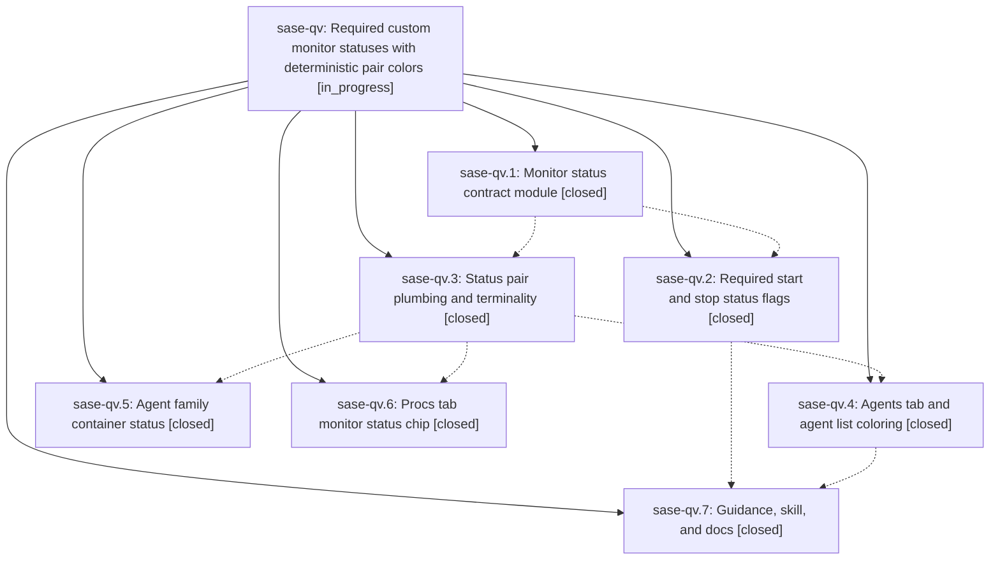

# Bead: sase-qv — Required custom monitor statuses with deterministic pair colors

[Bead Pages](../README.md) / sase-qv

**Status:** ◐ in_progress · **Type:** ▸ plan · **Tier:** epic
**Owner:** `bryanbugyi34@gmail.com` · **Created by:** [bbugyi200.athena.07k](https://github.com/sase-org/sase--agents/blob/main/families/bbugyi200.athena.07k.md) · **Assignee:** `sase-qv.land`
**Created:** 2026-08-19 09:14:31 EDT
**Plan:** [202608/monitor\_custom\_statuses.md](https://github.com/sase-org/sase--plans/blob/main/202608/monitor_custom_statuses.md)

## Description

Every sase monitor declares its own running and finished status labels, those labels are capped at 20 characters, and they appear -- in one deterministic, pair-derived color -- on every surface that shows a monitor, including agent family container rows and the Admin Center Procs tab.

## Notes

[2026-08-19T15:41:18Z · 07u] DISCOVERED ISSUE: just check fails at lint (symvision) because Justfile _lint-symvision still has five --epic-symbol entries keyed to closed phase sase-qv.2: clamp_monitor_status, effective_monitor_status, monitor_status_accent, monitor_status_glyph, monitor_status_style. Reproduced 2026-08-19 while implementing feature_task_type_scoping (no Justfile edits). Earlier gates (fmt, ruff, mypy, flags, pyscripts, test-waits, changelog, terminology) passed. Parent epic sase-qv is still in_progress; later coloring phases likely still need these symbols, so the cleanup is a re-key or consume-and-drop, not an unrelated delete. I did not edit the Justfile.

## Phases

| Bead | Title | Status | Size | Created | Agents | Commits |
|---|---|---|---|---|---:|---:|
| [sase-qv.1](sase-qv.1.md) | Monitor status contract module | ✓ closed | medium | 2026-08-19 | 1 | 1 |
| [sase-qv.2](sase-qv.2.md) | Required start and stop status flags | ✓ closed | medium | 2026-08-19 | 1 | 1 |
| [sase-qv.3](sase-qv.3.md) | Status pair plumbing and terminality | ✓ closed | medium | 2026-08-19 | 1 | 1 |
| [sase-qv.4](sase-qv.4.md) | Agents tab and agent list coloring | ✓ closed | medium | 2026-08-19 | 1 | 1 |
| [sase-qv.5](sase-qv.5.md) | Agent family container status | ✓ closed | small | 2026-08-19 | 1 | 1 |
| [sase-qv.6](sase-qv.6.md) | Procs tab monitor status chip | ✓ closed | small | 2026-08-19 | 1 | 1 |
| [sase-qv.7](sase-qv.7.md) | Guidance, skill, and docs | ✓ closed | small | 2026-08-19 | 1 | 1 |

## Lineage

## Agents

| Agent | Bead | Commits |
|---|---|---:|
| [bbugyi200.athena.sase-qv.1](https://github.com/sase-org/sase--agents/blob/main/agents/bbugyi200.athena.sase-qv.1/README.md) | [sase-qv.1](sase-qv.1.md) | 1 |
| [bbugyi200.athena.sase-qv.2](https://github.com/sase-org/sase--agents/blob/main/agents/bbugyi200.athena.sase-qv.2/README.md) | [sase-qv.2](sase-qv.2.md) | 1 |
| [bbugyi200.athena.sase-qv.3](https://github.com/sase-org/sase--agents/blob/main/agents/bbugyi200.athena.sase-qv.3/README.md) | [sase-qv.3](sase-qv.3.md) | 1 |
| [bbugyi200.athena.sase-qv.4](https://github.com/sase-org/sase--agents/blob/main/agents/bbugyi200.athena.sase-qv.4/README.md) | [sase-qv.4](sase-qv.4.md) | 1 |
| [bbugyi200.athena.sase-qv.5](https://github.com/sase-org/sase--agents/blob/main/agents/bbugyi200.athena.sase-qv.5/README.md) | [sase-qv.5](sase-qv.5.md) | 1 |
| [bbugyi200.athena.sase-qv.6](https://github.com/sase-org/sase--agents/blob/main/agents/bbugyi200.athena.sase-qv.6/README.md) | [sase-qv.6](sase-qv.6.md) | 1 |
| [bbugyi200.athena.sase-qv.7](https://github.com/sase-org/sase--agents/blob/main/agents/bbugyi200.athena.sase-qv.7/README.md) | [sase-qv.7](sase-qv.7.md) | 1 |
| [bbugyi200.athena.sase-qv.land](https://github.com/sase-org/sase--agents/blob/main/agents/bbugyi200.athena.sase-qv.land/README.md) | [sase-qv](README.md) | 0 |

## Commits

| Repo | Commit | Subject | Bead | Committed |
|---|---|---|---|---|
| sase | [`3e3c937`](https://github.com/sase-org/sase/commit/3e3c937748a1f001a8275943df8370466d64eb1e) | feat(monitor): add shared status-label contract and palette hash | [sase-qv.1](sase-qv.1.md) | 2026-08-19 10:03:37 EDT |
| sase | [`a64acb2`](https://github.com/sase-org/sase/commit/a64acb267e3e3435589b167fdeaebbcd04ab93bb) | feat(monitor)!: require start and stop status flags on monitor start | [sase-qv.2](sase-qv.2.md) | 2026-08-19 11:07:24 EDT |
| sase | [`ebe699d`](https://github.com/sase-org/sase/commit/ebe699d075e3442c802943e39f2f8d782af489d2) | feat(monitor): carry start/stop status pairs through listings | [sase-qv.3](sase-qv.3.md) | 2026-08-19 11:39:47 EDT |
| sase | [`4bca0e6`](https://github.com/sase-org/sase/commit/4bca0e66aabe4ac8a912cd29519f1862cf0d50af) | feat(tui): render monitor status chip in Procs tab rows | [sase-qv.6](sase-qv.6.md) | 2026-08-19 12:22:51 EDT |
| sase | [`18dcf6b`](https://github.com/sase-org/sase/commit/18dcf6b8d5bd168884d55b916cba35b586473ef3) | feat(ace): mirror monitor status pairs onto family containers | [sase-qv.5](sase-qv.5.md) | 2026-08-19 12:35:36 EDT |
| sase | [`91c4323`](https://github.com/sase-org/sase/commit/91c432385a6a632726a1838072474a9c16703d29) | feat(agents): color monitor status by pair accent | [sase-qv.4](sase-qv.4.md) | 2026-08-19 13:30:19 EDT |
| sase | [`94e3a86`](https://github.com/sase-org/sase/commit/94e3a864efbec30de29ba54f1d65e086022de685) | docs(monitors): require start and stop status labels | [sase-qv.7](sase-qv.7.md) | 2026-08-19 14:00:18 EDT |
