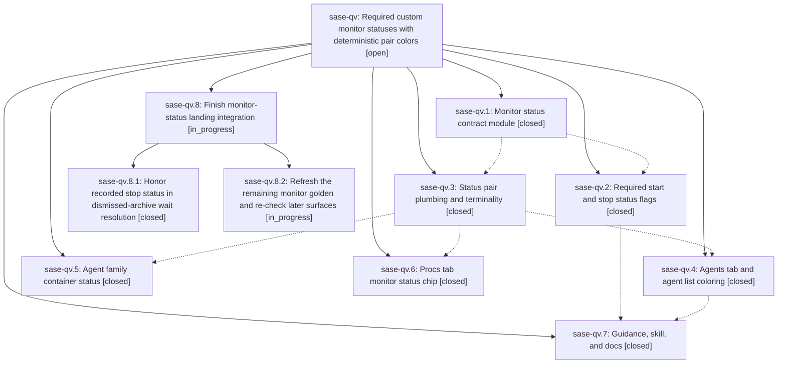

# Bead: sase-qv — Required custom monitor statuses with deterministic pair colors

[Bead Pages](../README.md) / sase-qv

**Status:** ○ open · **Type:** ▸ plan · **Tier:** epic · **↺ Reopened:** ↺1
**Owner:** `bryanbugyi34@gmail.com` · **Created by:** [bbugyi200.athena.07k](https://github.com/sase-org/sase--agents/blob/main/families/bbugyi200.athena.07k.md) · **Assignee:** `sase-qv.land`
**Created:** 2026-08-19 09:14:31 EDT
**Plan:** [202608/monitor\_custom\_statuses.md](https://github.com/sase-org/sase--plans/blob/main/202608/monitor_custom_statuses.md)

## Previously Closed

> ↺ Closed 2026-08-19T19:37:29Z · done
>
> (none)
>
> Reopened 2026-08-19T20:08:54Z by `sase bead open`

## Description

Every sase monitor declares its own running and finished status labels, those labels are capped at 20 characters, and they appear -- in one deterministic, pair-derived color -- on every surface that shows a monitor, including agent family container rows and the Admin Center Procs tab.

## Notes

[2026-08-19T15:41:18Z · 07u] DISCOVERED ISSUE: just check fails at lint (symvision) because Justfile _lint-symvision still has five --epic-symbol entries keyed to closed phase sase-qv.2: clamp_monitor_status, effective_monitor_status, monitor_status_accent, monitor_status_glyph, monitor_status_style. Reproduced 2026-08-19 while implementing feature_task_type_scoping (no Justfile edits). Earlier gates (fmt, ruff, mypy, flags, pyscripts, test-waits, changelog, terminology) passed. Parent epic sase-qv is still in_progress; later coloring phases likely still need these symbols, so the cleanup is a re-key or consume-and-drop, not an unrelated delete. I did not edit the Justfile.

[2026-08-19T18:42:13Z · sase-qt.land] DISCOVERED ISSUE: tests/completion/test_snapshot.py::test_checked_in_snapshot_has_no_drift and ::test_current_structural_view_matches_checked_in_snapshot fail deterministically on clean origin/master, caused by this epic's phase sase-qv.2 commit a64acb267 ('feat(monitor)!: require start and stop status flags on monitor start').

REPRODUCTION: .venv/bin/python -m pytest -p no:randomly -q tests/completion/test_snapshot.py on a clean checkout of a67ba351f (9 commits behind origin/master; origin/master has no later commit touching tests/completion/snapshots/cli_spec.json or src/sase/main/parser_monitor.py, so it is red there too). Also reproduced inside a full 'just test' lane: 2 failed, 4831 passed.

ROOT CAUSE: a64acb267 rewrote the 'sase monitor start' epilog examples and the -s/--start-status and -S/--stop-status help strings in src/sase/main/parser_monitor.py without rerunning 'just sync-completion-spec'. The checked-in structural snapshot tests/completion/snapshots/cli_spec.json was last regenerated at 5057a264e (2026-08-19 10:18), 46 minutes before a64acb267 (11:04). The entire drift is one field: root.subcommands[monitor].subcommands[start].description_digest, checked-in 6d513788060bea99 vs live 076adb65014057c7. Confirmed by diffing current_structural_view() against the checked-in file: 17 diff lines, that one digest and its context.

FIX: 'just sync-completion-spec' (tools/sync_completion_spec --write), then commit the regenerated cli_spec.json.

IMPACT: red on clean master for every agent. It fails 'just check' whenever the scoped lane selects tests/completion, and always fails 'just check-full'.

RELATED: task sase-pr tracks these same two node IDs but as a flake, on the empirical claim that they 'pass in isolation and against the checked-in snapshot on every clean tree tested'. That claim held when sase-pr was filed on 2026-08-18 and is now false as of a64acb267. This is a real, serially reproducible staleness, not the dirty-tree recording artifact sase-pr describes, so it is recorded here rather than as a +1 on sase-pr.

FOUND BY: land agent for epic sase-qt (ACE Memory panel), running the full test lane before landing. Unrelated to sase-qt's diff.

[2026-08-19T18:57:47Z · sase-qw.land--2] DISCOVERED ISSUE: tests/ace/tui/visual/test_ace_png_snapshots_agents_family_panel.py::test_family_conversation_monitor_phase_png_snapshot fails deterministically at HEAD because of this epic. Phase sase-qv.4 (91c432385, 'color monitor status by pair accent') did regenerate agents_family_conversation_monitor_120x40.png, but the committed golden still renders the family container row as '(MONITORED)' while the code renders '(MONITORED v)' in the amber status-pair accent, and the conversation pane to its right wraps the AGENT (plan)/(code) timestamps onto a second line in the actual frame - so the golden it shipped was already behind the tree it shipped in. 6.19% of the frame, content diff, not renderer noise. Repro at 4950f060c: just test-visual tests/ace/tui/visual/test_ace_png_snapshots_agents_family_panel.py::test_family_conversation_monitor_phase_png_snapshot -> 1 failed in 10.71s in isolation. Found by the sase-qw land agent's pre-land gate (monitor 0a4wh1amen35, 35 failed / 695 passed); not caused by sase-qw. Open task sase-q1 already names this node and has been +1'd with the same evidence; its other node, test_settled_monitor_lane_badge_png_snapshot, is now fixed by qv.4. The ACE PNG suite is excluded from just check and just check-full, which is why this landed red - regenerate with --sase-update-visual-snapshots before this epic lands.

[2026-08-19T19:37:29Z · sase-qv.land] VERIFIED (step 1). Read all 7 phase beads, every note, all 7 commits, and the shipped source. The feature is real end to end: sase/monitor_status.py owns the labels, the 20-char clamp with the trailing ellipsis, MonitorStatusPair + its unit-separated case-insensitive key, the 12-color OKLCH accent band, and the state-aware style/glyph/effective-label rule; sase/palette_hash.py is shared by project, artifact-tab, and monitor-pair accents. -s/--start-status and -S/--stop-status are required on sase monitor start (exit 2 with teaching text), clamp with a stderr warning, and are structurally required on StartMonitorRequest (clamped in __post_init__). Both labels ride the wire and filesystem loaders onto Agent, RunningAgentInfo, AgentListEntry, and the mobile summary; date_anchor_time keys monitor rows on monitor_state_is_terminal so a settled TESTED monitor anchors on stop_time; monitor rows carry an explicit status_bucket from monitor_state_bucket, so status bucketing never depends on the "MONITORED" literal in _TERMINAL_STATUSES. Coloring is live on the agent list (monitor_status_presentation), the prompt panel MONITOR section, family container rows (mirrored by _agent_status_apply/_agent_status_family_planner), the Procs tab MonitorStatusChip, sase agent list, and monitor list/show/markdown/JSON (schema v2 with status_label + status_accent). Guidance is in build_and_run.md, AGENTS.md and the four provider shims, docs/monitors.md, docs/ace.md, and the sase_monitor skill. epic_launch.py already passes EPIC APPROVED / EPIC CREATED. Re-verified the plan's documented breaking-change risk: opened sase-github, sase-telegram, sase-nvim, and sase-research-artifacts through /sase_repo and grepped each for "monitor start" / StartMonitorRequest / start_monitor -- zero callers, so the required-flag change breaks no plugin.

INTEGRATED (step 2). Reviewed all 21 non-epic commits landed since 3e3c93774. Two needed work and both are done in this landing:
  1. src/sase/core/dismissed_agent_completion.py: _archived_outcome_from_bundle only recognized the literal DEFAULT_MONITOR_STOP_STATUS, so once this epic made custom stop labels mandatory, that branch became dead for every new monitor and dismissed monitors fell through to fail-closed in wait-dependency resolution. It now compares the status against the bundle's own recorded monitor_stop_status (clamped, default-filled), which the dismissed bundle already persists because monitor_stop_status is an Agent dataclass field. Arbitrary statuses still fail closed. Added test_archived_recorded_stop_status_uses_monitor_state (5 monitor_state cases) and reshaped the old fail-closed test into test_archived_unmatched_custom_status_remains_fail_closed with an unrecorded-label case and a mismatched-label case; 34 passed in tests/test_dismissed_agent_completion.py.
  2. tests/completion/snapshots/cli_spec.json: a64acb267 changed sase monitor start's parser help without regenerating the checked-in completion spec, so the sase monitor start description_digest drifted (6d513788060bea99 -> 076adb65014057c7) and two tests/completion/test_snapshot.py nodes failed. Regenerated with tools/sync_completion_spec --write; 4 passed. This was epic-caused, not the unrelated drift sase-qv.4 assumed when it proposed it as a follow-up.
  Also checked and found NO integration needed: tmux_agent (be6077c7f, 14204d6a4) has no monitor surface; update_accents.py (012948e7c) is fixed accents, not a hashed palette; notification_tab_style.py hashes with fnv1a into its own tab palette by design; the Logs pane, Memory panel, and filter-bar work never render a monitor status. task_types/_validation.py and wait_dependency_resolution/_artifact_state.py do duplicate the shared hash and terminal-state primitives, but both predate this epic and are out of its scope.

ALSO FIXED AS EPIC WORK. tests/ace/tui/visual/.../agents_family_conversation_monitor_120x40.png was stale against this epic's own rendering: the committed golden showed "visual-family-root (MONITORED)" in the default status color while the code renders "(MONITORED v)" in the pair accent (sase-qv.4's glyph/accent on a container row mirrored by sase-qv.5), 94194/1520532 changed pixels. Regenerated that one golden with a scoped just test-visual -- <node-id> --sase-update-visual-snapshots; both monitor visual nodes now pass 10/10.

VERIFICATION. just install then monitored just check-full at this tree: every lint gate green (fmt python+markdown, keep-sorted, ruff, mypy, feature flags, pyscripts, test waits, changelog, patch/stitch terminology, symvision, toobig), SASE validation green, committed plans green, then test-cost "1 failed, 34517 passed, 12 skipped in 2785.73s (0:46:25)". The single failure was tests/ace/tui/test_plugins_browser_pane_comprehensive_update_confirmation.py::test_comprehensive_confirmation_stays_open_when_submit_collides, which passed immediately in isolation (1 passed in 8.60s) and with its whole file (5 passed) -- exact duplicate of ready task sase-oe, +1 recorded there. sase bead epic-symbols sase-qv is empty and the Justfile carries no sase-qv --epic-symbol lines. NOT FULLY GREEN, recorded honestly: just test-visual is red with 36 unrelated stale goldens (see sase-r5) and check-full logs a non-fatal core-floor-probe could_not_determine warning (see sase-qx).

FOLLOW-UPS -- every proposal from the 7 phase beads, with its outcome:
  - sase-qv.1 flake, test_real_zsh_zcompile_and_registration: exact duplicate of ready task sase-p9. +1 recorded with this epic's evidence. No new task.
  - sase-qv.1 flake, three tests/test_run_agent_runner_setup_linked_repos.py nod

… and 3488 more characters

## Phases

| Bead | Title | Status | Size | Created | Agents | Commits |
|---|---|---|---|---|---:|---:|
| [sase-qv.1](sase-qv.1.md) | Monitor status contract module | ✓ closed | medium | 2026-08-19 | 1 | 1 |
| [sase-qv.2](sase-qv.2.md) | Required start and stop status flags | ✓ closed | medium | 2026-08-19 | 1 | 1 |
| [sase-qv.3](sase-qv.3.md) | Status pair plumbing and terminality | ✓ closed | medium | 2026-08-19 | 1 | 1 |
| [sase-qv.4](sase-qv.4.md) | Agents tab and agent list coloring | ✓ closed | medium | 2026-08-19 | 1 | 1 |
| [sase-qv.5](sase-qv.5.md) | Agent family container status | ✓ closed | small | 2026-08-19 | 1 | 1 |
| [sase-qv.6](sase-qv.6.md) | Procs tab monitor status chip | ✓ closed | small | 2026-08-19 | 1 | 1 |
| [sase-qv.7](sase-qv.7.md) | Guidance, skill, and docs | ✓ closed | small | 2026-08-19 | 1 | 1 |

## Lineage

## Agents

| Agent | Bead | Commits |
|---|---|---:|
| [bbugyi200.athena.sase-qv.1](https://github.com/sase-org/sase--agents/blob/main/agents/bbugyi200.athena.sase-qv.1/README.md) | [sase-qv.1](sase-qv.1.md) | 1 |
| [bbugyi200.athena.sase-qv.2](https://github.com/sase-org/sase--agents/blob/main/agents/bbugyi200.athena.sase-qv.2/README.md) | [sase-qv.2](sase-qv.2.md) | 1 |
| [bbugyi200.athena.sase-qv.3](https://github.com/sase-org/sase--agents/blob/main/agents/bbugyi200.athena.sase-qv.3/README.md) | [sase-qv.3](sase-qv.3.md) | 1 |
| [bbugyi200.athena.sase-qv.4](https://github.com/sase-org/sase--agents/blob/main/agents/bbugyi200.athena.sase-qv.4/README.md) | [sase-qv.4](sase-qv.4.md) | 1 |
| [bbugyi200.athena.sase-qv.5](https://github.com/sase-org/sase--agents/blob/main/agents/bbugyi200.athena.sase-qv.5/README.md) | [sase-qv.5](sase-qv.5.md) | 1 |
| [bbugyi200.athena.sase-qv.6](https://github.com/sase-org/sase--agents/blob/main/agents/bbugyi200.athena.sase-qv.6/README.md) | [sase-qv.6](sase-qv.6.md) | 1 |
| [bbugyi200.athena.sase-qv.7](https://github.com/sase-org/sase--agents/blob/main/agents/bbugyi200.athena.sase-qv.7/README.md) | [sase-qv.7](sase-qv.7.md) | 1 |
| [bbugyi200.athena.sase-qv.8.1](https://github.com/sase-org/sase--agents/blob/main/agents/bbugyi200.athena.sase-qv.8.1/README.md) | [sase-qv.8.1](sase-qv.8.1.md) | 1 |
| [bbugyi200.athena.sase-qv.8.2](https://github.com/sase-org/sase--agents/blob/main/families/bbugyi200.athena.sase-qv.8.2.md) | [sase-qv.8.2](sase-qv.8.2.md) | 0 |
| [bbugyi200.athena.sase-qv.8.land](https://github.com/sase-org/sase--agents/blob/main/agents/bbugyi200.athena.sase-qv.8.land/README.md) | [sase-qv.8](sase-qv.8.md) | 0 |
| [bbugyi200.athena.sase-qv.land](https://github.com/sase-org/sase--agents/blob/main/families/bbugyi200.athena.sase-qv.land.md) | [sase-qv](README.md) | 0 |

## Commits

| Repo | Commit | Subject | Bead | Committed |
|---|---|---|---|---|
| sase | [`3e3c937`](https://github.com/sase-org/sase/commit/3e3c937748a1f001a8275943df8370466d64eb1e) | feat(monitor): add shared status-label contract and palette hash | [sase-qv.1](sase-qv.1.md) | 2026-08-19 10:03:37 EDT |
| sase | [`a64acb2`](https://github.com/sase-org/sase/commit/a64acb267e3e3435589b167fdeaebbcd04ab93bb) | feat(monitor)!: require start and stop status flags on monitor start | [sase-qv.2](sase-qv.2.md) | 2026-08-19 11:07:24 EDT |
| sase | [`ebe699d`](https://github.com/sase-org/sase/commit/ebe699d075e3442c802943e39f2f8d782af489d2) | feat(monitor): carry start/stop status pairs through listings | [sase-qv.3](sase-qv.3.md) | 2026-08-19 11:39:47 EDT |
| sase | [`4bca0e6`](https://github.com/sase-org/sase/commit/4bca0e66aabe4ac8a912cd29519f1862cf0d50af) | feat(tui): render monitor status chip in Procs tab rows | [sase-qv.6](sase-qv.6.md) | 2026-08-19 12:22:51 EDT |
| sase | [`18dcf6b`](https://github.com/sase-org/sase/commit/18dcf6b8d5bd168884d55b916cba35b586473ef3) | feat(ace): mirror monitor status pairs onto family containers | [sase-qv.5](sase-qv.5.md) | 2026-08-19 12:35:36 EDT |
| sase | [`91c4323`](https://github.com/sase-org/sase/commit/91c432385a6a632726a1838072474a9c16703d29) | feat(agents): color monitor status by pair accent | [sase-qv.4](sase-qv.4.md) | 2026-08-19 13:30:19 EDT |
| sase | [`94e3a86`](https://github.com/sase-org/sase/commit/94e3a864efbec30de29ba54f1d65e086022de685) | docs(monitors): require start and stop status labels | [sase-qv.7](sase-qv.7.md) | 2026-08-19 14:00:18 EDT |
| sase | [`3df3452`](https://github.com/sase-org/sase/commit/3df34525c0113a5cb7693c1a52c55e81be914383) | fix(core): honor recorded monitor stop status in dismissed-archive waits | [sase-qv.8.1](sase-qv.8.1.md) | 2026-08-19 17:23:56 EDT |
