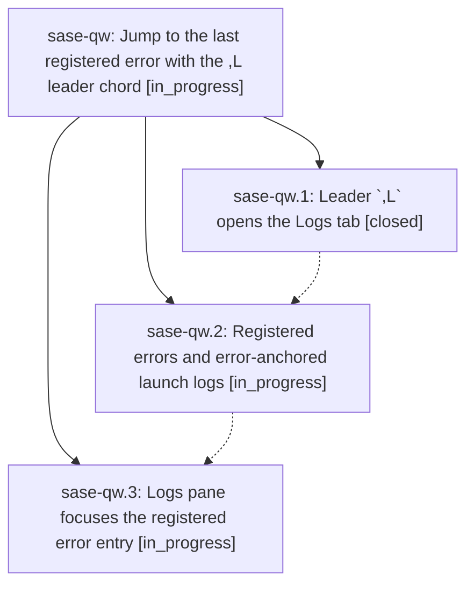

# Bead: sase-qw — Jump to the last registered error with the ,L leader chord

[Bead Pages](../README.md) / sase-qw

**Status:** ◐ in_progress · **Type:** ▸ plan · **Tier:** epic
**Owner:** `bryanbugyi34@gmail.com` · **Created by:** [bbugyi200.athena.07n](https://github.com/sase-org/sase--agents/blob/main/families/bbugyi200.athena.07n.md) · **Assignee:** `sase-qw.land`
**Created:** 2026-08-19 09:29:47 EDT
**Plan:** [202608/last\_error\_log\_jump.md](https://github.com/sase-org/sase--plans/blob/main/202608/last_error_log_jump.md)

## Description

When a SASE agent launch (or chop) fails, the error toast names a leader chord, and pressing that chord opens the Admin Center Logs tab already scrolled to the exact log entry for that failure instead of leaving the user to hunt through log sources.

## Phases

| Bead | Title | Status | Size | Created | Agents | Commits |
|---|---|---|---|---|---:|---:|
| [sase-qw.1](sase-qw.1.md) | Leader \`,L\` opens the Logs tab | ✓ closed | small | 2026-08-19 | 1 | 1 |
| [sase-qw.2](sase-qw.2.md) | Registered errors and error-anchored launch logs | ◐ in_progress | medium | 2026-08-19 | 1 | 0 |
| [sase-qw.3](sase-qw.3.md) | Logs pane focuses the registered error entry | ◐ in_progress | medium | 2026-08-19 | 1 | 0 |

## Lineage

## Agents

| Agent | Bead | Commits |
|---|---|---:|
| [bbugyi200.athena.sase-qw.1](https://github.com/sase-org/sase--agents/blob/main/agents/bbugyi200.athena.sase-qw.1/README.md) | [sase-qw.1](sase-qw.1.md) | 1 |
| [bbugyi200.athena.sase-qw.2](https://github.com/sase-org/sase--agents/blob/main/agents/bbugyi200.athena.sase-qw.2/README.md) | [sase-qw.2](sase-qw.2.md) | 0 |
| [bbugyi200.athena.sase-qw.3](https://github.com/sase-org/sase--agents/blob/main/agents/bbugyi200.athena.sase-qw.3/README.md) | [sase-qw.3](sase-qw.3.md) | 0 |
| [bbugyi200.athena.sase-qw.land](https://github.com/sase-org/sase--agents/blob/main/agents/bbugyi200.athena.sase-qw.land/README.md) | [sase-qw](README.md) | 0 |

## Commits

| Repo | Commit | Subject | Bead | Committed |
|---|---|---|---|---|
| sase | [`d4f6535`](https://github.com/sase-org/sase/commit/d4f6535c467906818a310534670f16140a70994b) | feat(ace): register the ,L jump\_to\_last\_error leader action | [sase-qw.1](sase-qw.1.md) | 2026-08-19 09:55:53 EDT |
