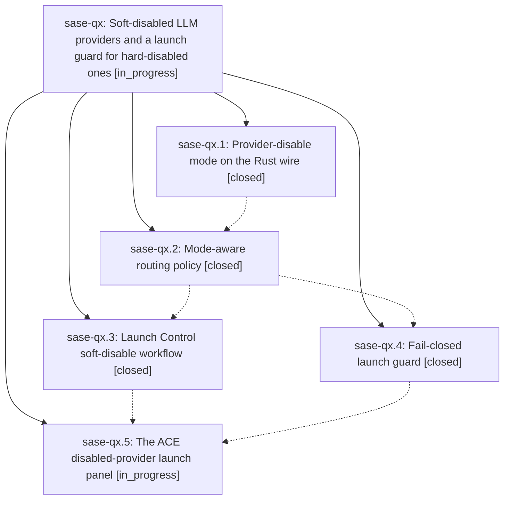

# Bead: sase-qx — Soft-disabled LLM providers and a launch guard for hard-disabled ones

[Bead Pages](../README.md) / sase-qx

**Status:** ◐ in_progress · **Type:** ▸ plan · **Tier:** epic
**Owner:** `bryanbugyi34@gmail.com` · **Created by:** [bbugyi200.athena.07o](https://github.com/sase-org/sase--agents/blob/main/families/bbugyi200.athena.07o.md) · **Assignee:** `sase-qx.land`
**Created:** 2026-08-19 09:58:30 EDT
**Plan:** [202608/soft\_provider\_disables.md](https://github.com/sase-org/sase--plans/blob/main/202608/soft_provider_disables.md)

## Description

A provider can be put in a soft disable that spares it in load-balanced pools while another member can cover, never triggers a `||` fallback, and still runs when an agent asks for it by name — and any launch that truly needs a hard-disabled provider is caught before an agent spawns, with an ACE panel that offers a one-keypress way out (enable, soft-enable, pick another model, abort this agent, abort the launch).

## Notes

[2026-08-19T15:06:24Z · 07t] DISCOVERED ISSUE: After sase-qx.1 landed provider-disable mode on the sase-core PyO3 wire, rebuilding sase_core_rs from current linked sase-core makes just check fail in tools/validate_sase_core_rs before any lint/test gate. Probe: provider_disable_try_set_relative(tmp, 'claude', 'usage_limit', 900.0, now) raises TypeError: argument 'mode': 'float' object cannot be converted to 'PyString'. Current binding signature is (sase_home, provider, source, mode='hard', duration_seconds=None, now=None), so the 4th positional arg is now mode. Production try_disable_provider in src/sase/llm_provider/provider_disable.py:193 has the same positional call (sase_home, provider, source, duration_seconds, now). Reproduced 2026-08-19 on workspace sase_16 while implementing clan_dismiss_cascade (planner.rs only); the probe fails after rust-install from linked sase-core HEAD. Later sase-qx phases still need to update Python callers and the first-writer probe.

[2026-08-19T15:23:56Z · grok] DISCOVERED ISSUE: After sase-qx.1 landed sase-core wire schema 2, ACE crashed during model-alias routing with `ProviderDisableStateError: unsupported provider-disable snapshot version: 2`. Python's facade still required schema 1 and rejected the new `mode` field. The crash payload was a v2 snapshot (`codex`, `mode=hard`, `source=ace` in the traceback). Live `get_active_provider_disables()` now decodes the on-disk v2 file successfully.

HOTFIX on the user's sase checkout (not a sase-qx.2 workspace): plan items 1-2 of the routing phase, decode-only.

- `src/sase/llm_provider/provider_disable.py`: schema constant 2; `TemporaryProviderDisable.mode` with `is_hard`/`is_soft`; setters take keyword-only `mode=` defaulting to hard and pass it in the new binding position (after `source` on relative set).
- `src/sase/llm_provider/provider_disable_peek.py`: accept leftover v1 files as hard without rewriting.
- `tools/validate_sase_core_rs`: first-writer probe follows `provider_disable_wire_schema_version()` so a published v1 floor wheel and a local v2 core both pass.
- Regression: `test_snapshot_from_wire_accepts_v2_hard_disable_from_ace`.

Routing still treats any decoded disable as today's all-or-nothing skip. That is why ACE can boot again with the existing hard Codex disable still in effect.

sase-qx.2 still owns items 3-10 (preferred/sparing/unavailable, pool/fallback masks, hard-only raise/pause/retry, docs). Do not regress the v2 decode or the setter argument order: relative set is `(sase_home, provider, source, mode="hard", duration_seconds, now)`. A positional duration as the 4th arg is now interpreted as mode. `is_hard`/`is_soft` are properties; symvision does not treat them as public defs, so they do not need `--epic-symbol`.

## Phases

| Bead | Title | Status | Size | Created | Agents | Commits |
|---|---|---|---|---|---:|---:|
| [sase-qx.1](sase-qx.1.md) | Provider-disable mode on the Rust wire | ✓ closed | medium | 2026-08-19 | 1 | 0 |
| [sase-qx.2](sase-qx.2.md) | Mode-aware routing policy | ✓ closed | medium | 2026-08-19 | 1 | 1 |
| [sase-qx.3](sase-qx.3.md) | Launch Control soft-disable workflow | ✓ closed | medium | 2026-08-19 | 1 | 1 |
| [sase-qx.4](sase-qx.4.md) | Fail-closed launch guard | ✓ closed | medium | 2026-08-19 | 1 | 1 |
| [sase-qx.5](sase-qx.5.md) | The ACE disabled-provider launch panel | ◐ in_progress | medium | 2026-08-19 | 1 | 0 |

## Lineage

## Agents

| Agent | Bead | Commits |
|---|---|---:|
| [bbugyi200.athena.sase-qx.1](https://github.com/sase-org/sase--agents/blob/main/agents/bbugyi200.athena.sase-qx.1/README.md) | [sase-qx.1](sase-qx.1.md) | 0 |
| [bbugyi200.athena.sase-qx.2](https://github.com/sase-org/sase--agents/blob/main/agents/bbugyi200.athena.sase-qx.2/README.md) | [sase-qx.2](sase-qx.2.md) | 1 |
| [bbugyi200.athena.sase-qx.3](https://github.com/sase-org/sase--agents/blob/main/families/bbugyi200.athena.sase-qx.3.md) | [sase-qx.3](sase-qx.3.md) | 1 |
| [bbugyi200.athena.sase-qx.4](https://github.com/sase-org/sase--agents/blob/main/agents/bbugyi200.athena.sase-qx.4/README.md) | [sase-qx.4](sase-qx.4.md) | 1 |
| [bbugyi200.athena.sase-qx.5](https://github.com/sase-org/sase--agents/blob/main/agents/bbugyi200.athena.sase-qx.5/README.md) | [sase-qx.5](sase-qx.5.md) | 0 |
| [bbugyi200.athena.sase-qx.land](https://github.com/sase-org/sase--agents/blob/main/agents/bbugyi200.athena.sase-qx.land/README.md) | [sase-qx](README.md) | 0 |

## Commits

| Repo | Commit | Subject | Bead | Committed |
|---|---|---|---|---|
| sase | [`11d6107`](https://github.com/sase-org/sase/commit/11d610757765ccb19e2ca0e0c417a0ff0d500bfe) | feat(llm): teach routing the hard/soft provider-disable mode | [sase-qx.2](sase-qx.2.md) | 2026-08-19 13:03:42 EDT |
| sase | [`44415dd`](https://github.com/sase-org/sase/commit/44415dddd0904937d59d3c65fa6e5988bcb95bea) | feat(agent): refuse launches that can only run on a hard-disabled provider | [sase-qx.4](sase-qx.4.md) | 2026-08-19 14:47:47 EDT |
| sase | [`c8a0e71`](https://github.com/sase-org/sase/commit/c8a0e7184a4eb0961fe75afe82ce90962e45eded) | feat(ace): add Launch Control soft-disable workflow | [sase-qx.3](sase-qx.3.md) | 2026-08-19 14:54:31 EDT |
