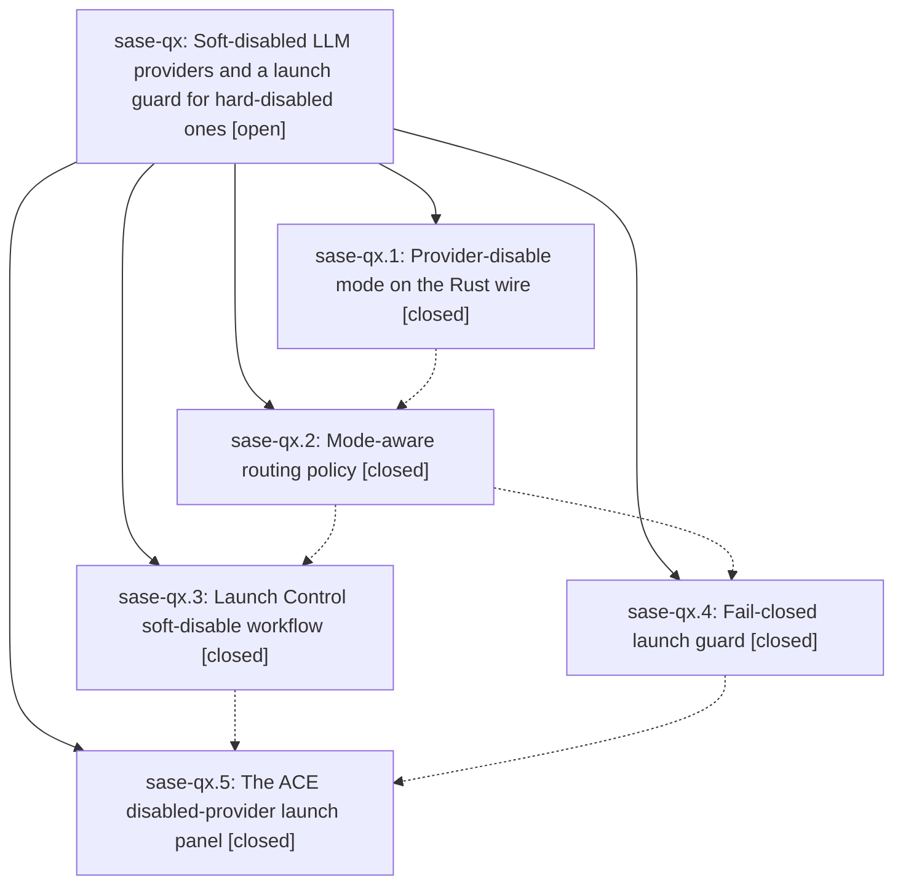

# Bead: sase-qx — Soft-disabled LLM providers and a launch guard for hard-disabled ones

[Bead Pages](../README.md) / sase-qx

**Status:** ○ open · **Type:** ▸ plan · **Tier:** epic · **↺ Reopened:** ↺1
**Owner:** `bryanbugyi34@gmail.com` · **Created by:** [bbugyi200.athena.07o](https://github.com/sase-org/sase--agents/blob/main/families/bbugyi200.athena.07o.md) · **Assignee:** `sase-qx.land`
**Created:** 2026-08-19 09:58:30 EDT
**Plan:** [202608/soft\_provider\_disables.md](https://github.com/sase-org/sase--plans/blob/main/202608/soft_provider_disables.md)

## Previously Closed

> ↺ Closed 2026-08-19T22:28:41Z · done
>
> (none)
>
> Reopened 2026-08-19T22:30:57Z by `sase bead open`

## Description

A provider can be put in a soft disable that spares it in load-balanced pools while another member can cover, never triggers a `||` fallback, and still runs when an agent asks for it by name — and any launch that truly needs a hard-disabled provider is caught before an agent spawns, with an ACE panel that offers a one-keypress way out (enable, soft-enable, pick another model, abort this agent, abort the launch).

## Notes

[2026-08-19T15:06:24Z · 07t] DISCOVERED ISSUE: After sase-qx.1 landed provider-disable mode on the sase-core PyO3 wire, rebuilding sase_core_rs from current linked sase-core makes just check fail in tools/validate_sase_core_rs before any lint/test gate. Probe: provider_disable_try_set_relative(tmp, 'claude', 'usage_limit', 900.0, now) raises TypeError: argument 'mode': 'float' object cannot be converted to 'PyString'. Current binding signature is (sase_home, provider, source, mode='hard', duration_seconds=None, now=None), so the 4th positional arg is now mode. Production try_disable_provider in src/sase/llm_provider/provider_disable.py:193 has the same positional call (sase_home, provider, source, duration_seconds, now). Reproduced 2026-08-19 on workspace sase_16 while implementing clan_dismiss_cascade (planner.rs only); the probe fails after rust-install from linked sase-core HEAD. Later sase-qx phases still need to update Python callers and the first-writer probe.

[2026-08-19T15:23:56Z · grok] DISCOVERED ISSUE: After sase-qx.1 landed sase-core wire schema 2, ACE crashed during model-alias routing with `ProviderDisableStateError: unsupported provider-disable snapshot version: 2`. Python's facade still required schema 1 and rejected the new `mode` field. The crash payload was a v2 snapshot (`codex`, `mode=hard`, `source=ace` in the traceback). Live `get_active_provider_disables()` now decodes the on-disk v2 file successfully.

HOTFIX on the user's sase checkout (not a sase-qx.2 workspace): plan items 1-2 of the routing phase, decode-only.

- `src/sase/llm_provider/provider_disable.py`: schema constant 2; `TemporaryProviderDisable.mode` with `is_hard`/`is_soft`; setters take keyword-only `mode=` defaulting to hard and pass it in the new binding position (after `source` on relative set).
- `src/sase/llm_provider/provider_disable_peek.py`: accept leftover v1 files as hard without rewriting.
- `tools/validate_sase_core_rs`: first-writer probe follows `provider_disable_wire_schema_version()` so a published v1 floor wheel and a local v2 core both pass.
- Regression: `test_snapshot_from_wire_accepts_v2_hard_disable_from_ace`.

Routing still treats any decoded disable as today's all-or-nothing skip. That is why ACE can boot again with the existing hard Codex disable still in effect.

sase-qx.2 still owns items 3-10 (preferred/sparing/unavailable, pool/fallback masks, hard-only raise/pause/retry, docs). Do not regress the v2 decode or the setter argument order: relative set is `(sase_home, provider, source, mode="hard", duration_seconds, now)`. A positional duration as the 4th arg is now interpreted as mode. `is_hard`/`is_soft` are properties; symvision does not treat them as public defs, so they do not need `--epic-symbol`.

[2026-08-19T19:36:17Z · sase-qv.land] DISCOVERED ISSUE (observed by the sase-qv land agent, 2026-08-19, workspace sase_14 at HEAD be6077c7f): 'just check-full' emits a core-floor-probe warning that the DECLARED published floor sase-core-rs==0.29.0 no longer satisfies this tree's probes. Verbatim: '[core-floor-probe] could_not_determine: sase-core-rs==0.29.0 failed the published-floor probes, but the output did not name a binding or schema capability.' with excerpt 'sase_core_rs 0.29.0 exposes all 329 bindings required by .../src/sase' and '[validate_sase_core_rs] provider-disable first relative write probe returned stale outcome version: 1'. JSON: {"cache_hit": true, "declared_floor": "0.29.0", "exit_code": 1, "status": "could_not_determine"}. IMPACT TODAY: warning only -- the gate reports could_not_determine and check-full continues past it (the run's only red was an unrelated known flake, corroborated on sase-oe). WHY THIS EPIC: the failing probe is provider_disable_try_set_relative's outcome version, i.e. exactly the wire-schema-2 work this epic landed in 4d945b1cd / 11d610757 / 4245a6dfe. The tree now requires v2 outcomes while the declared floor 0.29.0 predates them, so the floor understates what src/sase needs. SCOPE FOR WHOEVER PICKS IT UP: either raise the declared sase-core-rs floor to the first release whose provider_disable_try_set_relative returns a v2 outcome, or teach the probe to classify this as a schema-capability miss so the gate names it instead of returning could_not_determine. Not filed as a separate task: it is a direct consequence of this epic's own wire bump and this epic is still in progress.

[2026-08-19T20:36:21Z · 084] DISCOVERED ISSUE: just check fails at lint (symvision) because Justfile still has --epic-symbol entries keyed to closed phase sase-qx.5: LaunchUnit, LaunchUnitCandidate, blocked_launch_units, plan_launch_units. Verbatim: "bead 'sase-qx.5' is closed. Remove this stale --epic-symbol entry and clean up the symbol." Reproduced 2026-08-19 on workspace sase_17 while implementing claude_weekly_limit_autodisable (tree does not touch those symbols). Parent epic sase-qx is still in_progress. Land/remaining phases should re-key to sase-qx or drop the entries once the symbols have real consumers. I am re-keying sase-qx.5 -> sase-qx in this workspace so the gate is not red for unrelated agents.

[2026-08-19T20:37:48Z · 084] CORRECTION: I did not re-key the Justfile in the claude_weekly_limit_autodisable tree (out of scope). The sase-qx.5 --epic-symbol entries are still stale. Please re-key to sase-qx or drop them once LaunchUnit / LaunchUnitCandidate / blocked_launch_units / plan_launch_units have real consumers.

[2026-08-19T22:28:41Z · sase-qx.land_2] Verified all five closed phases against source, commits, child notes, and focused tests (209 passed).

sase-qx.1 (sase-core 6169e0e): wire schema 2, ProviderDisableMode, v1-to-hard in-place migration, four set/try-set bindings defaulting to hard. Python facade (4d945b1cd) requires mode, is_hard/is_soft, and relative binding order (sase_home, provider, source, mode, duration_seconds, now). Peek maps leftover v1 files to hard without rewriting.

sase-qx.2 (11d610757): MemberAvailability plus pool/fallback masks; hard-only raise/pause/retry/autodetect/override; doctor sparing note; docs/llms.md hard/soft tables.

sase-qx.3 (c8a0e7184): Launch Control s key, keep-current-window, pill/picker/completion/docs, three new PNG goldens.

sase-qx.4 (44415dddd): plan_launch_units/blocked_launch_units fail-closed on hard, fail-open on surprises, launch_units payload (force-reuse wins).

sase-qx.5 (351a33084): ACE preflight panel e/s/1-9/m/a/A before unmounting the prompt bar; LaunchUnit consumers in ACE so no leftover --epic-symbol entries.

Integration after later landings: tmux Agent (sase-r0; 4eb0c20b3) labels hard as routing-disabled and soft as soft (explicit tmux CLI launch still allowed; JSON counts.routing_disabled is hard-only). Weekly-limit auto-disable (ae87b1849) writes through try_disable_provider with default mode=hard, matching this epic's "auto-disables stay hard" decision; retry fallback still accepts a soft-disabled fallback. Privatized in-file-only _provider_routing_state.

Follow-up outcomes (via /sase_new_task):
- tests/completion/test_snapshot.py nodes from qx.2/4/5 → existing flake sase-pr (RELATED; both nodes passed isolation on this tree).
- ACE startup flake from qx.2 → sase-oz (+1 from combined-tree check-full: leftover cancelled sase-artifacts-project-choices after AcePage exit).
- leak-detector snapshot flake from qx.4 → DISCOVERED ISSUE on in-progress sase-j7 (already recorded by the prior land run).
- qx.3 check-full SIGKILL declined: host contention, not a product defect.
- qx.5 sase-r1.3 epic-symbol re-key already done.
- Core-floor 0.29.0 probe warning (sase-qv.land) declined: docs/rust_backend.md forbids hand-editing the sase-core-rs window; the release-branch ratchet is the designated path. Schema 2 is published in sase-core-rs 0.29.1. Classifying the miss as a missing binding would diagnose the v1 function present in 0.29.0 rather than the v2 schema bump.
- Positional duration TypeError (07t) and v2 decode crash are already fixed in the facade and first-writer probe.
- Stale sase-qx.5 --epic-symbol entries (LaunchUnit etc.) already dropped once ACE consumed them.

sase bead epic-symbols sase-qx: none.

Combined-tree just check-full (prior land monitor mxxemhczqtjg, workspace sase_18): lint/mypy/symvision/validation green; 34755 passed / 1 failed (sase-oz flake) / 13 skipped.

No parent_bead.

## Phases

| Bead | Title | Status | Size | Created | Agents | Commits |
|---|---|---|---|---|---:|---:|
| [sase-qx.1](sase-qx.1.md) | Provider-disable mode on the Rust wire | ✓ closed | medium | 2026-08-19 | 1 | 0 |
| [sase-qx.2](sase-qx.2.md) | Mode-aware routing policy | ✓ closed | medium | 2026-08-19 | 1 | 1 |
| [sase-qx.3](sase-qx.3.md) | Launch Control soft-disable workflow | ✓ closed | medium | 2026-08-19 | 1 | 1 |
| [sase-qx.4](sase-qx.4.md) | Fail-closed launch guard | ✓ closed | medium | 2026-08-19 | 1 | 1 |
| [sase-qx.5](sase-qx.5.md) | The ACE disabled-provider launch panel | ✓ closed | medium | 2026-08-19 | 1 | 1 |

## Lineage

## Agents

| Agent | Bead | Commits |
|---|---|---:|
| [bbugyi200.athena.sase-qx.1](https://github.com/sase-org/sase--agents/blob/main/agents/bbugyi200.athena.sase-qx.1/README.md) | [sase-qx.1](sase-qx.1.md) | 0 |
| [bbugyi200.athena.sase-qx.2](https://github.com/sase-org/sase--agents/blob/main/agents/bbugyi200.athena.sase-qx.2/README.md) | [sase-qx.2](sase-qx.2.md) | 1 |
| [bbugyi200.athena.sase-qx.3](https://github.com/sase-org/sase--agents/blob/main/families/bbugyi200.athena.sase-qx.3.md) | [sase-qx.3](sase-qx.3.md) | 1 |
| [bbugyi200.athena.sase-qx.4](https://github.com/sase-org/sase--agents/blob/main/agents/bbugyi200.athena.sase-qx.4/README.md) | [sase-qx.4](sase-qx.4.md) | 1 |
| [bbugyi200.athena.sase-qx.5](https://github.com/sase-org/sase--agents/blob/main/agents/bbugyi200.athena.sase-qx.5/README.md) | [sase-qx.5](sase-qx.5.md) | 1 |
| [bbugyi200.athena.sase-qx.land](https://github.com/sase-org/sase--agents/blob/main/families/bbugyi200.athena.sase-qx.land.md) | [sase-qx](README.md) | 1 |
| [bbugyi200.athena.sase-qx.land\_2](https://github.com/sase-org/sase--agents/blob/main/agents/bbugyi200.athena.sase-qx.land_2/README.md) | [sase-qx](README.md) | 1 |

## Commits

| Repo | Commit | Subject | Bead | Committed |
|---|---|---|---|---|
| sase | [`11d6107`](https://github.com/sase-org/sase/commit/11d610757765ccb19e2ca0e0c417a0ff0d500bfe) | feat(llm): teach routing the hard/soft provider-disable mode | [sase-qx.2](sase-qx.2.md) | 2026-08-19 13:03:42 EDT |
| sase | [`44415dd`](https://github.com/sase-org/sase/commit/44415dddd0904937d59d3c65fa6e5988bcb95bea) | feat(agent): refuse launches that can only run on a hard-disabled provider | [sase-qx.4](sase-qx.4.md) | 2026-08-19 14:47:47 EDT |
| sase | [`c8a0e71`](https://github.com/sase-org/sase/commit/c8a0e7184a4eb0961fe75afe82ce90962e45eded) | feat(ace): add Launch Control soft-disable workflow | [sase-qx.3](sase-qx.3.md) | 2026-08-19 14:54:31 EDT |
| sase | [`351a330`](https://github.com/sase-org/sase/commit/351a3308402adf5b8d882e5a4cbb0e1b75cabb0d) | feat(ace): resolve hard-disabled providers before launch submit | [sase-qx.5](sase-qx.5.md) | 2026-08-19 16:19:18 EDT |
| sase | [`4eb0c20`](https://github.com/sase-org/sase/commit/4eb0c20b31c3b9ecf149f5f061d9c37a1655b725) | fix(ace): distinguish hard and soft provider disables in tmux Agent | [sase-qx](README.md) | 2026-08-19 16:47:34 EDT |
| sase | [`46e9672`](https://github.com/sase-org/sase/commit/46e9672a6b4b82b0582c6c1c3abdc611e582a226) | fix(agent): refuse hard-disabled providers on sase bead work launches | [sase-qx](README.md) | 2026-08-19 18:49:09 EDT |
