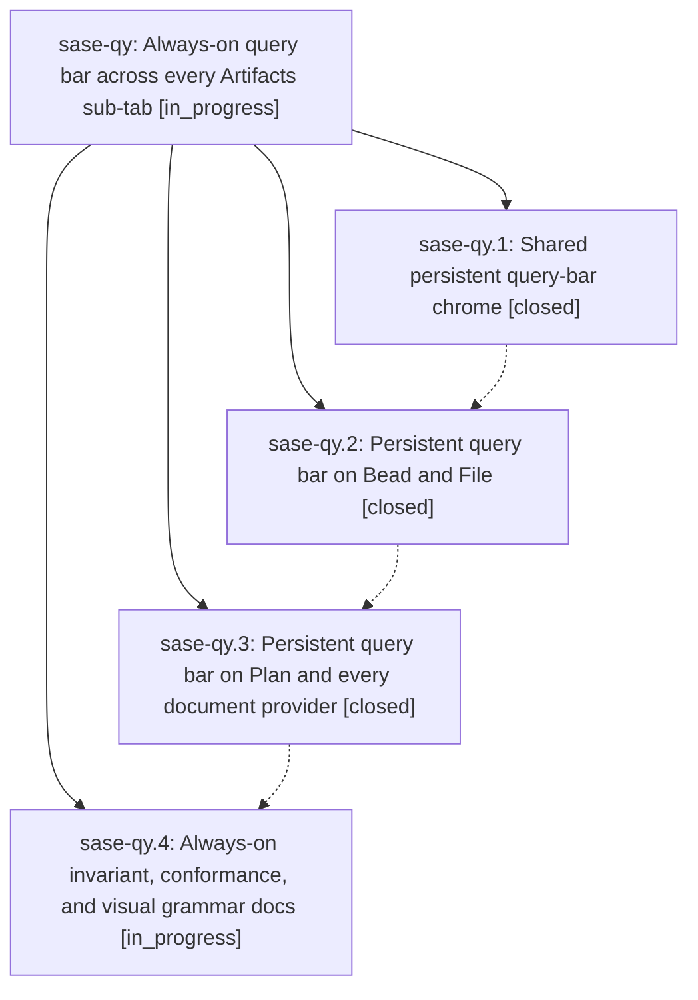

# Bead: sase-qy — Always-on query bar across every Artifacts sub-tab

[Bead Pages](../README.md) / sase-qy

**Status:** ◐ in_progress · **Type:** ▸ plan · **Tier:** epic
**Owner:** `bryanbugyi34@gmail.com` · **Created by:** [bbugyi200.athena.07r](https://github.com/sase-org/sase--agents/blob/main/families/bbugyi200.athena.07r.md) · **Assignee:** `sase-qy.land`
**Created:** 2026-08-19 10:02:14 EDT
**Plan:** [202608/artifacts\_persistent\_query\_bar.md](https://github.com/sase-org/sase--plans/blob/main/202608/artifacts_persistent_query_bar.md)

## Description

Every Artifacts sub-tab that can be queried shows its query bar at all times, in one shared visual grammar, so pressing the query key never shifts the layout and the active query is always readable from the pane it filters.

## Phases

| Bead | Title | Status | Size | Created | Agents | Commits |
|---|---|---|---|---|---:|---:|
| [sase-qy.1](sase-qy.1.md) | Shared persistent query-bar chrome | ✓ closed | medium | 2026-08-19 | 1 | 1 |
| [sase-qy.2](sase-qy.2.md) | Persistent query bar on Bead and File | ✓ closed | medium | 2026-08-19 | 1 | 1 |
| [sase-qy.3](sase-qy.3.md) | Persistent query bar on Plan and every document provider | ✓ closed | medium | 2026-08-19 | 1 | 1 |
| [sase-qy.4](sase-qy.4.md) | Always-on invariant, conformance, and visual grammar docs | ◐ in_progress | small | 2026-08-19 | 1 | 0 |

## Lineage

## Agents

| Agent | Bead | Commits |
|---|---|---:|
| [bbugyi200.athena.sase-qy.1](https://github.com/sase-org/sase--agents/blob/main/agents/bbugyi200.athena.sase-qy.1/README.md) | [sase-qy.1](sase-qy.1.md) | 1 |
| [bbugyi200.athena.sase-qy.2](https://github.com/sase-org/sase--agents/blob/main/agents/bbugyi200.athena.sase-qy.2/README.md) | [sase-qy.2](sase-qy.2.md) | 1 |
| [bbugyi200.athena.sase-qy.3](https://github.com/sase-org/sase--agents/blob/main/agents/bbugyi200.athena.sase-qy.3/README.md) | [sase-qy.3](sase-qy.3.md) | 1 |
| [bbugyi200.athena.sase-qy.4](https://github.com/sase-org/sase--agents/blob/main/agents/bbugyi200.athena.sase-qy.4/README.md) | [sase-qy.4](sase-qy.4.md) | 0 |
| [bbugyi200.athena.sase-qy.land](https://github.com/sase-org/sase--agents/blob/main/agents/bbugyi200.athena.sase-qy.land/README.md) | [sase-qy](README.md) | 0 |

## Commits

| Repo | Commit | Subject | Bead | Committed |
|---|---|---|---|---|
| sase | [`c9cb183`](https://github.com/sase-org/sase/commit/c9cb183c46055f6cd853b08490e38f647467f65e) | feat(ace): give FilterBar shared idle chrome and adopt it on Commit/Patch bars | [sase-qy.1](sase-qy.1.md) | 2026-08-19 11:33:13 EDT |
| sase | [`1a0d8e8`](https://github.com/sase-org/sase/commit/1a0d8e867184c87c4bf39ac798378ea64bb6b978) | feat(ace): make BeadFilterBar and FileFilterBar persistent | [sase-qy.2](sase-qy.2.md) | 2026-08-19 12:48:50 EDT |
| sase | [`be757ca`](https://github.com/sase-org/sase/commit/be757cabcb363fb07c15565ec0c2864433201386) | feat(ace): make the Plan query bar persistent across document providers | [sase-qy.3](sase-qy.3.md) | 2026-08-19 14:05:52 EDT |
