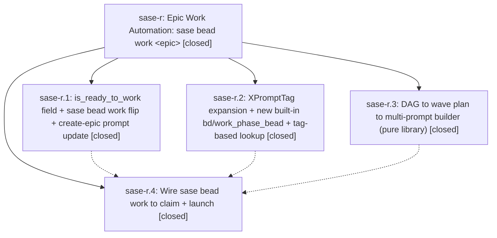

# Bead: sase-r — Epic Work Automation: sase bead work \<epic\>

[Bead Pages](../README.md) / sase-r

**Status:** ✓ closed · **Resolution:** (unrecorded) · **Type:** plan · **Tier:** epic
**Owner:** `bryanbugyi34@gmail.com`
**Created:** 2026-04-25 21:20:44 UTC · **Closed:** 2026-04-25 22:11:45 UTC
**Plan:** [202604/epic\_work\_automation.md](https://github.com/sase-org/sase--plans/blob/main/202604/epic_work_automation.md)

## Description

Land a built-in automation: a single sase bead work <epic_id> command that marks the epic ready, computes a phase-wave schedule from the dependency DAG, pre-claims each phase bead, and spawns one background agent per phase plus a final land-epic agent.

## Phases

| Bead | Title | Status | Size | Agents | Commits |
|---|---|---|---|---:|---:|
| [sase-r.1](sase-r.1.md) | is\_ready\_to\_work field + sase bead work flip + create-epic prompt update | ✓ closed | small | 0 | 1 |
| [sase-r.2](sase-r.2.md) | XPromptTag expansion + new built-in bd/work\_phase\_bead + tag-based lookup | ✓ closed | small | 0 | 1 |
| [sase-r.3](sase-r.3.md) | DAG to wave plan to multi-prompt builder (pure library) | ✓ closed | small | 0 | 1 |
| [sase-r.4](sase-r.4.md) | Wire sase bead work to claim + launch | ✓ closed | small | 0 | 1 |

## Lineage

## Commits

| Commit | Subject | Bead | Committed (UTC) |
|---|---|---|---|
| [`bb7ae76`](https://github.com/sase-org/sase/commit/bb7ae76706fe798f96f2b4b0cf3a7df362c5a9cd) | feat: \`is\_ready\_to\_work\` field + \`sase bead work\` CLI flag-flip (sase-r.1) | [sase-r.1](sase-r.1.md) | 2026-04-25 21:39:11 |
| [`8163af7`](https://github.com/sase-org/sase/commit/8163af7e3d809ec3c7dbc67b51e3c702a6c5a34a) | feat: XPromptTag expansion + bd/work\_phase\_bead built-in + tag-based lookup (sase-r.2) | [sase-r.2](sase-r.2.md) | 2026-04-25 21:50:14 |
| [`d430c6d`](https://github.com/sase-org/sase/commit/d430c6d7c467d9bcb27203caf45e24d403ff0262) | feat: DAG to wave plan to multi-prompt builder for epic work automation (sase-r.3) | [sase-r.3](sase-r.3.md) | 2026-04-25 21:57:15 |
| [`7258025`](https://github.com/sase-org/sase/commit/7258025c43cef2607e8e817bc6b80513eb093816) | feat: wire \`sase bead work\` to pre-claim phases + launch agents (sase-r.4) | [sase-r.4](sase-r.4.md) | 2026-04-25 22:08:18 |
