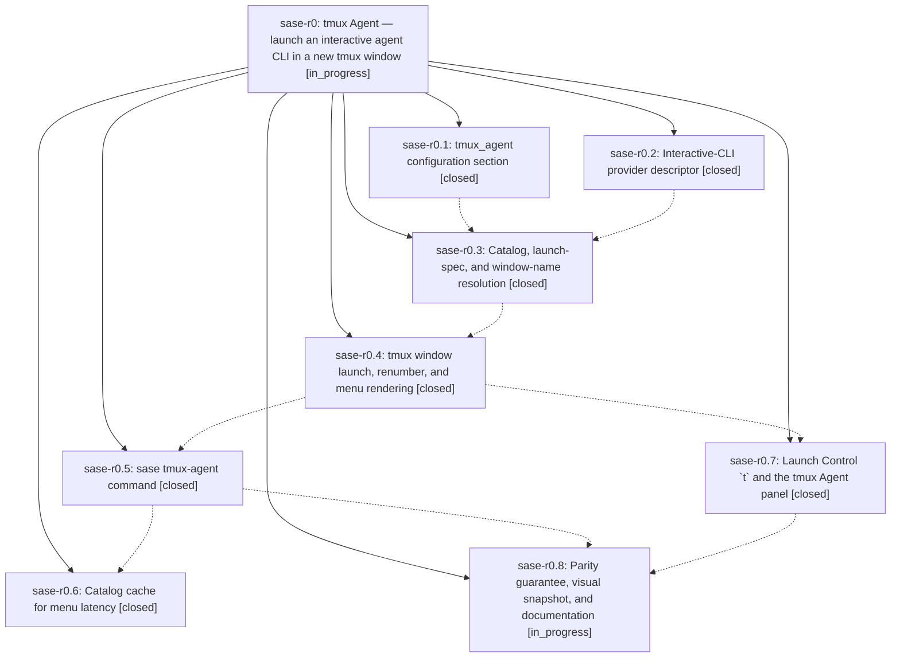

# Bead: sase-r0 — tmux Agent — launch an interactive agent CLI in a new tmux window

[Bead Pages](../README.md) / sase-r0

**Status:** ◐ in_progress · **Type:** ▸ plan · **Tier:** epic
**Owner:** `bryanbugyi34@gmail.com` · **Created by:** [bbugyi200.athena.07y](https://github.com/sase-org/sase--agents/blob/main/families/bbugyi200.athena.07y.md) · **Assignee:** `sase-r0.land`
**Created:** 2026-08-19 11:56:54 EDT
**Plan:** [202608/tmux\_agent\_launcher.md](https://github.com/sase-org/sase--plans/blob/main/202608/tmux_agent_launcher.md)

## Description

Pressing `t` in Launch Control, or running `sase tmux-agent`, opens a keyboard-first chooser of every registered agent-CLI provider and drops the chosen one into a fresh, auto-numbered tmux window in the current directory. Both surfaces share one registry-driven catalog, so a newly registered provider plugin appears with no code change here.

## Phases

| Bead | Title | Status | Size | Created | Agents | Commits |
|---|---|---|---|---|---:|---:|
| [sase-r0.1](sase-r0.1.md) | tmux\_agent configuration section | ✓ closed | small | 2026-08-19 | 1 | 1 |
| [sase-r0.2](sase-r0.2.md) | Interactive-CLI provider descriptor | ✓ closed | small | 2026-08-19 | 1 | 1 |
| [sase-r0.3](sase-r0.3.md) | Catalog, launch-spec, and window-name resolution | ✓ closed | medium | 2026-08-19 | 1 | 1 |
| [sase-r0.4](sase-r0.4.md) | tmux window launch, renumber, and menu rendering | ✓ closed | medium | 2026-08-19 | 1 | 1 |
| [sase-r0.5](sase-r0.5.md) | sase tmux-agent command | ✓ closed | medium | 2026-08-19 | 1 | 1 |
| [sase-r0.6](sase-r0.6.md) | Catalog cache for menu latency | ✓ closed | small | 2026-08-19 | 1 | 1 |
| [sase-r0.7](sase-r0.7.md) | Launch Control \`t\` and the tmux Agent panel | ✓ closed | medium | 2026-08-19 | 1 | 1 |
| [sase-r0.8](sase-r0.8.md) | Parity guarantee, visual snapshot, and documentation | ◐ in_progress | small | 2026-08-19 | 1 | 0 |

## Lineage

## Agents

| Agent | Bead | Commits |
|---|---|---:|
| [bbugyi200.athena.sase-r0.1](https://github.com/sase-org/sase--agents/blob/main/agents/bbugyi200.athena.sase-r0.1/README.md) | [sase-r0.1](sase-r0.1.md) | 1 |
| [bbugyi200.athena.sase-r0.2](https://github.com/sase-org/sase--agents/blob/main/agents/bbugyi200.athena.sase-r0.2/README.md) | [sase-r0.2](sase-r0.2.md) | 1 |
| [bbugyi200.athena.sase-r0.3](https://github.com/sase-org/sase--agents/blob/main/families/bbugyi200.athena.sase-r0.3.md) | [sase-r0.3](sase-r0.3.md) | 1 |
| [bbugyi200.athena.sase-r0.4](https://github.com/sase-org/sase--agents/blob/main/agents/bbugyi200.athena.sase-r0.4/README.md) | [sase-r0.4](sase-r0.4.md) | 1 |
| [bbugyi200.athena.sase-r0.5](https://github.com/sase-org/sase--agents/blob/main/agents/bbugyi200.athena.sase-r0.5/README.md) | [sase-r0.5](sase-r0.5.md) | 1 |
| [bbugyi200.athena.sase-r0.6](https://github.com/sase-org/sase--agents/blob/main/agents/bbugyi200.athena.sase-r0.6/README.md) | [sase-r0.6](sase-r0.6.md) | 1 |
| [bbugyi200.athena.sase-r0.7](https://github.com/sase-org/sase--agents/blob/main/agents/bbugyi200.athena.sase-r0.7/README.md) | [sase-r0.7](sase-r0.7.md) | 1 |
| [bbugyi200.athena.sase-r0.8](https://github.com/sase-org/sase--agents/blob/main/families/bbugyi200.athena.sase-r0.8.md) | [sase-r0.8](sase-r0.8.md) | 0 |
| [bbugyi200.athena.sase-r0.land](https://github.com/sase-org/sase--agents/blob/main/agents/bbugyi200.athena.sase-r0.land/README.md) | [sase-r0](README.md) | 0 |

## Commits

| Repo | Commit | Subject | Bead | Committed |
|---|---|---|---|---|
| sase | [`88a7de4`](https://github.com/sase-org/sase/commit/88a7de4af1be4f596cca283c9f61d78350ffb212) | feat(llm): add interactive CLI descriptors and vendor metadata | [sase-r0.2](sase-r0.2.md) | 2026-08-19 12:57:18 EDT |
| sase | [`14204d6`](https://github.com/sase-org/sase/commit/14204d6a48a7188c4c12f66a4c2f55cfea21b093) | feat(config): add tmux\_agent configuration section | [sase-r0.1](sase-r0.1.md) | 2026-08-19 13:29:27 EDT |
| sase | [`be6077c`](https://github.com/sase-org/sase/commit/be6077c7fff3ece4bc40c419565b1ca1338f9eed) | feat(tmux-agent): add catalog, launch-spec, and window-name resolution | [sase-r0.3](sase-r0.3.md) | 2026-08-19 14:00:47 EDT |
| sase | [`45bd0f7`](https://github.com/sase-org/sase/commit/45bd0f7c707b9b837c1579e66edd26d8b864af26) | feat(tmux-agent): add window launch, renumber, and display-menu | [sase-r0.4](sase-r0.4.md) | 2026-08-19 14:34:22 EDT |
| sase | [`b9ece10`](https://github.com/sase-org/sase/commit/b9ece108998721586586628436778d0ddf3d3574) | feat(ace): add Launch Control tmux Agent panel bound to \`t\` | [sase-r0.7](sase-r0.7.md) | 2026-08-19 15:15:37 EDT |
| sase | [`6339525`](https://github.com/sase-org/sase/commit/63395254ea88fa80ebb5adaa08692420d434ee08) | feat(cli): add sase tmux-agent command | [sase-r0.5](sase-r0.5.md) | 2026-08-19 15:21:15 EDT |
| sase | [`4f25812`](https://github.com/sase-org/sase/commit/4f258124327591e3b8cb6598c569192af414e238) | perf(tmux-agent): cache catalog metadata for menu latency | [sase-r0.6](sase-r0.6.md) | 2026-08-19 16:26:11 EDT |
