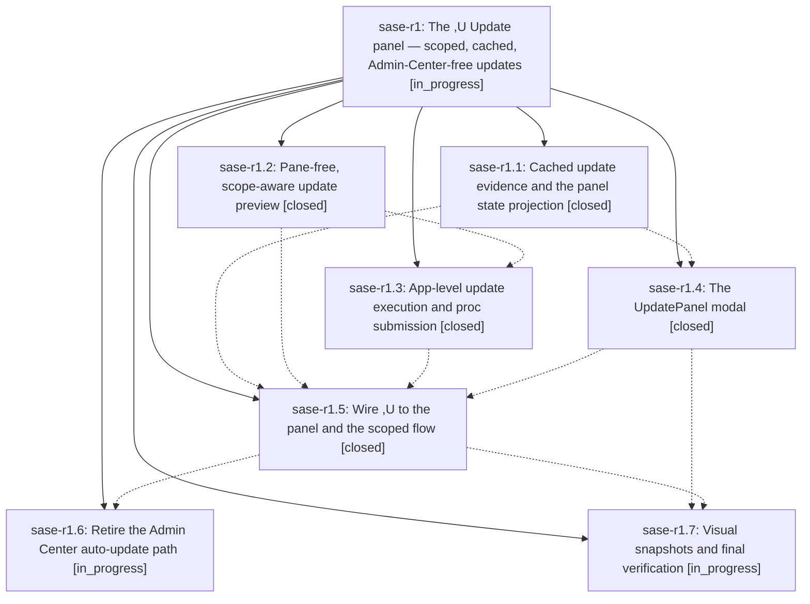

# Bead: sase-r1 — The ,U Update panel — scoped, cached, Admin-Center-free updates

[Bead Pages](../README.md) / sase-r1

**Status:** ◐ in_progress · **Type:** ▸ plan · **Tier:** epic
**Owner:** `bryanbugyi34@gmail.com` · **Created by:** [bbugyi200.athena.080](https://github.com/sase-org/sase--agents/blob/main/families/bbugyi200.athena.080.md) · **Assignee:** `sase-r1.land`
**Created:** 2026-08-19 12:05:13 EDT
**Plan:** [202608/update\_panel.md](https://github.com/sase-org/sase--plans/blob/main/202608/update_panel.md)

## Description

Pressing ,U opens a fast, keyboard-first Update panel rendered entirely from already-fetched update evidence. Each option runs its scoped update as a background proc that asks for the same y/n confirmation ACE asks today, and no option opens the SASE Admin Center.

## Notes

[2026-08-19T19:40:34Z · sase-qv.land] DISCOVERED ISSUE (from the sase-qv land agent, 2026-08-19): after phase sase-r1.4 closed, its three Justfile --epic-symbol entries went stale and turned the symvision lint gate red for every agent on this machine -- 'just symvision' failed with three errors of the form "--epic-symbol 'sase-r1.4(UpdateOptionChip)': bead 'sase-r1.4' is closed". Symbols: UpdateOptionChip, UpdateOptionRow, UpdatePanelState. I re-keyed those three lines from sase-r1.4 to the still-open parent epic sase-r1 (same transformation phases sase-qv.3 and sase-qv.5 applied to stale sase-qt.4/qt.6/qt.7 lines), and 'just symvision' is green again: 'All public/private classes/functions are used properly!'. The sase-r1.5(build_update_panel_state) line was already correct and untouched. FOR THIS EPIC'S LAND AGENT: these three symbols still need a real resolution before sase-r1 closes -- sase-r1.5 ('Wire ,U to the panel and the scoped flow') is the phase that should consume UpdateOptionChip / UpdateOptionRow / UpdatePanelState, so either wire them up and delete the whitelist lines, or re-key them to whichever phase genuinely still needs the exemption. 'sase bead epic-symbols sase-r1' will refuse the close while they remain.

## Phases

| Bead | Title | Status | Size | Created | Agents | Commits |
|---|---|---|---|---|---:|---:|
| [sase-r1.1](sase-r1.1.md) | Cached update evidence and the panel state projection | ✓ closed | small | 2026-08-19 | 1 | 1 |
| [sase-r1.2](sase-r1.2.md) | Pane-free, scope-aware update preview | ✓ closed | medium | 2026-08-19 | 1 | 1 |
| [sase-r1.3](sase-r1.3.md) | App-level update execution and proc submission | ✓ closed | medium | 2026-08-19 | 1 | 1 |
| [sase-r1.4](sase-r1.4.md) | The UpdatePanel modal | ✓ closed | medium | 2026-08-19 | 1 | 1 |
| [sase-r1.5](sase-r1.5.md) | Wire ,U to the panel and the scoped flow | ✓ closed | medium | 2026-08-19 | 1 | 1 |
| [sase-r1.6](sase-r1.6.md) | Retire the Admin Center auto-update path | ◐ in_progress | medium | 2026-08-19 | 1 | 0 |
| [sase-r1.7](sase-r1.7.md) | Visual snapshots and final verification | ◐ in_progress | small | 2026-08-19 | 1 | 0 |

## Lineage

## Agents

| Agent | Bead | Commits |
|---|---|---:|
| [bbugyi200.athena.sase-r1.1](https://github.com/sase-org/sase--agents/blob/main/agents/bbugyi200.athena.sase-r1.1/README.md) | [sase-r1.1](sase-r1.1.md) | 1 |
| [bbugyi200.athena.sase-r1.2](https://github.com/sase-org/sase--agents/blob/main/families/bbugyi200.athena.sase-r1.2.md) | [sase-r1.2](sase-r1.2.md) | 1 |
| [bbugyi200.athena.sase-r1.3](https://github.com/sase-org/sase--agents/blob/main/agents/bbugyi200.athena.sase-r1.3/README.md) | [sase-r1.3](sase-r1.3.md) | 1 |
| [bbugyi200.athena.sase-r1.4](https://github.com/sase-org/sase--agents/blob/main/agents/bbugyi200.athena.sase-r1.4/README.md) | [sase-r1.4](sase-r1.4.md) | 1 |
| [bbugyi200.athena.sase-r1.5](https://github.com/sase-org/sase--agents/blob/main/agents/bbugyi200.athena.sase-r1.5/README.md) | [sase-r1.5](sase-r1.5.md) | 1 |
| [bbugyi200.athena.sase-r1.6](https://github.com/sase-org/sase--agents/blob/main/agents/bbugyi200.athena.sase-r1.6/README.md) | [sase-r1.6](sase-r1.6.md) | 0 |
| [bbugyi200.athena.sase-r1.7](https://github.com/sase-org/sase--agents/blob/main/agents/bbugyi200.athena.sase-r1.7/README.md) | [sase-r1.7](sase-r1.7.md) | 0 |
| [bbugyi200.athena.sase-r1.land](https://github.com/sase-org/sase--agents/blob/main/agents/bbugyi200.athena.sase-r1.land/README.md) | [sase-r1](README.md) | 0 |

## Commits

| Repo | Commit | Subject | Bead | Committed |
|---|---|---|---|---|
| sase | [`012948e`](https://github.com/sase-org/sase/commit/012948e7c749cf8f563fadef8defc236892faec6) | feat(tui): cache update evidence and project Update panel rows | [sase-r1.1](sase-r1.1.md) | 2026-08-19 13:27:53 EDT |
| sase | [`ba03cec`](https://github.com/sase-org/sase/commit/ba03cec630e37b70d0e92da78acdbba2437f80e4) | feat(ace): scope comprehensive update preview to selected legs | [sase-r1.2](sase-r1.2.md) | 2026-08-19 14:11:14 EDT |
| sase | [`8cd80f1`](https://github.com/sase-org/sase/commit/8cd80f1e1a310ff6014cbd377b8232eac76a0cd2) | feat(tui): add keyboard-first Update panel modal | [sase-r1.4](sase-r1.4.md) | 2026-08-19 14:52:54 EDT |
| sase | [`9f24f13`](https://github.com/sase-org/sase/commit/9f24f133d76ceaa4296db6d1b1465dbe2d9270d1) | feat(ace): run comprehensive updates from the ACE app mixin | [sase-r1.3](sase-r1.3.md) | 2026-08-19 15:22:16 EDT |
| sase | [`e9ed6a3`](https://github.com/sase-org/sase/commit/e9ed6a35011ead7e3c6f06b56a9c70b0ccc9bd05) | feat(ace): wire ,U to the Update panel and scoped preview | [sase-r1.5](sase-r1.5.md) | 2026-08-19 16:17:45 EDT |
