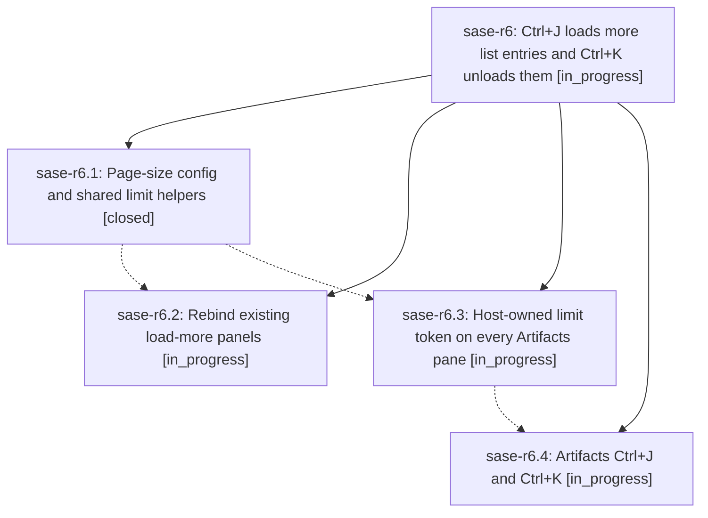

# Bead: sase-r6 — Ctrl+J loads more list entries and Ctrl+K unloads them

[Bead Pages](../README.md) / sase-r6

**Status:** ◐ in_progress · **Type:** ▸ plan · **Tier:** epic
**Owner:** `bryanbugyi34@gmail.com` · **Created by:** [bbugyi200.athena.086](https://github.com/sase-org/sase--agents/blob/main/families/bbugyi200.athena.086.md) · **Assignee:** `sase-r6.land`
**Created:** 2026-08-19 17:09:38 EDT
**Plan:** [202608/load\_more\_ctrl\_j.md](https://github.com/sase-org/sase--plans/blob/main/202608/load_more_ctrl_j.md)

## Description

Every ACE list that today pages with Ctrl+K loads the next page with Ctrl+J and unloads that page with Ctrl+K, using one configurable page size that defaults to 100. Every Artifacts sub-tab speaks the same limit:N query token, starts with it in its default query, and uses those two keys to raise or lower the cap.

## Phases

| Bead | Title | Status | Size | Created | Agents | Commits |
|---|---|---|---|---|---:|---:|
| [sase-r6.1](sase-r6.1.md) | Page-size config and shared limit helpers | ✓ closed | small | 2026-08-19 | 1 | 1 |
| [sase-r6.2](sase-r6.2.md) | Rebind existing load-more panels | ◐ in_progress | medium | 2026-08-19 | 1 | 0 |
| [sase-r6.3](sase-r6.3.md) | Host-owned limit token on every Artifacts pane | ◐ in_progress | medium | 2026-08-19 | 1 | 0 |
| [sase-r6.4](sase-r6.4.md) | Artifacts Ctrl+J and Ctrl+K | ◐ in_progress | medium | 2026-08-19 | 1 | 0 |

## Lineage

## Agents

| Agent | Bead | Commits |
|---|---|---:|
| [bbugyi200.athena.sase-r6.1](https://github.com/sase-org/sase--agents/blob/main/families/bbugyi200.athena.sase-r6.1.md) | [sase-r6.1](sase-r6.1.md) | 1 |
| [bbugyi200.athena.sase-r6.2](https://github.com/sase-org/sase--agents/blob/main/agents/bbugyi200.athena.sase-r6.2/README.md) | [sase-r6.2](sase-r6.2.md) | 0 |
| [bbugyi200.athena.sase-r6.3](https://github.com/sase-org/sase--agents/blob/main/agents/bbugyi200.athena.sase-r6.3/README.md) | [sase-r6.3](sase-r6.3.md) | 0 |
| [bbugyi200.athena.sase-r6.4](https://github.com/sase-org/sase--agents/blob/main/agents/bbugyi200.athena.sase-r6.4/README.md) | [sase-r6.4](sase-r6.4.md) | 0 |
| [bbugyi200.athena.sase-r6.land](https://github.com/sase-org/sase--agents/blob/main/agents/bbugyi200.athena.sase-r6.land/README.md) | [sase-r6](README.md) | 0 |

## Commits

| Repo | Commit | Subject | Bead | Committed |
|---|---|---|---|---|
| sase | [`35ba42c`](https://github.com/sase-org/sase/commit/35ba42ce77d39ad9974bac8b4ab8869f0b30ff41) | feat(ace): add page\_size config and shared limit-token helpers | [sase-r6.1](sase-r6.1.md) | 2026-08-19 18:27:42 EDT |
