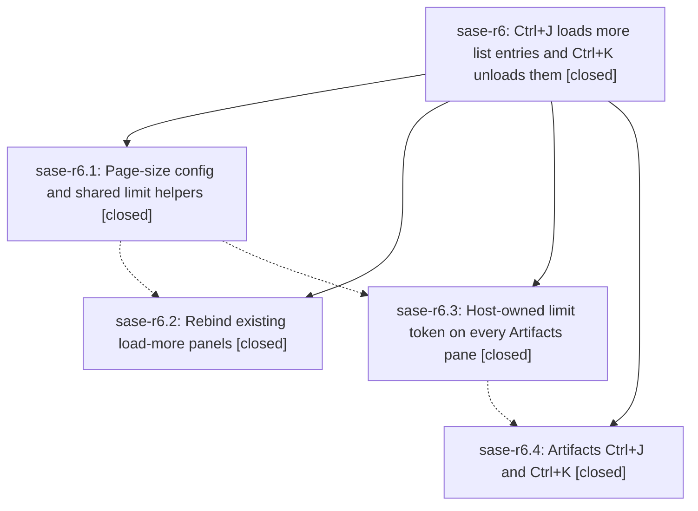

# Bead: sase-r6 — Ctrl+J loads more list entries and Ctrl+K unloads them

[Bead Pages](../README.md) / sase-r6

**Status:** ✓ closed · **Resolution:** done · **Type:** ▸ plan · **Tier:** epic
**Owner:** `bryanbugyi34@gmail.com` · **Created by:** [bbugyi200.athena.086](https://github.com/sase-org/sase--agents/blob/main/families/bbugyi200.athena.086.md) · **Assignee:** `sase-r6.land`
**Created:** 2026-08-19 17:09:38 EDT · **Closed:** 2026-08-19 21:43:30 EDT
**Plan:** [202608/load\_more\_ctrl\_j.md](https://github.com/sase-org/sase--plans/blob/main/202608/load_more_ctrl_j.md)

## Description

Every ACE list that today pages with Ctrl+K loads the next page with Ctrl+J and unloads that page with Ctrl+K, using one configurable page size that defaults to 100. Every Artifacts sub-tab speaks the same limit:N query token, starts with it in its default query, and uses those two keys to raise or lower the cap.

## Notes

[2026-08-19T23:45:06Z · 08e] DISCOVERED ISSUE: just check fails at lint (symvision) on an unrelated tree because Justfile _lint-symvision still has --epic-symbol sase-r6.2(get_ace_page_size) after phase sase-r6.2 closed. Earlier lint gates pass. Remove the stale entry and resolve get_ace_page_size per the epic-whitelist policy. Reproduced 2026-08-19; this tree does not touch Justfile or that symbol.

[2026-08-20T01:21:38Z · toobig-37.split_file.src.sase.ace.tui.widgets._prompt_text_area_key_handling.0--1] DISCOVERED ISSUE: just check fails at lint (symvision) because Justfile _lint-symvision still had --epic-symbol sase-r6.4(adjust_limit) after phase sase-r6.4 closed. This tree has no production consumer of adjust_limit (r6.4's stitch is not merged here). Retargeted the whitelist to in-progress epic sase-r6 so the public helper survives until land merges r6.4's consumer. Lander should drop --epic-symbol sase-r6(adjust_limit) once adjust_limit has a non-test caller (or privatize/delete it if that consumer never lands).

[2026-08-20T01:43:30Z · sase-r6.land--1] Verified sase-r6 against the plan, all four closed phases, child notes, source, and commits 35ba42ce7 (sase-r6.1), 84e09d5da (sase-r6.2), 6b0b1e3f9 (sase-r6.3), ed20ccdb8 (sase-r6.4). ace.page_size default 100, get_ace_page_size, limit-token helpers, modal Ctrl+J/Ctrl+K plus-or-minus paging (prompt-history, alias-history, revive), host-owned limit: on every Artifacts dialect with ensure_limit defaults, and Artifacts tab Ctrl+J/Ctrl+K actions are in tree with tests. Non-goals preserved (prompt-bar Ctrl+K, Agents metadata Ctrl+J/K, wait-modal, saved-group PageDown). Fast-forwarded onto 194dbebfb (sase-qy.4 always-on query bar + AcePage pump-free drain). Interleaved non-epic commits (shell titles, FAMILY/AGENT SHELL headers, memory-panel split, update panel, xhigh grok, referenced-by, bead-work provider guard) do not need further r6 wiring; query-bar invariant still holds with injected limit: tokens. Leftover bundled comment in default_config.yml still said omitted Stitches limit: was uncapped; aligned it with the schema/docs inject-on-startup rule.

just check after that comment alignment: 34933 passed, 1 failed — tests/ace/tui/widgets/test_agent_display_kind_headers.py::test_workflow_step_has_no_kind_heading[parallel]. Already-tracked ready ci sase-r9 (this land family +1 earlier; supplementary note this turn). Not caused-by-epic remaining work.

Follow-ups: (1) leak-detector flake from sase-r6.1 → DISCOVERED ISSUE on in-progress sase-j7 (detector test that epic added; already in flake baseline). (2) AcePage structurally-quiet flake from sase-r6.3/r6.4 → note on ready sase-oz plus candidate fix 194dbebfb drain; no +1 this turn (no rerun). (3) PNG goldens from sase-r6.3/r6.4 → +1 sase-r5 and DISCOVERED ISSUE on in-progress sase-qy (qy.land already regenerating those goldens; will pick up limit: and footer chords). Declined as r6 land work to avoid racing qy.land / blanket-accepting (sase-lo). (4) test_workflow_step_has_no_kind_heading[parallel] from sase-r6.4 → +1 ready ci sase-r9 after source confirmation; just check this turn reproduced it again (supplementary note). (5) epic DISCOVERED ISSUE about stale --epic-symbol sase-r6.2(get_ace_page_size) already gone from Justfile. (6) later DISCOVERED ISSUE about --epic-symbol sase-r6.4/sase-r6(adjust_limit): this tree has production consumers (artifacts_limit.adjust_limit, get_ace_page_size callers); sase bead epic-symbols sase-r6 is empty.

No parent_bead.

[2026-08-20T01:48:38Z · sase-r6.land--1] Verified sase-r6 against the plan, all four closed phases, child notes, source, and commits 35ba42ce7 (sase-r6.1), 84e09d5da (sase-r6.2), 6b0b1e3f9 (sase-r6.3), ed20ccdb8 (sase-r6.4). ace.page_size default 100, get_ace_page_size, limit-token helpers, modal Ctrl+J/Ctrl+K plus-or-minus paging (prompt-history, alias-history, revive), host-owned limit: on every Artifacts dialect with ensure_limit defaults, and Artifacts tab Ctrl+J/Ctrl+K actions are in tree with tests. Non-goals preserved (prompt-bar Ctrl+K, Agents metadata Ctrl+J/K, wait-modal, saved-group PageDown). Fast-forwarded onto 194dbebfb (sase-qy.4 always-on query bar + AcePage pump-free drain). Interleaved non-epic commits (shell titles, FAMILY/AGENT SHELL headers, memory-panel split, update panel, xhigh grok, referenced-by, bead-work provider guard) do not need further r6 wiring; query-bar invariant still holds with injected limit: tokens. Leftover bundled comment in default_config.yml still said omitted Stitches limit: was uncapped; aligned it with the schema/docs inject-on-startup rule.

just check: 1 failed / 34933 passed. The only failure was tests/ace/tui/widgets/test_agent_display_kind_headers.py::test_workflow_step_has_no_kind_heading[parallel] (cheap header Name/Patch/timestamps, no Step: do). That is ready CI sase-r9, already corroborated; not caused by sase-r6 or the leftover comment.

Follow-ups: (1) leak-detector flake from sase-r6.1 → DISCOVERED ISSUE on in-progress sase-j7 (detector test that epic added; already in flake baseline). (2) AcePage structurally-quiet flake from sase-r6.3/r6.4 → note on ready sase-oz plus candidate fix 194dbebfb drain; no +1 this turn (no rerun). (3) PNG goldens from sase-r6.3/r6.4 → +1 sase-r5 and DISCOVERED ISSUE on in-progress sase-qy (qy.land already regenerating those goldens; will pick up limit: and footer chords). Declined as r6 land work to avoid racing qy.land / blanket-accepting (sase-lo). (4) test_workflow_step_has_no_kind_heading[parallel] from sase-r6.4 → +1 ready ci sase-r9 after source confirmation; this just check reproduced it. (5) epic DISCOVERED ISSUE about stale --epic-symbol sase-r6.2(get_ace_page_size) already gone from Justfile. epic-symbols sase-r6 empty; production callers exist for get_ace_page_size and adjust_limit.

## Phases

| Bead | Title | Status | Size | Created | Agents | Commits |
|---|---|---|---|---|---:|---:|
| [sase-r6.1](sase-r6.1.md) | Page-size config and shared limit helpers | ✓ closed | small | 2026-08-19 | 1 | 1 |
| [sase-r6.2](sase-r6.2.md) | Rebind existing load-more panels | ✓ closed | medium | 2026-08-19 | 1 | 1 |
| [sase-r6.3](sase-r6.3.md) | Host-owned limit token on every Artifacts pane | ✓ closed | medium | 2026-08-19 | 1 | 1 |
| [sase-r6.4](sase-r6.4.md) | Artifacts Ctrl+J and Ctrl+K | ✓ closed | medium | 2026-08-19 | 1 | 1 |

## Lineage

## Agents

| Agent | Bead | Commits |
|---|---|---:|
| [bbugyi200.athena.sase-r6.1](https://github.com/sase-org/sase--agents/blob/main/families/bbugyi200.athena.sase-r6.1.md) | [sase-r6.1](sase-r6.1.md) | 1 |
| [bbugyi200.athena.sase-r6.2](https://github.com/sase-org/sase--agents/blob/main/agents/bbugyi200.athena.sase-r6.2/README.md) | [sase-r6.2](sase-r6.2.md) | 1 |
| [bbugyi200.athena.sase-r6.3](https://github.com/sase-org/sase--agents/blob/main/agents/bbugyi200.athena.sase-r6.3/README.md) | [sase-r6.3](sase-r6.3.md) | 1 |
| [bbugyi200.athena.sase-r6.4](https://github.com/sase-org/sase--agents/blob/main/agents/bbugyi200.athena.sase-r6.4/README.md) | [sase-r6.4](sase-r6.4.md) | 1 |
| [bbugyi200.athena.sase-r6.land](https://github.com/sase-org/sase--agents/blob/main/families/bbugyi200.athena.sase-r6.land.md) | [sase-r6](README.md) | 1 |

## Commits

| Repo | Commit | Subject | Bead | Committed |
|---|---|---|---|---|
| sase | [`35ba42c`](https://github.com/sase-org/sase/commit/35ba42ce77d39ad9974bac8b4ab8869f0b30ff41) | feat(ace): add page\_size config and shared limit-token helpers | [sase-r6.1](sase-r6.1.md) | 2026-08-19 18:27:42 EDT |
| sase | [`84e09d5`](https://github.com/sase-org/sase/commit/84e09d5daf448aeb2235daee2d3f6aa28bdd1dbe) | feat(ace): rebind load-more panels to Ctrl+J / Ctrl+K | [sase-r6.2](sase-r6.2.md) | 2026-08-19 19:15:16 EDT |
| sase | [`6b0b1e3`](https://github.com/sase-org/sase/commit/6b0b1e3f9ac223586a36825dc3dd5b48516f02a1) | feat(ace): apply host-owned limit:N cap on every Artifacts pane | [sase-r6.3](sase-r6.3.md) | 2026-08-19 20:03:05 EDT |
| sase | [`ed20ccd`](https://github.com/sase-org/sase/commit/ed20ccdb8eff5102de6366d76375032280bae403) | feat(ace): page Artifacts lists with Ctrl+J and Ctrl+K | [sase-r6.4](sase-r6.4.md) | 2026-08-19 21:05:10 EDT |
| sase | [`d11ebe6`](https://github.com/sase-org/sase/commit/d11ebe69554ccec5434feb52fd3ef3375e7e8877) | docs(ace): align Stitches default\_query comment with injected limit | [sase-r6](README.md) | 2026-08-19 21:49:27 EDT |
