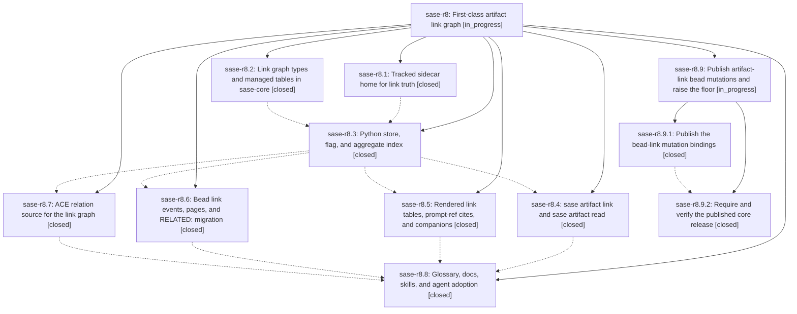

# Bead: sase-r8 — First-class artifact link graph

[Bead Pages](../README.md) / sase-r8

**Status:** ◐ in_progress · **Type:** ▸ plan · **Tier:** epic
**Owner:** `bryanbugyi34@gmail.com` · **Created by:** [bbugyi200.athena.08f](https://github.com/sase-org/sase--agents/blob/main/families/bbugyi200.athena.08f.md) · **Assignee:** `sase-r8.land`
**Created:** 2026-08-19 19:16:34 EDT
**Plan:** [202608/artifact\_link\_graph.md](https://github.com/sase-org/sase--plans/blob/main/202608/artifact_link_graph.md)

## Description

Every SASE artifact has a defined artifact markdown file and a typed, committed link graph. Agents write links with `sase artifact link` (required relation and description), read artifacts with `sase artifact read`, and see a beautiful GitHub-hyperlinked Links table plus Referenced By citations. Prompt refs, audited reads, and the RELATED: bead-note convention become first-class edges behind the `artifact_links` beta flag.

## Notes

[2026-08-20T13:41:38Z · sase-r8.land] LANDING AUDIT PAUSED FOR REMAINING WORK: reviewed the epic plan, all eight children and notes, source in sase and linked sase-core, and epic commits 0f3992a03/6d87cf227/69802b326/5cfbf08dd/55ee145f6/585e34b33/4687d3795 plus intervening drift. Functional focused tests pass after just install; just check passed every lint/validation gate and 35038/35039 executed tests, with the sole unrelated full-lane flake corroborated on sase-qp. Follow-up outcomes: usage-limit date skew routed to active epic sase-n4 and verified fixed by 5cfbf08dd; Models modal flake corroborated on sase-oh; Logs scroll recurrence noted without reopening sase-jb per its close policy. Blocking epic completion: linked sase-core commit 751d60f adds bead_add_link/bead_remove_link after tag v0.29.4, so tools/validate_sase_core_rs reports blocked_unpublished and the shipped Python floor cannot supply required bindings. Validated child epic plan sase_plan_artifact_link_core_release.md contains only release and floor integration; resume this landing after it lands.

## Phases

| Bead | Title | Status | Size | Created | Agents | Commits |
|---|---|---|---|---|---:|---:|
| [sase-r8.1](sase-r8.1.md) | Tracked sidecar home for link truth | ✓ closed | small | 2026-08-19 | 1 | 1 |
| [sase-r8.2](sase-r8.2.md) | Link graph types and managed tables in sase-core | ✓ closed | medium | 2026-08-19 | 1 | 1 |
| [sase-r8.3](sase-r8.3.md) | Python store, flag, and aggregate index | ✓ closed | medium | 2026-08-19 | 1 | 1 |
| [sase-r8.4](sase-r8.4.md) | sase artifact link and sase artifact read | ✓ closed | medium | 2026-08-19 | 1 | 1 |
| [sase-r8.5](sase-r8.5.md) | Rendered link tables, prompt-ref cites, and companions | ✓ closed | medium | 2026-08-19 | 1 | 1 |
| [sase-r8.6](sase-r8.6.md) | Bead link events, pages, and RELATED: migration | ✓ closed | medium | 2026-08-19 | 1 | 2 |
| [sase-r8.7](sase-r8.7.md) | ACE relation source for the link graph | ✓ closed | small | 2026-08-19 | 1 | 1 |
| [sase-r8.8](sase-r8.8.md) | Glossary, docs, skills, and agent adoption | ✓ closed | medium | 2026-08-19 | 1 | 1 |

## Lineage

## Agents

| Agent | Bead | Commits |
|---|---|---:|
| [bbugyi200.athena.sase-r8.1](https://github.com/sase-org/sase--agents/blob/main/agents/bbugyi200.athena.sase-r8.1/README.md) | [sase-r8.1](sase-r8.1.md) | 1 |
| [bbugyi200.athena.sase-r8.2](https://github.com/sase-org/sase--agents/blob/main/agents/bbugyi200.athena.sase-r8.2/README.md) | [sase-r8.2](sase-r8.2.md) | 1 |
| [bbugyi200.athena.sase-r8.3](https://github.com/sase-org/sase--agents/blob/main/agents/bbugyi200.athena.sase-r8.3/README.md) | [sase-r8.3](sase-r8.3.md) | 1 |
| [bbugyi200.athena.sase-r8.4](https://github.com/sase-org/sase--agents/blob/main/agents/bbugyi200.athena.sase-r8.4/README.md) | [sase-r8.4](sase-r8.4.md) | 1 |
| [bbugyi200.athena.sase-r8.5](https://github.com/sase-org/sase--agents/blob/main/agents/bbugyi200.athena.sase-r8.5/README.md) | [sase-r8.5](sase-r8.5.md) | 1 |
| [bbugyi200.athena.sase-r8.6](https://github.com/sase-org/sase--agents/blob/main/agents/bbugyi200.athena.sase-r8.6/README.md) | [sase-r8.6](sase-r8.6.md) | 2 |
| [bbugyi200.athena.sase-r8.7](https://github.com/sase-org/sase--agents/blob/main/agents/bbugyi200.athena.sase-r8.7/README.md) | [sase-r8.7](sase-r8.7.md) | 1 |
| [bbugyi200.athena.sase-r8.8](https://github.com/sase-org/sase--agents/blob/main/agents/bbugyi200.athena.sase-r8.8/README.md) | [sase-r8.8](sase-r8.8.md) | 1 |
| [bbugyi200.athena.sase-r8.9.1](https://github.com/sase-org/sase--agents/blob/main/families/bbugyi200.athena.sase-r8.9.1.md) | [sase-r8.9.1](sase-r8.9.1.md) | 1 |
| [bbugyi200.athena.sase-r8.9.2](https://github.com/sase-org/sase--agents/blob/main/families/bbugyi200.athena.sase-r8.9.2.md) | [sase-r8.9.2](sase-r8.9.2.md) | 1 |
| [bbugyi200.athena.sase-r8.9.land](https://github.com/sase-org/sase--agents/blob/main/agents/bbugyi200.athena.sase-r8.9.land/README.md) | [sase-r8.9](sase-r8.9.md) | 0 |
| [bbugyi200.athena.sase-r8.land](https://github.com/sase-org/sase--agents/blob/main/families/bbugyi200.athena.sase-r8.land.md) | [sase-r8](README.md) | 0 |

## Commits

| Repo | Commit | Subject | Bead | Committed |
|---|---|---|---|---|
| sase-core | [`sase-core@3eb2a6e`](https://github.com/sase-org/sase-core/commit/3eb2a6e200f23bed460a5ec509e1207e6917ff6a) | feat(artifact\_link): add link-row types, managed tables, and bead events | [sase-r8.2](sase-r8.2.md) | 2026-08-19 19:53:29 EDT |
| sase | [`0f3992a`](https://github.com/sase-org/sase/commit/0f3992a03caef10fb3a7e6dd930efa39969de481) | fix(sdd): commit Referenced By index under tracked links/ | [sase-r8.1](sase-r8.1.md) | 2026-08-19 20:01:49 EDT |
| sase | [`6d87cf2`](https://github.com/sase-org/sase/commit/6d87cf2270b8d16dd6aad7de93e53cd2751e7d83) | feat(sdd): add artifact\_links store, flag, and aggregate index | [sase-r8.3](sase-r8.3.md) | 2026-08-20 07:05:27 EDT |
| sase | [`69802b3`](https://github.com/sase-org/sase/commit/69802b3267b50bb761c36d752af30fb2296eb879) | feat(ace): expose artifact link relations in panes | [sase-r8.7](sase-r8.7.md) | 2026-08-20 07:46:33 EDT |
| sase | [`5cfbf08`](https://github.com/sase-org/sase/commit/5cfbf08dd0ab26e9330b1d518e0ccaaebeb9cc55) | feat(sdd): render artifact link projections | [sase-r8.5](sase-r8.5.md) | 2026-08-20 08:01:17 EDT |
| sase | [`55ee145`](https://github.com/sase-org/sase/commit/55ee145f6c5a8fc05b34c028b08c5e8fb0262c6f) | feat(artifact): add sase artifact link and sase artifact read | [sase-r8.4](sase-r8.4.md) | 2026-08-20 08:03:12 EDT |
| sase | [`585e34b`](https://github.com/sase-org/sase/commit/585e34b33d9c633e070fcc875a0403788297042a) | feat(beads): persist typed links in events, pages, and migrate-notes | [sase-r8.6](sase-r8.6.md) | 2026-08-20 08:31:35 EDT |
| sase-core | [`sase-core@751d60f`](https://github.com/sase-org/sase-core/commit/751d60f600d0c7f59abe13bdb471bdbcfb7dd4b1) | feat(bead): add bead\_add\_link and bead\_remove\_link mutations | [sase-r8.6](sase-r8.6.md) | 2026-08-20 08:33:06 EDT |
| sase | [`4687d37`](https://github.com/sase-org/sase/commit/4687d37956ac2b995fff556319180091bf71af1b) | feat(artifacts): publish relation registry snapshot | [sase-r8.8](sase-r8.8.md) | 2026-08-20 09:17:44 EDT |
| sase-core | [`sase-core@b2568ee`](https://github.com/sase-org/sase-core/commit/b2568ee5849765be7fd86ad985137f22ba84749a) | fix(bead): allow clippy::too\_many\_arguments on bead\_add\_link | [sase-r8.9.1](sase-r8.9.1.md) | 2026-08-20 09:52:00 EDT |
| sase | [`43b79bf`](https://github.com/sase-org/sase/commit/43b79bf12b5b8c0ef5376319fec8991e7327812a) | build(deps): raise sase-core-rs floor to 0.29.5 | [sase-r8.9.2](sase-r8.9.2.md) | 2026-08-20 11:14:24 EDT |
