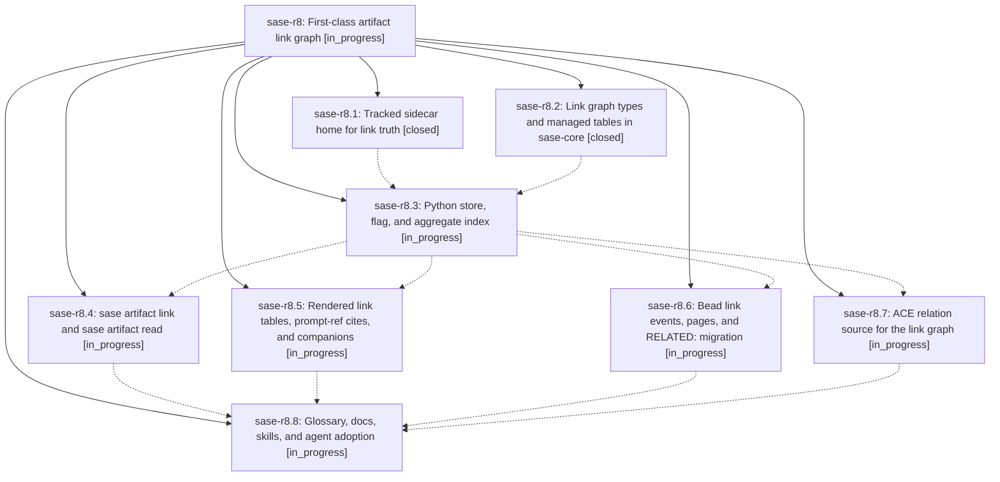

# Bead: sase-r8 — First-class artifact link graph

[Bead Pages](../README.md) / sase-r8

**Status:** ◐ in_progress · **Type:** ▸ plan · **Tier:** epic
**Owner:** `bryanbugyi34@gmail.com` · **Created by:** [bbugyi200.athena.08f](https://github.com/sase-org/sase--agents/blob/main/families/bbugyi200.athena.08f.md) · **Assignee:** `sase-r8.land`
**Created:** 2026-08-19 19:16:34 EDT
**Plan:** [202608/artifact\_link\_graph.md](https://github.com/sase-org/sase--plans/blob/main/202608/artifact_link_graph.md)

## Description

Every SASE artifact has a defined artifact markdown file and a typed, committed link graph. Agents write links with `sase artifact link` (required relation and description), read artifacts with `sase artifact read`, and see a beautiful GitHub-hyperlinked Links table plus Referenced By citations. Prompt refs, audited reads, and the RELATED: bead-note convention become first-class edges behind the `artifact_links` beta flag.

## Phases

| Bead | Title | Status | Size | Created | Agents | Commits |
|---|---|---|---|---|---:|---:|
| [sase-r8.1](sase-r8.1.md) | Tracked sidecar home for link truth | ✓ closed | small | 2026-08-19 | 1 | 1 |
| [sase-r8.2](sase-r8.2.md) | Link graph types and managed tables in sase-core | ✓ closed | medium | 2026-08-19 | 1 | 1 |
| [sase-r8.3](sase-r8.3.md) | Python store, flag, and aggregate index | ◐ in_progress | medium | 2026-08-19 | 1 | 0 |
| [sase-r8.4](sase-r8.4.md) | sase artifact link and sase artifact read | ◐ in_progress | medium | 2026-08-19 | 1 | 0 |
| [sase-r8.5](sase-r8.5.md) | Rendered link tables, prompt-ref cites, and companions | ◐ in_progress | medium | 2026-08-19 | 1 | 0 |
| [sase-r8.6](sase-r8.6.md) | Bead link events, pages, and RELATED: migration | ◐ in_progress | medium | 2026-08-19 | 1 | 0 |
| [sase-r8.7](sase-r8.7.md) | ACE relation source for the link graph | ◐ in_progress | small | 2026-08-19 | 1 | 0 |
| [sase-r8.8](sase-r8.8.md) | Glossary, docs, skills, and agent adoption | ◐ in_progress | medium | 2026-08-19 | 1 | 0 |

## Lineage

## Agents

| Agent | Bead | Commits |
|---|---|---:|
| [bbugyi200.athena.sase-r8.1](https://github.com/sase-org/sase--agents/blob/main/agents/bbugyi200.athena.sase-r8.1/README.md) | [sase-r8.1](sase-r8.1.md) | 1 |
| [bbugyi200.athena.sase-r8.2](https://github.com/sase-org/sase--agents/blob/main/agents/bbugyi200.athena.sase-r8.2/README.md) | [sase-r8.2](sase-r8.2.md) | 1 |
| [bbugyi200.athena.sase-r8.3](https://github.com/sase-org/sase--agents/blob/main/agents/bbugyi200.athena.sase-r8.3/README.md) | [sase-r8.3](sase-r8.3.md) | 0 |
| [bbugyi200.athena.sase-r8.4](https://github.com/sase-org/sase--agents/blob/main/agents/bbugyi200.athena.sase-r8.4/README.md) | [sase-r8.4](sase-r8.4.md) | 0 |
| [bbugyi200.athena.sase-r8.5](https://github.com/sase-org/sase--agents/blob/main/agents/bbugyi200.athena.sase-r8.5/README.md) | [sase-r8.5](sase-r8.5.md) | 0 |
| [bbugyi200.athena.sase-r8.6](https://github.com/sase-org/sase--agents/blob/main/agents/bbugyi200.athena.sase-r8.6/README.md) | [sase-r8.6](sase-r8.6.md) | 0 |
| [bbugyi200.athena.sase-r8.7](https://github.com/sase-org/sase--agents/blob/main/agents/bbugyi200.athena.sase-r8.7/README.md) | [sase-r8.7](sase-r8.7.md) | 0 |
| [bbugyi200.athena.sase-r8.8](https://github.com/sase-org/sase--agents/blob/main/agents/bbugyi200.athena.sase-r8.8/README.md) | [sase-r8.8](sase-r8.8.md) | 0 |
| [bbugyi200.athena.sase-r8.land](https://github.com/sase-org/sase--agents/blob/main/agents/bbugyi200.athena.sase-r8.land/README.md) | [sase-r8](README.md) | 0 |

## Commits

| Repo | Commit | Subject | Bead | Committed |
|---|---|---|---|---|
| sase-core | [`sase-core@3eb2a6e`](https://github.com/sase-org/sase-core/commit/3eb2a6e200f23bed460a5ec509e1207e6917ff6a) | feat(artifact\_link): add link-row types, managed tables, and bead events | [sase-r8.2](sase-r8.2.md) | 2026-08-19 19:53:29 EDT |
| sase | [`0f3992a`](https://github.com/sase-org/sase/commit/0f3992a03caef10fb3a7e6dd930efa39969de481) | fix(sdd): commit Referenced By index under tracked links/ | [sase-r8.1](sase-r8.1.md) | 2026-08-19 20:01:49 EDT |
