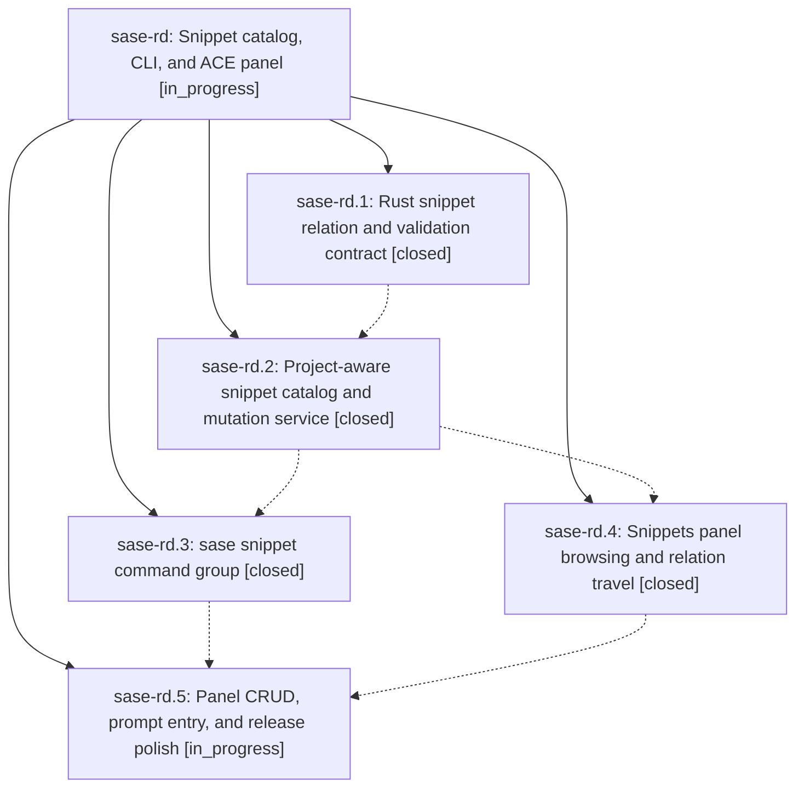

# Bead: sase-rd — Snippet catalog, CLI, and ACE panel

[Bead Pages](../README.md) / sase-rd

**Status:** ◐ in_progress · **Type:** ▸ plan · **Tier:** epic
**Owner:** `bryanbugyi34@gmail.com` · **Created by:** [bbugyi200.athena.08h](https://github.com/sase-org/sase--agents/blob/main/families/bbugyi200.athena.08h.md) · **Assignee:** `sase-rd.land`
**Created:** 2026-08-20 07:38:51 EDT
**Plan:** [202608/snippets\_panel.md](https://github.com/sase-org/sase--plans/blob/main/202608/snippets_panel.md)

## Description

Users can inspect and safely manage SASE snippets from a shared command/domain layer and a polished ACE panel, including first-class navigation across #[...] calls and backlinks.

## Phases

| Bead | Title | Status | Size | Created | Agents | Commits |
|---|---|---|---|---|---:|---:|
| [sase-rd.1](sase-rd.1.md) | Rust snippet relation and validation contract | ✓ closed | medium | 2026-08-20 | 1 | 1 |
| [sase-rd.2](sase-rd.2.md) | Project-aware snippet catalog and mutation service | ✓ closed | medium | 2026-08-20 | 1 | 1 |
| [sase-rd.3](sase-rd.3.md) | sase snippet command group | ✓ closed | medium | 2026-08-20 | 1 | 1 |
| [sase-rd.4](sase-rd.4.md) | Snippets panel browsing and relation travel | ✓ closed | medium | 2026-08-20 | 1 | 1 |
| [sase-rd.5](sase-rd.5.md) | Panel CRUD, prompt entry, and release polish | ◐ in_progress | medium | 2026-08-20 | 1 | 0 |

## Lineage

## Agents

| Agent | Bead | Commits |
|---|---|---:|
| [bbugyi200.athena.sase-rd.1](https://github.com/sase-org/sase--agents/blob/main/agents/bbugyi200.athena.sase-rd.1/README.md) | [sase-rd.1](sase-rd.1.md) | 1 |
| [bbugyi200.athena.sase-rd.2](https://github.com/sase-org/sase--agents/blob/main/agents/bbugyi200.athena.sase-rd.2/README.md) | [sase-rd.2](sase-rd.2.md) | 1 |
| [bbugyi200.athena.sase-rd.3](https://github.com/sase-org/sase--agents/blob/main/agents/bbugyi200.athena.sase-rd.3/README.md) | [sase-rd.3](sase-rd.3.md) | 1 |
| [bbugyi200.athena.sase-rd.4](https://github.com/sase-org/sase--agents/blob/main/agents/bbugyi200.athena.sase-rd.4/README.md) | [sase-rd.4](sase-rd.4.md) | 1 |
| [bbugyi200.athena.sase-rd.5](https://github.com/sase-org/sase--agents/blob/main/agents/bbugyi200.athena.sase-rd.5/README.md) | [sase-rd.5](sase-rd.5.md) | 0 |
| [bbugyi200.athena.sase-rd.land](https://github.com/sase-org/sase--agents/blob/main/agents/bbugyi200.athena.sase-rd.land/README.md) | [sase-rd](README.md) | 0 |

## Commits

| Repo | Commit | Subject | Bead | Committed |
|---|---|---|---|---|
| sase-core | [`sase-core@e9b4d89`](https://github.com/sase-org/sase-core/commit/e9b4d89adbe8df4aa2633e9a1b6bd92073427951) | feat(snippet\_catalog): add trigger validation, call graph, and diagnostics | [sase-rd.1](sase-rd.1.md) | 2026-08-20 08:07:52 EDT |
| sase | [`82e6800`](https://github.com/sase-org/sase/commit/82e68005f0794e5c8621de8535d03cf00959150f) | feat(snippet): add project-aware catalog and conflict-safe mutations | [sase-rd.2](sase-rd.2.md) | 2026-08-20 09:08:03 EDT |
| sase | [`f3a52bc`](https://github.com/sase-org/sase/commit/f3a52bc0aa11e7939406bb5d998906087bd56254) | feat(snippet): add sase snippet CLI for catalog add/list/show/delete | [sase-rd.3](sase-rd.3.md) | 2026-08-20 09:49:43 EDT |
| sase | [`4571198`](https://github.com/sase-org/sase/commit/45711984b473e4a27f4636485d666b58f7337461) | feat(ace): add hidden Snippets panel for catalog browsing and travel | [sase-rd.4](sase-rd.4.md) | 2026-08-20 10:25:20 EDT |
