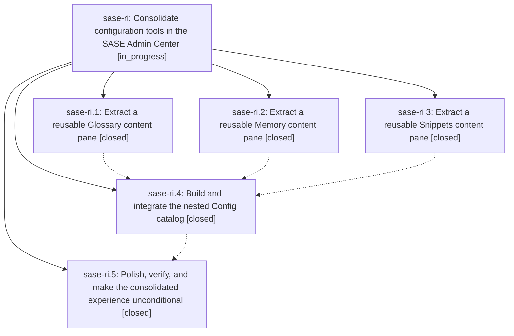

# Bead: sase-ri — Consolidate configuration tools in the SASE Admin Center

[Bead Pages](../README.md) / sase-ri

**Status:** ◐ in_progress · **Type:** ▸ plan · **Tier:** epic
**Owner:** `bryanbugyi34@gmail.com` · **Created by:** [bbugyi200.athena.sase-rd.land.w1](https://github.com/sase-org/sase--agents/blob/main/families/bbugyi200.athena.sase-rd.land.w1.md) · **Assignee:** `sase-ri.land`
**Created:** 2026-08-20 12:42:59 EDT
**Plan:** [202608/admin\_center\_config\_catalog.md](https://github.com/sase-org/sase--plans/blob/main/202608/admin_center_config_catalog.md)

## Description

The Admin Center Config section becomes a polished, lazy catalog for XPrompts, Snippets, Glossary, Memory, and miscellaneous layered settings, while prompt shortcuts continue to open the right content with their contextual selection intact.

## Notes

[2026-08-20T21:23:43Z · toobig-3a.split_file.src.sase.ace.tui.proc_producer_sites.0] DISCOVERED ISSUE: In an unrelated proc-producer inventory split at HEAD 982ad299e, 'just check' fails deterministically at the feature-flag lint gate: closed flag bead sase-rk still has a surviving admin_center_config_hub definition. The refactor only changes src/sase/ace/tui/proc_producer_sites.py and newly extracted _proc_producer_site*.py inventory modules, so it does not touch that flag or its call sites. This epic is the causal owner: active phase sase-ri.5 explicitly makes the consolidated Admin Center Config experience unconditional. Impact: every agent on the shared tree is blocked at lint until the surviving definition is removed or the flag state is reconciled.

[2026-08-20T21:25:36Z · toobig-3a.split_file.src.sase.ace.tui.proc_producer_sites.0] DISCOVERED ISSUE: The same unrelated proc-producer inventory split also reaches Symvision and fails deterministically because src/sase/ace/tui/modals/snippets_panel.py has now-unnecessary pragmas on SnippetsPaneSessionState (line 63), SnippetsPaneHost (line 96), and SnippetsPane (line 127); Symvision reports each symbol is already imported by other Python files. The inventory refactor does not touch snippets_panel.py or import these symbols. This is causally linked to this epic's extracted/reused Snippets content pane, so it belongs with active cutover phase sase-ri.5 rather than a new CI task.

[2026-08-20T22:01:25Z · toobig-3b.split_file.src.sase.ace.tui.widgets._file_completion_base.0] DISCOVERED ISSUE (independent reproduction): At HEAD 1db274e84e368b1bdc2057b148a43cd12ee38575, while verifying an unrelated split of src/sase/ace/tui/widgets/_file_completion_base.py, just check passed Python/Markdown formatting, keep-sorted, Ruff, and mypy, then failed deterministically at lint (feature flags): rule 7 reports closed flag bead sase-rk still has a surviving admin_center_config_hub definition. This corroborates the 2026-08-20T21:23:43Z report already on this epic. The current diff only moves prompt-completion methods and does not touch feature flags. Active phase sase-ri.5 owns the unconditional cutover and flag retirement, so no duplicate task was created.

[2026-08-20T22:24:27Z · toobig-3b.split_file.tests.ace.tui.widgets.test_directive_completion_interactions.0] DISCOVERED ISSUE (independent reproduction, 2026-08-20): At HEAD b1c6bb105fd82239c6624115ea58fa5af423657c, while verifying an unrelated test-only split of tests/ace/tui/widgets/test_directive_completion_interactions.py, just check passed Python/Markdown formatting, keep-sorted, Ruff, and mypy, then failed deterministically at lint (feature flags): rule 7 reports closed flag bead sase-rk still has a surviving admin_center_config_hub definition. The focused 33 directive-completion tests all pass, and the current diff only reorganizes those tests into three modules. This independently corroborates the existing reports on this epic. Active phase sase-ri.5 owns making the consolidated Admin Center Config experience unconditional, so no duplicate task bead was created.

[2026-08-20T22:41:20Z · toobig-3b.split_file.tests.test_editor_helper_agent_catalog.0] DISCOVERED ISSUE (independent reproduction, 2026-08-20): At HEAD a7b2e690184204e92f06789761d579723b3395ee, while verifying an unrelated test-only split of tests/test_editor_helper_agent_catalog.py, just check passed Python/Markdown formatting, keep-sorted, Ruff, and mypy, then failed deterministically at lint (feature flags): rule 7 reports closed flag bead sase-rk still has a surviving admin_center_config_hub definition. The focused 14 editor-helper catalog tests all pass, and the current diff only reorganizes those tests into three modules. This independently corroborates the existing reports on this epic. Active phase sase-ri.5 owns making the consolidated Admin Center Config experience unconditional, so no duplicate task bead was created.

[2026-08-20T23:43:18Z · sase-rn.land] DISCOVERED ISSUE corroboration from epic sase-rn landing: phase proposals sase-rn.2, sase-rn.3, sase-rn.4, sase-rn.5, sase-rn.6, and sase-rn.7 independently report the closed sase-rk admin_center_config_hub definition blocking feature-flag lint; sase-rn.3 and sase-rn.6 also report the now-unnecessary SnippetsPaneSessionState, SnippetsPaneHost, and SnippetsPane Symvision pragmas. Current source still contains both sets. These are causally owned by active cutover phase sase-ri.5, which makes the consolidated Config experience unconditional, so no standalone tasks were created.

## Phases

| Bead | Title | Status | Size | Created | Agents | Commits |
|---|---|---|---|---|---:|---:|
| [sase-ri.1](sase-ri.1.md) | Extract a reusable Glossary content pane | ✓ closed | medium | 2026-08-20 | 1 | 1 |
| [sase-ri.2](sase-ri.2.md) | Extract a reusable Memory content pane | ✓ closed | medium | 2026-08-20 | 1 | 1 |
| [sase-ri.3](sase-ri.3.md) | Extract a reusable Snippets content pane | ✓ closed | medium | 2026-08-20 | 1 | 1 |
| [sase-ri.4](sase-ri.4.md) | Build and integrate the nested Config catalog | ✓ closed | medium | 2026-08-20 | 1 | 1 |
| [sase-ri.5](sase-ri.5.md) | Polish, verify, and make the consolidated experience unconditional | ✓ closed | medium | 2026-08-20 | 1 | 1 |

## Lineage

## Agents

| Agent | Bead | Commits |
|---|---|---:|
| [bbugyi200.athena.sase-ri.1](https://github.com/sase-org/sase--agents/blob/main/agents/bbugyi200.athena.sase-ri.1/README.md) | [sase-ri.1](sase-ri.1.md) | 1 |
| [bbugyi200.athena.sase-ri.2](https://github.com/sase-org/sase--agents/blob/main/agents/bbugyi200.athena.sase-ri.2/README.md) | [sase-ri.2](sase-ri.2.md) | 1 |
| [bbugyi200.athena.sase-ri.3](https://github.com/sase-org/sase--agents/blob/main/families/bbugyi200.athena.sase-ri.3.md) | [sase-ri.3](sase-ri.3.md) | 1 |
| [bbugyi200.athena.sase-ri.4](https://github.com/sase-org/sase--agents/blob/main/agents/bbugyi200.athena.sase-ri.4/README.md) | [sase-ri.4](sase-ri.4.md) | 1 |
| [bbugyi200.athena.sase-ri.5](https://github.com/sase-org/sase--agents/blob/main/agents/bbugyi200.athena.sase-ri.5/README.md) | [sase-ri.5](sase-ri.5.md) | 1 |
| [bbugyi200.athena.sase-ri.land](https://github.com/sase-org/sase--agents/blob/main/agents/bbugyi200.athena.sase-ri.land/README.md) | [sase-ri](README.md) | 1 |

## Commits

| Repo | Commit | Subject | Bead | Committed |
|---|---|---|---|---|
| sase | [`5ac4c61`](https://github.com/sase-org/sase/commit/5ac4c61d7778d622a57dfdfdac5ff65fac0f3f3b) | refactor(ace): extract reusable GlossaryPane from GlossaryPanel | [sase-ri.1](sase-ri.1.md) | 2026-08-20 13:20:52 EDT |
| sase | [`4c304ad`](https://github.com/sase-org/sase/commit/4c304ad1fb78a611f7caa23ed9b6c9b3a1c0103c) | refactor(tui): extract reusable snippets pane | [sase-ri.3](sase-ri.3.md) | 2026-08-20 13:39:06 EDT |
| sase | [`4daa8b0`](https://github.com/sase-org/sase/commit/4daa8b019b775a04dfd1c8a81ca68d4d4b980c2c) | refactor(ace): extract Memory catalog into a reusable pane | [sase-ri.2](sase-ri.2.md) | 2026-08-20 13:39:15 EDT |
| sase | [`1382a43`](https://github.com/sase-org/sase/commit/1382a43d8c5fedeb5d09b95df089c692a3e6cbcc) | feat(ace): nest Admin Center config tools behind a beta flag | [sase-ri.4](sase-ri.4.md) | 2026-08-20 15:09:49 EDT |
| sase | [`29c5372`](https://github.com/sase-org/sase/commit/29c5372062808403edcf14f87cfd9093699122d9) | feat!: make Admin Center ConfigHub unconditional | [sase-ri.5](sase-ri.5.md) | 2026-08-21 05:54:26 EDT |
| sase | [`b8565c5`](https://github.com/sase-org/sase/commit/b8565c5d64015cf4b0738954abb2a8492d83a6bb) | test(ace): refresh Config Hub visual snapshots | [sase-ri](README.md) | 2026-08-21 06:11:04 EDT |
