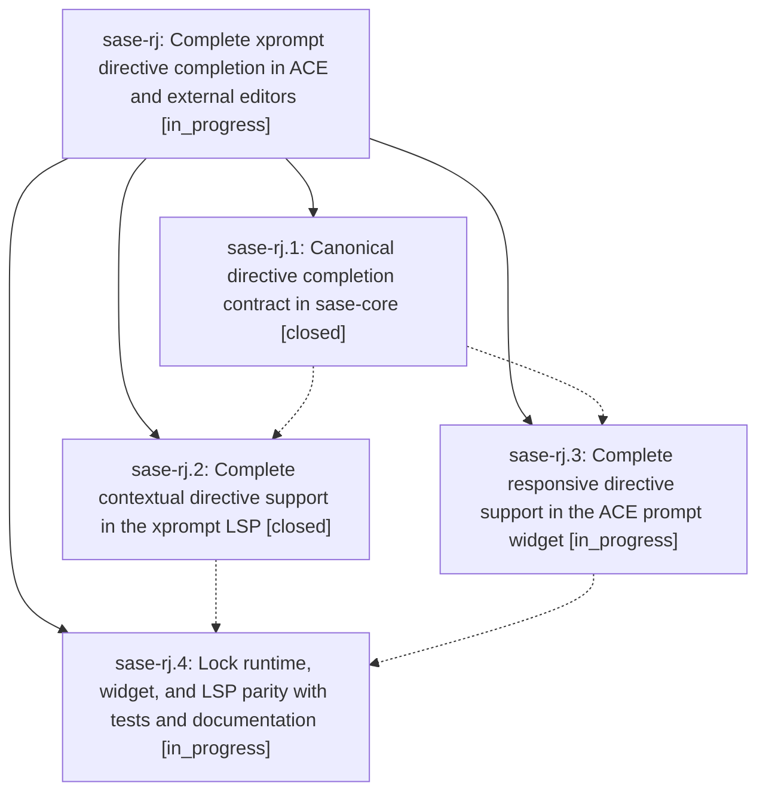

# Bead: sase-rj — Complete xprompt directive completion in ACE and external editors

[Bead Pages](../README.md) / sase-rj

**Status:** ◐ in_progress · **Type:** ▸ plan · **Tier:** epic
**Owner:** `bryanbugyi34@gmail.com` · **Created by:** [bbugyi200.athena.08s](https://github.com/sase-org/sase--agents/blob/main/families/bbugyi200.athena.08s.md) · **Assignee:** `sase-rj.land`
**Created:** 2026-08-20 13:44:18 EDT
**Plan:** [202608/xprompt\_directive\_completion\_parity.md](https://github.com/sase-org/sase--plans/blob/main/202608/xprompt_directive_completion_parity.md)

## Description

Give every supported xprompt directive, syntax form, keyword name, and useful keyword value one shared, responsive completion contract across the prompt input widget and the xprompt LSP.

## Phases

| Bead | Title | Status | Size | Created | Agents | Commits |
|---|---|---|---|---|---:|---:|
| [sase-rj.1](sase-rj.1.md) | Canonical directive completion contract in sase-core | ✓ closed | medium | 2026-08-20 | 1 | 1 |
| [sase-rj.2](sase-rj.2.md) | Complete contextual directive support in the xprompt LSP | ✓ closed | medium | 2026-08-20 | 1 | 1 |
| [sase-rj.3](sase-rj.3.md) | Complete responsive directive support in the ACE prompt widget | ◐ in_progress | medium | 2026-08-20 | 1 | 0 |
| [sase-rj.4](sase-rj.4.md) | Lock runtime, widget, and LSP parity with tests and documentation | ◐ in_progress | medium | 2026-08-20 | 1 | 0 |

## Lineage

## Agents

| Agent | Bead | Commits |
|---|---|---:|
| [bbugyi200.athena.sase-rj.1](https://github.com/sase-org/sase--agents/blob/main/agents/bbugyi200.athena.sase-rj.1/README.md) | [sase-rj.1](sase-rj.1.md) | 1 |
| [bbugyi200.athena.sase-rj.2](https://github.com/sase-org/sase--agents/blob/main/agents/bbugyi200.athena.sase-rj.2/README.md) | [sase-rj.2](sase-rj.2.md) | 1 |
| [bbugyi200.athena.sase-rj.3](https://github.com/sase-org/sase--agents/blob/main/agents/bbugyi200.athena.sase-rj.3/README.md) | [sase-rj.3](sase-rj.3.md) | 0 |
| [bbugyi200.athena.sase-rj.4](https://github.com/sase-org/sase--agents/blob/main/agents/bbugyi200.athena.sase-rj.4/README.md) | [sase-rj.4](sase-rj.4.md) | 0 |
| [bbugyi200.athena.sase-rj.land](https://github.com/sase-org/sase--agents/blob/main/agents/bbugyi200.athena.sase-rj.land/README.md) | [sase-rj](README.md) | 0 |

## Commits

| Repo | Commit | Subject | Bead | Committed |
|---|---|---|---|---|
| sase-core | [`sase-core@04c27f2`](https://github.com/sase-org/sase-core/commit/04c27f2a22a9d1e621b6acec666789a3fb89395e) | feat(editor): add canonical xprompt directive completion contract | [sase-rj.1](sase-rj.1.md) | 2026-08-20 14:20:14 EDT |
| sase-core | [`sase-core@16b1594`](https://github.com/sase-org/sase-core/commit/16b15944e4fb5fd73c8a8e22d25d2fc6944708a6) | feat(editor): drive xprompt LSP directive completion from the shared contract | [sase-rj.2](sase-rj.2.md) | 2026-08-20 15:18:20 EDT |
