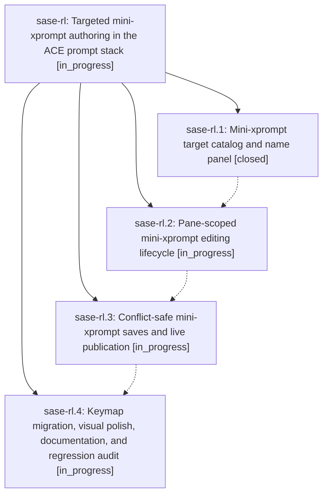

# Bead: sase-rl — Targeted mini-xprompt authoring in the ACE prompt stack

[Bead Pages](../README.md) / sase-rl

**Status:** ◐ in_progress · **Type:** ▸ plan · **Tier:** epic
**Owner:** `bryanbugyi34@gmail.com` · **Created by:** [bbugyi200.athena.08v](https://github.com/sase-org/sase--agents/blob/main/families/bbugyi200.athena.08v.md) · **Assignee:** `sase-rl.land`
**Created:** 2026-08-20 14:37:46 EDT
**Plan:** [202608/targeted\_mini\_xprompt.md](https://github.com/sase-org/sase--plans/blob/main/202608/targeted_mini_xprompt.md)

## Description

Users can create or edit one non-swarm xprompt in a focused, pane-scoped ACE workflow, while whole-stack saves, frontmatter-local helpers, and existing targeted-xprompt behavior remain clear, safe, and visually distinct.

## Phases

| Bead | Title | Status | Size | Created | Agents | Commits |
|---|---|---|---|---|---:|---:|
| [sase-rl.1](sase-rl.1.md) | Mini-xprompt target catalog and name panel | ✓ closed | medium | 2026-08-20 | 1 | 1 |
| [sase-rl.2](sase-rl.2.md) | Pane-scoped mini-xprompt editing lifecycle | ◐ in_progress | medium | 2026-08-20 | 1 | 0 |
| [sase-rl.3](sase-rl.3.md) | Conflict-safe mini-xprompt saves and live publication | ◐ in_progress | medium | 2026-08-20 | 1 | 0 |
| [sase-rl.4](sase-rl.4.md) | Keymap migration, visual polish, documentation, and regression audit | ◐ in_progress | medium | 2026-08-20 | 1 | 0 |

## Lineage

## Agents

| Agent | Bead | Commits |
|---|---|---:|
| [bbugyi200.athena.sase-rl.1](https://github.com/sase-org/sase--agents/blob/main/agents/bbugyi200.athena.sase-rl.1/README.md) | [sase-rl.1](sase-rl.1.md) | 1 |
| [bbugyi200.athena.sase-rl.2](https://github.com/sase-org/sase--agents/blob/main/agents/bbugyi200.athena.sase-rl.2/README.md) | [sase-rl.2](sase-rl.2.md) | 0 |
| [bbugyi200.athena.sase-rl.3](https://github.com/sase-org/sase--agents/blob/main/agents/bbugyi200.athena.sase-rl.3/README.md) | [sase-rl.3](sase-rl.3.md) | 0 |
| [bbugyi200.athena.sase-rl.4](https://github.com/sase-org/sase--agents/blob/main/agents/bbugyi200.athena.sase-rl.4/README.md) | [sase-rl.4](sase-rl.4.md) | 0 |
| [bbugyi200.athena.sase-rl.land](https://github.com/sase-org/sase--agents/blob/main/agents/bbugyi200.athena.sase-rl.land/README.md) | [sase-rl](README.md) | 0 |

## Commits

| Repo | Commit | Subject | Bead | Committed |
|---|---|---|---|---|
| sase | [`f55b0b8`](https://github.com/sase-org/sase/commit/f55b0b80f94dabd0bdf5f409f0478e84e459034f) | feat(ace): add mini xprompt target name panel | [sase-rl.1](sase-rl.1.md) | 2026-08-20 15:32:48 EDT |
