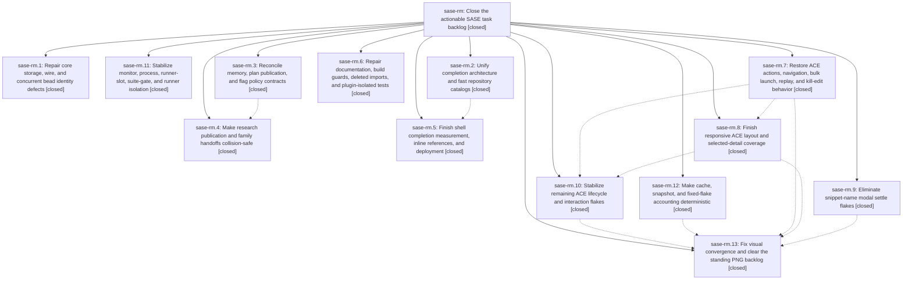

# Bead: sase-rm — Close the actionable SASE task backlog

[Bead Pages](../README.md) / sase-rm

**Status:** ✓ closed · **Resolution:** done · **Type:** ▸ plan · **Tier:** epic
**Owner:** `bryanbugyi34@gmail.com` · **Created by:** [bbugyi200.athena.08u](https://github.com/sase-org/sase--agents/blob/main/families/bbugyi200.athena.08u.md) · **Assignee:** `sase-rm.land`
**Created:** 2026-08-20 14:47:46 EDT · **Closed:** 2026-08-21 13:19:46 EDT
**Plan:** [202608/task\_backlog\_closeout.md](https://github.com/sase-org/sase--plans/blob/main/202608/task_backlog_closeout.md)

## Description

Resolve, verify, and close every currently ready SASE task bead without racing owned work, violating deferrals, or retiring live feature flags

## Notes

[2026-08-21T10:06:47Z · sase-ri.land] DISCOVERED ISSUE from epic sase-ri landing (phase sase-ri.5 proposal, independently reproduced at HEAD 29c537206 after just install): just symvision fails on private imports introduced by the proc-producer split and finalizer work: _ProcProducerSite/_site, commit_finalizer auto-commit/cleanup helpers, finalizers.declaration load/normalize/validate helpers, and _result_changed_files. No existing task search matched these symbols. This is causally tied to commits within active backlog epic sase-rm (including proc split/finalizer phases), not to sase-ri's Admin Center diff; resolve before sase-rm lands.

[2026-08-21T10:10:33Z · sase-ri.land] DISCOVERED ISSUE from epic sase-ri landing check at HEAD 29c537206: just check now passes fmt, keep-sorted, Ruff, mypy, feature flags, pyscripts, test-waits, and changelog, then fails patch/stitch terminology on 11 unclassified legacy changespec tokens in src/sase/core/__init__.py and tests/test_lazy_facades.py. These came from the later lazy-facade/completion integration commit 4a3e69196 associated with active backlog epic sase-rm, not from sase-ri. Resolve before sase-rm lands.

[2026-08-21T11:22:19Z · sase-rl.land] CORROBORATION of existing 2026-08-21T10:10:33Z DISCOVERED ISSUE on this epic: during mini-xprompt landing-gap verification, just check passed fmt, keep-sorted, ruff, mypy, feature flags, pyscripts, test-waits, and changelog, then failed tools/audit_patch_stitch_terminology on the same 11 unclassified legacy changespec tokens in src/sase/core/__init__.py and tests/test_lazy_facades.py. The local diff touches mini-xprompt/docs plus a test-wait cleanup, not those terminology-audit files. No standalone task bead created because this is already routed to the active backlog epic.

[2026-08-21T12:39:13Z · sase-rp.land] DISCOVERED ISSUE corroboration from epic sase-rp landing (full-visual failure recorded in sase-rp.3 completion notes): after mandatory just install at master 4119b0d8d, just test-visual produced 372 failed / 399 passed / 1 skipped across nearly every ACE surface. The two new Config Launch snapshots pass in a focused run (2 passed), so this is standing repository-wide golden drift, not sase-rp work. Corroborated task sase-r5 separately; active phase sase-rm.13 already owns visual convergence.

[2026-08-21T12:39:14Z · sase-rp.land] DISCOVERED ISSUE corroboration from epic sase-rp landing (PROPOSED FOLLOW-UP notes on sase-rp.1, sase-rp.2, and sase-rp.3): after mandatory just install at master 4119b0d8d, just symvision deterministically fails on the same private imports already recorded here: _ProcProducerSite/_site, commit_finalizer auto-commit/cleanup helpers, finalizers.declaration load/normalize/validate helpers, and _result_changed_files. Focused Config Launch tests pass and none of these files belong to sase-rp. No standalone task was created because this active backlog epic causally owns the proc/finalizer commits.

[2026-08-21T12:49:20Z · 093] DISCOVERED ISSUE corroboration from runner-statistics-peak implementation verification: after rebuilding the local Rust binding and passing focused runner/statistics tests plus linked core just check, primary just check passed fmt, keep-sorted, Ruff, mypy, feature flags, pyscripts, test-waits, changelog, and patch/stitch terminology, then failed lint (symvision) on the same private imports already recorded here: _ProcProducerSite/_site, commit_finalizer auto-commit/cleanup helpers, finalizers.declaration load/normalize/validate helpers, and _result_changed_files. The current diff touches runner occupancy/statistics predicates and tests, not those proc/finalizer/declaration files, so this is independent corroboration of the existing active-epic blocker rather than a new task.

[2026-08-21T12:54:20Z · 094] DISCOVERED ISSUE corroboration from ctrl_g_ctrl_x_mini_xprompt verification: after mandatory just install, focused keymap/mini-xprompt/save-panel/help tests passed, then just check passed fmt, markdown formatting after Prettier, keep-sorted, Ruff, mypy, feature flags, pyscripts, test-waits, changelog, and patch/stitch terminology before failing lint (symvision) on the same private-import set already recorded here: _ProcProducerSite/_site, commit_finalizer auto-commit/cleanup helpers, finalizers.declaration load/normalize/validate helpers, and _result_changed_files. The current diff touches prompt g-prefix routing, help/docs, and focused tests, not those proc/finalizer/declaration files. No standalone task created because this active backlog epic already owns the blocker.

[2026-08-21T13:18:46Z · 097] DISCOVERED ISSUE corroboration from agent_xprompt_ref_highlighting implementation verification: focused artifact-ref/xprompt tests passed (56 passed), linked core artifact scanner tests passed (8 passed), and focused ACE xprompt visual snapshot comparison passed (2 passed). Required primary just check then passed fmt, markdown formatting, keep-sorted, Ruff, mypy, feature flags, pyscripts, test-waits, changelog, and patch/stitch terminology before failing lint (symvision) on the same private-import set already recorded here: _ProcProducerSite/_site, commit_finalizer auto-commit/cleanup helpers, finalizers.declaration load/normalize/validate helpers, and _result_changed_files. The current diff touches ACE artifact-ref/xprompt highlighting, ref-aware file-hint suppression, PNG snapshots, and the linked artifact_ref scanner left-context rule; it does not touch proc-producer, commit_finalizer, finalizers.declaration, or commit_finalizer_prompting. No standalone task created because this active backlog epic already owns the blocker.

[2026-08-21T13:40:03Z · sase-ri.land.w2.f3] DISCOVERED ISSUE corroboration from admin_center_subtab_numbers implementation verification at HEAD e91b9f83a on 2026-08-21: required just check passed fmt, markdown formatting after targeted Prettier, keep-sorted, Ruff, mypy, feature flags, pyscripts, test-waits, changelog, and patch/stitch terminology, then failed lint (symvision) on the same private-import set already recorded here: _ProcProducerSite/_site, commit_finalizer auto-commit/cleanup helpers, finalizers.declaration load/normalize/validate helpers, and _result_changed_files. The current diff touches Admin Center Config/Statistics keymap/navigation/docs/tests/PNG snapshots, not proc-producer, commit_finalizer, finalizers.declaration, or commit_finalizer_prompting. No standalone task created because this active backlog epic already owns the blocker.

[2026-08-21T13:45:21Z · 098] DISCOVERED ISSUE corroboration from retired_xprompt_skill_cleanup implementation verification: focused skill-init/manifest/deploy/inventory tests passed, then required just check passed fmt, markdown formatting, keep-sorted, Ruff, mypy, feature flags, pyscripts, test-waits, changelog, and patch/stitch terminology before failing lint (symvision) on the same private-import set already recorded here: _ProcProducerSite/_site, commit_finalizer auto-commit/cleanup helpers, finalizers.declaration load/normalize/validate helpers, and _result_changed_files. The current diff touches generated xprompt skill ownership, retired managed-skill cleanup, skill inventory/listing/doctor output, docs, and tests; it does not touch proc-producer, commit_finalizer, finalizers.declaration, or commit_finalizer_prompting. No standalone task created because this active backlog epic already owns the blocker.

[2026-08-21T14:07:57Z · 09f] DISCOVERED ISSUE corroboration from amber soft-disabled alias-description implementation: after just install/fmt rebuilt the local Rust binding, just check passed fmt, markdown, keep-sorted, Ruff, mypy, feature flags, pyscripts, test-waits, changelog, and patch/stitch terminology, then failed lint (symvision) on the same private-import set already recorded here: _ProcProducerSite/_site, commit_finalizer auto-commit/cleanup helpers, finalizers.declaration load/normalize/validate helpers, and _result_changed_files. Confirmed pre-existing by stashing the working tree and re-running the exact Justfile symvision command against unmodified HEAD 4ebdd05ad — identical failure. The current diff only touches models_panel_rendering_descriptions.py, docs/ace.md, alias-rendering tests, and the models_panel_provider_soft_disabled PNG snapshot; it does not touch proc-producer, commit_finalizer, or finalizers.declaration. No standalone task created because this active backlog epic already owns the blocker.

[2026-08-21T14:08:41Z · 099] DISCOVERED ISSUE corroboration from retire_artifact_links verification at HEAD e91b9f83a on 2026-08-21: focused artifact-link tests passed and the current diff touches artifact-link storage, CLI, docs, tests, and managed skill wording, but required just check passed fmt, markdown formatting after Prettier, keep-sorted, Ruff, mypy, feature flags, pyscripts, test-waits, changelog, and patch/stitch terminology before failing lint (symvision) on the same private-import set already recorded here: _ProcProducerSite/_site, commit_finalizer auto-commit/cleanup helpers, finalizers.declaration load/normalize/validate helpers, and _result_changed_files. No standalone task created because this active backlog epic already owns the blocker.

[2026-08-21T14:25:58Z · sase-ri.land.w2.f2.w2] DISCOVERED ISSUE: During prefixed_glossary_memory_links implementation verification on 2026-08-21 at HEAD e9d3521f4, just check passed fmt, markdown, keep-sorted, Ruff, mypy, feature flags, pyscripts, test-waits, changelog, and patch/stitch terminology, then failed lint (symvision) on the same private-import set already recorded here: _ProcProducerSite/_site, commit_finalizer auto-commit/cleanup helpers, finalizers.declaration load/normalize/validate helpers, and _result_changed_files. The current diff only touches Glossary/Memory numbered-link prefix dispatch, chip labels, docs, tests, and populated PNG goldens; it does not touch proc-producer, commit_finalizer, or finalizers.declara

… and 2604 more characters

## Phases

| Bead | Title | Status | Size | Created | Agents | Commits |
|---|---|---|---|---|---:|---:|
| [sase-rm.1](sase-rm.1.md) | Repair core storage, wire, and concurrent bead identity defects | ✓ closed | large | 2026-08-20 | 1 | 2 |
| [sase-rm.10](sase-rm.10.md) | Stabilize remaining ACE lifecycle and interaction flakes | ✓ closed | large | 2026-08-20 | 1 | 1 |
| [sase-rm.11](sase-rm.11.md) | Stabilize monitor, process, runner-slot, suite-gate, and runner isolation | ✓ closed | large | 2026-08-20 | 1 | 1 |
| [sase-rm.12](sase-rm.12.md) | Make cache, snapshot, and fixed-flake accounting deterministic | ✓ closed | medium | 2026-08-20 | 1 | 1 |
| [sase-rm.13](sase-rm.13.md) | Fix visual convergence and clear the standing PNG backlog | ✓ closed | large | 2026-08-20 | 1 | 2 |
| [sase-rm.2](sase-rm.2.md) | Unify completion architecture and fast repository catalogs | ✓ closed | large | 2026-08-20 | 1 | 2 |
| [sase-rm.3](sase-rm.3.md) | Reconcile memory, plan publication, and flag policy contracts | ✓ closed | large | 2026-08-20 | 1 | 2 |
| [sase-rm.4](sase-rm.4.md) | Make research publication and family handoffs collision-safe | ✓ closed | large | 2026-08-20 | 1 | 1 |
| [sase-rm.5](sase-rm.5.md) | Finish shell completion measurement, inline references, and deployment | ✓ closed | large | 2026-08-20 | 1 | 1 |
| [sase-rm.6](sase-rm.6.md) | Repair documentation, build guards, deleted imports, and plugin-isolated tests | ✓ closed | medium | 2026-08-20 | 1 | 1 |
| [sase-rm.7](sase-rm.7.md) | Restore ACE actions, navigation, bulk launch, replay, and kill-edit behavior | ✓ closed | medium | 2026-08-20 | 1 | 1 |
| [sase-rm.8](sase-rm.8.md) | Finish responsive ACE layout and selected-detail coverage | ✓ closed | medium | 2026-08-20 | 1 | 1 |
| [sase-rm.9](sase-rm.9.md) | Eliminate snippet-name modal settle flakes | ✓ closed | medium | 2026-08-20 | 1 | 1 |

## Lineage

## Agents

| Agent | Bead | Commits |
|---|---|---:|
| [bbugyi200.athena.sase-rm.1](https://github.com/sase-org/sase--agents/blob/main/families/bbugyi200.athena.sase-rm.1.md) | [sase-rm.1](sase-rm.1.md) | 2 |
| [bbugyi200.athena.sase-rm.10](https://github.com/sase-org/sase--agents/blob/main/families/bbugyi200.athena.sase-rm.10.md) | [sase-rm.10](sase-rm.10.md) | 1 |
| [bbugyi200.athena.sase-rm.11](https://github.com/sase-org/sase--agents/blob/main/families/bbugyi200.athena.sase-rm.11.md) | [sase-rm.11](sase-rm.11.md) | 1 |
| [bbugyi200.athena.sase-rm.12](https://github.com/sase-org/sase--agents/blob/main/agents/bbugyi200.athena.sase-rm.12/README.md) | [sase-rm.12](sase-rm.12.md) | 1 |
| [bbugyi200.athena.sase-rm.13](https://github.com/sase-org/sase--agents/blob/main/families/bbugyi200.athena.sase-rm.13.md) | [sase-rm.13](sase-rm.13.md) | 2 |
| [bbugyi200.athena.sase-rm.2](https://github.com/sase-org/sase--agents/blob/main/families/bbugyi200.athena.sase-rm.2.md) | [sase-rm.2](sase-rm.2.md) | 2 |
| [bbugyi200.athena.sase-rm.3](https://github.com/sase-org/sase--agents/blob/main/families/bbugyi200.athena.sase-rm.3.md) | [sase-rm.3](sase-rm.3.md) | 2 |
| [bbugyi200.athena.sase-rm.4](https://github.com/sase-org/sase--agents/blob/main/families/bbugyi200.athena.sase-rm.4.md) | [sase-rm.4](sase-rm.4.md) | 1 |
| [bbugyi200.athena.sase-rm.5](https://github.com/sase-org/sase--agents/blob/main/families/bbugyi200.athena.sase-rm.5.md) | [sase-rm.5](sase-rm.5.md) | 1 |
| [bbugyi200.athena.sase-rm.6](https://github.com/sase-org/sase--agents/blob/main/agents/bbugyi200.athena.sase-rm.6/README.md) | [sase-rm.6](sase-rm.6.md) | 1 |
| [bbugyi200.athena.sase-rm.7](https://github.com/sase-org/sase--agents/blob/main/agents/bbugyi200.athena.sase-rm.7/README.md) | [sase-rm.7](sase-rm.7.md) | 1 |
| [bbugyi200.athena.sase-rm.8](https://github.com/sase-org/sase--agents/blob/main/agents/bbugyi200.athena.sase-rm.8/README.md) | [sase-rm.8](sase-rm.8.md) | 1 |
| [bbugyi200.athena.sase-rm.9](https://github.com/sase-org/sase--agents/blob/main/families/bbugyi200.athena.sase-rm.9.md) | [sase-rm.9](sase-rm.9.md) | 1 |
| [bbugyi200.athena.sase-rm.land](https://github.com/sase-org/sase--agents/blob/main/agents/bbugyi200.athena.sase-rm.land/README.md) | [sase-rm](README.md) | 1 |

## Commits

| Repo | Commit | Subject | Bead | Committed |
|---|---|---|---|---|
| sase | [`dbb0511`](https://github.com/sase-org/sase/commit/dbb05112e7f9c3667e17b4d4b5a0c4399c83158d) | test(ace): wait for snippet-name modal analysis to settle | [sase-rm.9](sase-rm.9.md) | 2026-08-20 15:28:58 EDT |
| sase | [`19bdc94`](https://github.com/sase-org/sase/commit/19bdc94dbde36b7f15bf16b5a2ad6de6f799167b) | feat(ace): restore notification, palette, bulk launch, and kill-edit flows | [sase-rm.7](sase-rm.7.md) | 2026-08-20 15:44:48 EDT |
| sase-core | [`sase-core@58256f9`](https://github.com/sase-org/sase-core/commit/58256f90d11a82bd8c104ea9bc6d90db39096fd3) | feat(task\_type): add optional create\_refusal on catalog wire | [sase-rm.3](sase-rm.3.md) | 2026-08-20 15:54:57 EDT |
| sase | [`f136f4f`](https://github.com/sase-org/sase/commit/f136f4fbdcb8a48cde0716dd54ad71aa3c386796) | feat: reconcile memory, plan publication, and flag policy contracts | [sase-rm.3](sase-rm.3.md) | 2026-08-20 15:56:27 EDT |
| sase | [`569d425`](https://github.com/sase-org/sase/commit/569d4257b747902476422cd7b30ad7824e6b876e) | fix: stabilize process concurrency closeout | [sase-rm.11](sase-rm.11.md) | 2026-08-20 16:30:23 EDT |
| sase-core | [`sase-core@279f0e0`](https://github.com/sase-org/sase-core/commit/279f0e0ef7b694dd8ecadd6fae00124695b2d09a) | fix: repair core storage identity contracts | [sase-rm.1](sase-rm.1.md) | 2026-08-20 16:46:08 EDT |
| sase | [`891cf60`](https://github.com/sase-org/sase/commit/891cf604f38cd4b308245210df6443dd46d60160) | fix: propagate core storage repair outcomes | [sase-rm.1](sase-rm.1.md) | 2026-08-20 16:49:36 EDT |
| sase | [`982ad29`](https://github.com/sase-org/sase/commit/982ad299ee6a81eec30f496b303b4ff0a29eb15b) | fix: make successor handoffs collision-safe | [sase-rm.4](sase-rm.4.md) | 2026-08-20 17:07:14 EDT |
| sase | [`96257e1`](https://github.com/sase-org/sase/commit/96257e1fb34f28f3f28e5b42ce815b056211f92a) | fix(test): make cache and flake accounting deterministic | [sase-rm.12](sase-rm.12.md) | 2026-08-21 05:27:46 EDT |
| sase | [`b76f53b`](https://github.com/sase-org/sase/commit/b76f53b998e3f208d339253a9ca7538469cb987a) | fix: repair guardrails for provider docs and proc imports | [sase-rm.6](sase-rm.6.md) | 2026-08-21 05:28:24 EDT |
| sase | [`671d27c`](https://github.com/sase-org/sase/commit/671d27c899d75bb610b0eae5648e2faf2db1b312) | fix(ace): stabilize responsive pane layout | [sase-rm.8](sase-rm.8.md) | 2026-08-21 05:35:06 EDT |
| sase | [`4a3e691`](https://github.com/sase-org/sase/commit/4a3e691964b6715a8698cce29fd5a16d55d50acc) | feat(completion): add inventory and snippet candidate providers | [sase-rm.2](sase-rm.2.md) | 2026-08-21 05:48:40 EDT |
| sase-core | [`sase-core@427d57e`](https://github.com/sase-org/sase-core/commit/427d57e743d02eafbd39388bdba0a35d1966c370) | feat(completion): share model filtering with bindings and LSP | [sase-rm.2](sase-rm.2.md) | 2026-08-21 05:50:41 EDT |
| sase | [`b8559f3`](https://github.com/sase-org/sase/commit/b8559f36f00a3f46c0ee0ce7343dc50735275900) | fix(ace): stabilize async teardown and interaction waits | [sase-rm.10](sase-rm.10.md) | 2026-08-21 06:47:03 EDT |
| sase | [`abb80f4`](https://github.com/sase-org/sase/commit/abb80f44ac78e3ddadb3d8708613dfa144dd74e8) | feat(completion): support managed shell distribution | [sase-rm.5](sase-rm.5.md) | 2026-08-21 07:14:47 EDT |
| sase-core | [`sase-core@1f0d236`](https://github.com/sase-org/sase-core/commit/1f0d236f940f8cde852e3de55679e8185c591c34) | fix(editor): hide final directive from name completions | [sase-rm.13](sase-rm.13.md) | 2026-08-21 12:31:34 EDT |
| sase | [`72f93fb`](https://github.com/sase-org/sase/commit/72f93fb1fb3917c39f1859650b87ac33b6d80847) | fix: stabilize visual closeout and verification gates | [sase-rm.13](sase-rm.13.md) | 2026-08-21 12:42:29 EDT |
| sase | [`bcb7411`](https://github.com/sase-org/sase/commit/bcb7411aca13ba9a607762f290430dd7df005108) | fix(finalizers): complete public API cleanup | [sase-rm](README.md) | 2026-08-21 13:20:36 EDT |
