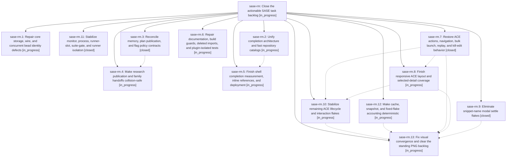

# Bead: sase-rm — Close the actionable SASE task backlog

[Bead Pages](../README.md) / sase-rm

**Status:** ◐ in_progress · **Type:** ▸ plan · **Tier:** epic
**Owner:** `bryanbugyi34@gmail.com` · **Created by:** [bbugyi200.athena.08u](https://github.com/sase-org/sase--agents/blob/main/families/bbugyi200.athena.08u.md) · **Assignee:** `sase-rm.land`
**Created:** 2026-08-20 14:47:46 EDT
**Plan:** [202608/task\_backlog\_closeout.md](https://github.com/sase-org/sase--plans/blob/main/202608/task_backlog_closeout.md)

## Description

Resolve, verify, and close every currently ready SASE task bead without racing owned work, violating deferrals, or retiring live feature flags

## Phases

| Bead | Title | Status | Size | Created | Agents | Commits |
|---|---|---|---|---|---:|---:|
| [sase-rm.1](sase-rm.1.md) | Repair core storage, wire, and concurrent bead identity defects | ◐ in_progress | large | 2026-08-20 | 1 | 0 |
| [sase-rm.10](sase-rm.10.md) | Stabilize remaining ACE lifecycle and interaction flakes | ◐ in_progress | large | 2026-08-20 | 1 | 0 |
| [sase-rm.11](sase-rm.11.md) | Stabilize monitor, process, runner-slot, suite-gate, and runner isolation | ✓ closed | large | 2026-08-20 | 1 | 1 |
| [sase-rm.12](sase-rm.12.md) | Make cache, snapshot, and fixed-flake accounting deterministic | ◐ in_progress | medium | 2026-08-20 | 1 | 0 |
| [sase-rm.13](sase-rm.13.md) | Fix visual convergence and clear the standing PNG backlog | ◐ in_progress | large | 2026-08-20 | 1 | 0 |
| [sase-rm.2](sase-rm.2.md) | Unify completion architecture and fast repository catalogs | ◐ in_progress | large | 2026-08-20 | 1 | 0 |
| [sase-rm.3](sase-rm.3.md) | Reconcile memory, plan publication, and flag policy contracts | ✓ closed | large | 2026-08-20 | 1 | 2 |
| [sase-rm.4](sase-rm.4.md) | Make research publication and family handoffs collision-safe | ◐ in_progress | large | 2026-08-20 | 1 | 0 |
| [sase-rm.5](sase-rm.5.md) | Finish shell completion measurement, inline references, and deployment | ◐ in_progress | large | 2026-08-20 | 1 | 0 |
| [sase-rm.6](sase-rm.6.md) | Repair documentation, build guards, deleted imports, and plugin-isolated tests | ◐ in_progress | medium | 2026-08-20 | 1 | 0 |
| [sase-rm.7](sase-rm.7.md) | Restore ACE actions, navigation, bulk launch, replay, and kill-edit behavior | ✓ closed | medium | 2026-08-20 | 1 | 1 |
| [sase-rm.8](sase-rm.8.md) | Finish responsive ACE layout and selected-detail coverage | ◐ in_progress | medium | 2026-08-20 | 1 | 0 |
| [sase-rm.9](sase-rm.9.md) | Eliminate snippet-name modal settle flakes | ✓ closed | medium | 2026-08-20 | 1 | 1 |

## Lineage

## Agents

| Agent | Bead | Commits |
|---|---|---:|
| [bbugyi200.athena.sase-rm.1](https://github.com/sase-org/sase--agents/blob/main/families/bbugyi200.athena.sase-rm.1.md) | [sase-rm.1](sase-rm.1.md) | 0 |
| [bbugyi200.athena.sase-rm.10](https://github.com/sase-org/sase--agents/blob/main/agents/bbugyi200.athena.sase-rm.10/README.md) | [sase-rm.10](sase-rm.10.md) | 0 |
| [bbugyi200.athena.sase-rm.11](https://github.com/sase-org/sase--agents/blob/main/families/bbugyi200.athena.sase-rm.11.md) | [sase-rm.11](sase-rm.11.md) | 1 |
| [bbugyi200.athena.sase-rm.12](https://github.com/sase-org/sase--agents/blob/main/agents/bbugyi200.athena.sase-rm.12/README.md) | [sase-rm.12](sase-rm.12.md) | 0 |
| [bbugyi200.athena.sase-rm.13](https://github.com/sase-org/sase--agents/blob/main/agents/bbugyi200.athena.sase-rm.13/README.md) | [sase-rm.13](sase-rm.13.md) | 0 |
| [bbugyi200.athena.sase-rm.2](https://github.com/sase-org/sase--agents/blob/main/families/bbugyi200.athena.sase-rm.2.md) | [sase-rm.2](sase-rm.2.md) | 0 |
| [bbugyi200.athena.sase-rm.3](https://github.com/sase-org/sase--agents/blob/main/families/bbugyi200.athena.sase-rm.3.md) | [sase-rm.3](sase-rm.3.md) | 2 |
| [bbugyi200.athena.sase-rm.4](https://github.com/sase-org/sase--agents/blob/main/families/bbugyi200.athena.sase-rm.4.md) | [sase-rm.4](sase-rm.4.md) | 0 |
| [bbugyi200.athena.sase-rm.5](https://github.com/sase-org/sase--agents/blob/main/agents/bbugyi200.athena.sase-rm.5/README.md) | [sase-rm.5](sase-rm.5.md) | 0 |
| [bbugyi200.athena.sase-rm.6](https://github.com/sase-org/sase--agents/blob/main/families/bbugyi200.athena.sase-rm.6.md) | [sase-rm.6](sase-rm.6.md) | 0 |
| [bbugyi200.athena.sase-rm.7](https://github.com/sase-org/sase--agents/blob/main/agents/bbugyi200.athena.sase-rm.7/README.md) | [sase-rm.7](sase-rm.7.md) | 1 |
| [bbugyi200.athena.sase-rm.8](https://github.com/sase-org/sase--agents/blob/main/agents/bbugyi200.athena.sase-rm.8/README.md) | [sase-rm.8](sase-rm.8.md) | 0 |
| [bbugyi200.athena.sase-rm.9](https://github.com/sase-org/sase--agents/blob/main/families/bbugyi200.athena.sase-rm.9.md) | [sase-rm.9](sase-rm.9.md) | 1 |
| [bbugyi200.athena.sase-rm.land](https://github.com/sase-org/sase--agents/blob/main/agents/bbugyi200.athena.sase-rm.land/README.md) | [sase-rm](README.md) | 0 |

## Commits

| Repo | Commit | Subject | Bead | Committed |
|---|---|---|---|---|
| sase | [`dbb0511`](https://github.com/sase-org/sase/commit/dbb05112e7f9c3667e17b4d4b5a0c4399c83158d) | test(ace): wait for snippet-name modal analysis to settle | [sase-rm.9](sase-rm.9.md) | 2026-08-20 15:28:58 EDT |
| sase | [`19bdc94`](https://github.com/sase-org/sase/commit/19bdc94dbde36b7f15bf16b5a2ad6de6f799167b) | feat(ace): restore notification, palette, bulk launch, and kill-edit flows | [sase-rm.7](sase-rm.7.md) | 2026-08-20 15:44:48 EDT |
| sase-core | [`sase-core@58256f9`](https://github.com/sase-org/sase-core/commit/58256f90d11a82bd8c104ea9bc6d90db39096fd3) | feat(task\_type): add optional create\_refusal on catalog wire | [sase-rm.3](sase-rm.3.md) | 2026-08-20 15:54:57 EDT |
| sase | [`f136f4f`](https://github.com/sase-org/sase/commit/f136f4fbdcb8a48cde0716dd54ad71aa3c386796) | feat: reconcile memory, plan publication, and flag policy contracts | [sase-rm.3](sase-rm.3.md) | 2026-08-20 15:56:27 EDT |
| sase | [`569d425`](https://github.com/sase-org/sase/commit/569d4257b747902476422cd7b30ad7824e6b876e) | fix: stabilize process concurrency closeout | [sase-rm.11](sase-rm.11.md) | 2026-08-20 16:30:23 EDT |
